# Learn TT-Metal by following the data

  
UNOFFICIAL · SOURCE-TRACKED · VISUAL

  

    Build a durable mental model of Tenstorrent hardware and TT-Metalium,
    then connect every concept back to the official code.
  

  

    <a class="md-button md-button--primary" href="start/learning-path/">Start the learning path</a>
    <a class="md-button" href="start/optimization-path/">Study optimization</a>
    <a class="md-button" href="reference/report-catalog/">Browse reports by layer</a>
    <a class="md-button" href="resources/">Explore external &amp; ISA sources</a>
  

## One stack, eight learning levels

{ .atlas-diagram }

<small>[Open full-size diagram](assets/diagrams/stack.svg) · [Diagram source](https://github.com/buicongnguyen/tenstorrent_work/blob/main/diagram_sources/stack.mmd)</small>

You do not need to learn every API before understanding the system. The Atlas
groups all 57 reports into eight levels, from models and TT-NN down through
tensor storage, kernels, TT-LLK, hardware, and ISA. Start with the recurring
data path and add detail only where it explains correctness or performance.

## The recurring data path

{ .atlas-diagram }

<small>[Open full-size diagram](assets/diagrams/kernel-pipeline.svg) · [Diagram source](https://github.com/buicongnguyen/tenstorrent_work/blob/main/diagram_sources/kernel-pipeline.mmd)</small>

This picture is deliberately simplified. It gives you a stable set of
questions for any operator:

- Where is the tensor now?
- In which layout and data format?
- Which kernel owns the next movement or transformation?
- Which circular-buffer or semaphore event makes the next step safe?
- Is the bottleneck compute, local SRAM, NoC, DRAM, PCIe, or synchronization?

## What is different here?

-   :material-source-commit:{ .lg .middle } **Traceable source**

    ---

    Every rewrite links to an exact upstream commit and keeps the untouched
    report beside the project.

-   :material-graph-outline:{ .lg .middle } **Diagrams with a job**

    ---

    Graphs explain ownership, movement, ordering, or trade-offs—not decoration.

-   :material-map-marker-path:{ .lg .middle } **Eight layered groups**

    ---

    The catalog and sidebar move from basic, high-level concepts to advanced,
    lower-level details instead of presenting one flat list.

-   :material-code-braces:{ .lg .middle } **Code connection**

    ---

    Each chapter ends with symbols, examples, and experiments to find in
    `tt-metal`.

!!! warning "Project status"
    The upstream snapshot is complete, but the learner-focused rewrite is a
    work in progress. Every report now has a source-linked learner page; the
    catalog distinguishes substantive `improved-draft` chapters from `seed`
    reading maps that still await a full rewrite.

## Recommended next page

[Build the architecture mental model →](start/architecture-mental-model.md)

If you already know the stack and want an evidence-driven performance route,
open the [performance optimization learning track](start/optimization-path.md).
It connects program cache, Fast Dispatch, Metal Trace, multiple command queues,
memory placement, kernel dataflow, and ISA-level study without flattening their
different abstraction levels.

For lower-level study, open the
[external and ISA resource guide](resources/index.md). It distinguishes
official living documentation from independent field notes and links directly
to every original location.
