# Level 0 — Reason across the whole stack

<strong>Source class:</strong> Atlas architecture synthesis ·
<strong>Report set:</strong>
[Level 0 catalog](../report-catalog.md#level-0-orientation) ·
<strong>Use this page for:</strong> locating ownership before debugging or optimizing

Level 0 is not a vocabulary quiz. Its purpose is to stop a common failure:
changing the layer you can see instead of the layer that owns the problem.

{ .atlas-diagram }

<small>[Open full-size diagram](../../assets/diagrams/layer0-stack-contracts.svg) · [Diagram source](https://github.com/buicongnguyen/tenstorrent_work/blob/main/diagram_sources/layer0-stack-contracts.mmd)</small>

## The architecture contract

| Layer | Owns | Must preserve for the layer below |
|---|---|---|
| Model/application | graph meaning, acceptable accuracy, workload shape | valid operator sequence and performance target |
| TT-NN | tensor/operator semantics, layouts exposed to users | a legal device operation with explicit tensor metadata |
| Runtime/TT-Metalium | programs, queues, buffers, synchronization, dispatch | correct lifetimes, ordering, and kernel configuration |
| Device kernels | reader/compute/writer dataflow across cores | pages and tiles arrive in the expected order and format |
| TT-LLK/hardware | engine state, instructions, formats, hazards | architecture-specific execution correctness |

The boundary is a contract, not a wall. A higher layer may choose policy while
a lower layer supplies mechanism. For example, a model decides that an
activation is required; TT-NN chooses or constructs an operation; kernels move
and compute the tiles; hardware executes the actual matrix or SFPU sequence.

## Architecture reasoning loop

1. **State the symptom without naming a cause.** “Warm latency is 20% above
   target” is better than “the kernel is slow.”
2. **Name the first broken invariant.** Wrong shape? Wrong value? Host gap?
   Empty circular buffer? Engine hazard?
3. **Find the owning layer.** The owner can change the invariant directly;
   adjacent layers only observe or consume it.
4. **Collect evidence one layer above and below.** This prevents local evidence
   from being mistaken for the end-to-end cause.
5. **Change one mechanism.** Preserve the public contract while testing the
   hypothesis.
6. **Re-measure the original symptom.** A lower-level metric is supporting
   evidence, not success by itself.

## Worked problem — a TT-NN operator is slower than expected

**Symptom:** correct output, acceptable cold start, but poor steady-state
latency.

### Step 1: write the end-to-end latency equation

`latency = host gaps + dispatch + data movement + kernel waits + compute + synchronization`

Do not optimize any term until a trace or profiler shows its contribution.

### Step 2: descend only as evidence requires

- Large host gaps between operations point first to Level 2/5: program cache,
  Fast Dispatch, trace, or queue behavior.
- Long device movement with idle compute points to Level 3/4: placement,
  sharding, NoC, circular buffers, or reuse.
- Busy compute at its expected roofline points to Level 1 policy: reduce work,
  fuse operations, or change model shape/precision.
- An unexplained engine-level stall after kernel dataflow is balanced justifies
  Level 7 inspection.

### Step 3: preserve the invariant during optimization

The operator's output semantics and accepted accuracy are invariants. A faster
data format, fused operator, or replay path is valid only if it keeps those
contracts for the target workload.

## Tradeoffs an architect tracks

| Desired property | Usually purchased with | Common hidden cost |
|---|---|---|
| Simpler application API | stronger compiler/runtime policy | less direct control and harder attribution |
| More portability | fewer architecture-specific assumptions | some peak performance is left unused |
| Lower latency | caching, reuse, overlap, fusion | state/lifetime constraints become stricter |
| Higher throughput | batching and parallelism | queueing latency and memory capacity rise |
| Better efficiency | specialization and local memory | software scheduling complexity rises |

## Report-by-report architecture decisions

### TT-NN — why the stack keeps semantic operations above device programs

[Pinned original](https://github.com/tenstorrent/tt-metal/blob/992f3ca634aac8733c70e48da395aab5361b4166/tech_reports/ttnn/ttnn.md) ·
[learner analysis](../../rewrites/ttnn/ttnn.md)

**Why this design exists.** A model author needs stable tensor and operator
semantics, while the efficient implementation depends on shape, layout,
placement, device generation, and program-cache state. Putting both concerns in
one API would either expose hardware policy everywhere or freeze one physical
implementation behind every operation.

**Mechanism and benefit.** TT-NN separates framework-facing operations, the
operation library and infrastructure, and runtime/device execution. An operation
can validate semantic inputs, select or create a specialized device program,
cache the reusable structure, and patch runtime addresses for each invocation.
The benefit is not merely clean code: expensive specialization moves out of the
steady-state path, while model code keeps one semantic contract.

**Price and rejected shortcut.** The price is causal distance. A Python
`matmul` can fail because of a tensor contract, cache identity, runtime
argument, reader kernel, or matrix-engine assumption. Flattening the stack into
“one kernel call” would make attribution appear simpler but would duplicate
placement, dispatch, and compatibility policy in every operator.

**Architect's evidence test.** Trace one operation from its public tensor
metadata to operation selection, program identity/cache behavior, runtime
arguments, queued kernels, and output tensor. At each boundary record the owner
and invariant. If two layers both believe they own layout, lifetime, or
synchronization, the abstraction is leaking and the design needs a single
authoritative contract.

## Questions and expert answers

### 1. Why not debug directly at the lowest layer?

???+ note "Expert answer — reasoning"
    1. The lowest layer exposes many mechanisms but does not know the full
       application contract.
    2. Most failures originate earlier: an incorrect shape, stale buffer,
       dispatch lifetime, or layout mismatch can look like an ISA problem.
    3. Starting low multiplies the hypothesis space and encourages accidental
       architecture-specific fixes.
    4. Begin at the first violated invariant, then descend one boundary at a
       time. Use ISA evidence only when the kernel-level model cannot explain
       the observation.

### 2. Why are multiple abstraction layers a performance feature rather than only software organization?

???+ note "Expert answer — reasoning"
    1. Stable upper contracts let the runtime cache programs, select kernels,
       and specialize implementation without changing model code.
    2. Kernel abstractions let many operators reuse the same movement,
       synchronization, and engine mechanisms.
    3. The separation allows expensive decisions to move out of the hot path:
       compile/configure once, execute repeatedly.
    4. The cost is imperfect visibility; therefore tracing and profiling must
       reconnect decisions across boundaries.

### 3. When is it correct to cross a layer boundary during optimization?

???+ note "Expert answer — reasoning"
    Cross when three conditions hold: the current layer's evidence localizes a
    limiting mechanism below it, the lower-layer change can preserve the upper
    contract, and you can measure the original end-to-end metric afterward.
    Example: a device trace shows compute waiting on input; that justifies
    examining layout, reader kernels, and circular buffers. A vague desire for
    “more control” does not.

### 4. How should this stack model transfer to another NPU?

???+ note "Expert answer — reasoning"
    Keep the questions and replace the names. Identify the framework/operator
    layer, runtime/queue layer, tensor-memory representation, device-kernel
    layer, and engine/ISA layer. Then map contracts and evidence between them.
    The reusable insight is ownership: graph semantics, dispatch, placement,
    dataflow, and instructions are different decisions even when another SDK
    combines them in one API.

## Evidence checklist

- Can you draw one operator from Python call to device engine and back?
- At every arrow, can you name the object crossing the boundary?
- Can you identify one invariant and one measurement owned by each layer?
- Can you explain why your proposed change belongs at that layer?
- Can you state what would falsify your current hypothesis?

## Continue

Read the [TT-NN stack overview](../../rewrites/ttnn/ttnn.md), then move to
[Level 1 — model and operator architecture](level-1-models-operators.md).
