# Level 1 — Solve model and operator architecture problems

<strong>Source class:</strong> Atlas architecture synthesis ·
<strong>Report set:</strong>
<a href="../report-catalog.md#level-1-models-operators">Level 1 catalog</a> ·
<strong>Use this page for:</strong> deciding what work the accelerator should execute

Level 1 converts a model requirement into an executable operator plan. The
expert question is not “does TT-NN have this operator?” It is “what partition
of the graph preserves accuracy while minimizing movement, synchronization,
and repeated work?”

{ .atlas-diagram }

<small>[Open full-size diagram](../../assets/diagrams/layer1-model-decisions.svg) · [Diagram source](https://github.com/buicongnguyen/tenstorrent_work/blob/main/diagram_sources/layer1-model-decisions.mmd)</small>

## The architecture contract

Level 1 owns:

- graph semantics and required numerical behavior;
- workload shapes, dynamic dimensions, batch/sequence regimes, and reuse;
- operator partitioning, fusion opportunities, and fallback boundaries;
- end-to-end latency, throughput, and accuracy targets.

It does **not** own the physical NoC route or ISA sequence. It must express
enough intent—shape, layout, format, placement preference, and operation
configuration—for lower layers to make those decisions well.

## Architecture reasoning loop

1. **Characterize the workload distribution**, not only one example shape.
2. **Draw data dependencies and tensor lifetimes.** Movement often costs more
   than a small arithmetic operation.
3. **Choose graph partitions around reusable resident data.** Fuse when it
   removes a material boundary; split when specialization or reuse wins.
4. **Define an accuracy budget per transformation.** Precision choices are
   model decisions before they become hardware settings.
5. **Measure the complete request path.** A faster operator can lose to added
   conversions, queue gaps, or host fallback.
6. **Keep a correct reference path.** Optimization requires a stable semantic
   and accuracy oracle.

## Worked problem — bring up an attention block

**Goal:** support prefill and decode without treating them as the same
workload.

### Step 1: separate regimes

Prefill has large matrix dimensions and substantial parallelism. Decode often
has a small query dimension, persistent KV state, and tight per-token latency.
One kernel configuration is unlikely to be optimal for both.

### Step 2: identify expensive boundaries

- Host fallback creates device/host transfers and synchronization.
- Reformatting Q/K/V between operators can dominate small decode steps.
- Re-reading weights or KV state wastes bandwidth if they could remain device
  resident.
- Materializing a full attention matrix wastes memory when a tiled online
  algorithm can keep partial statistics.

### Step 3: choose the operator architecture

Use separate prefill/decode specializations behind one semantic interface.
Fuse only the boundaries that remove measured movement or launch cost. Preserve
an unfused reference path for validation and unusual shapes.

### Step 4: validate at three levels

1. compare values to the reference across representative shapes;
2. measure end-to-end token/prefill latency including conversions;
3. inspect lower levels only for the dominant remaining term.

## Tradeoffs an architect tracks

| Choice | Benefit | Cost | Decision evidence |
|---|---|---|---|
| Fuse adjacent operators | removes intermediate storage and launch gaps | larger specialization and harder debug | bytes/launches removed versus reuse lost |
| Separate shape regimes | better tile/core utilization | more compiled variants and cache pressure | production shape histogram |
| Keep tensors resident | avoids PCIe and repeated allocation | consumes device memory and complicates lifetime | reuse count and residency capacity |
| Lower precision | raises throughput and cuts traffic | accuracy and exceptional-value risk | model-level accuracy budget |
| Fallback to host | quick correctness coverage | transfers, synchronization, and deployment variance | frequency and end-to-end penalty |

## Questions and expert answers

### 1. Why can an individually faster fused operator make the model slower?

???+ note "Expert answer — reasoning"
    1. Fusion may prevent reuse of an intermediate or force a less favorable
       layout for the next consumer.
    2. It may create more compiled variants, program-cache misses, or a larger
       working set.
    3. The fused kernel may improve arithmetic time while worsening movement or
       occupancy.
    4. Compare the original and fused **subgraph** including conversions,
       allocation, dispatch, and downstream layout. Optimize the boundary, not
       the kernel name.

### 2. How should an architect choose between one general operator and several specialized variants?

???+ note "Expert answer — reasoning"
    Build a cost model over the real shape distribution. Specialize when a
    common regime has a different bottleneck or dataflow and the saved steady-
    state cost exceeds compilation, cache, testing, and maintenance costs.
    Keep a general fallback for rare shapes. This is an expected-value decision,
    not a contest for the fastest single benchmark.

### 3. Where should the accuracy budget be decided?

???+ note "Expert answer — reasoning"
    The model layer owns acceptable task-level error; lower layers expose
    format and fidelity choices. Start from the model metric, allocate
    tolerances to sensitive operations, then test the selected formats across
    representative inputs. Hardware peak throughput never defines acceptable
    accuracy. Conversely, demanding maximum precision everywhere can waste
    bandwidth and compute without improving the model result.

### 4. What is the correct reasoning order for a host fallback?

???+ note "Expert answer — reasoning"
    First establish semantic coverage: which shapes/dtypes require fallback?
    Then quantify frequency in the target workload. Next measure transfers,
    synchronization, and queue disruption around it. Finally compare three
    choices: implement on device, restructure the graph to avoid it, or accept
    it as a rare path. Replacing fallback is justified by end-to-end impact,
    not by the mere existence of a CPU operation.

## Evidence checklist

- Workload shape histogram, not only a canonical benchmark.
- Correct reference outputs and model-level accuracy thresholds.
- Tensor lifetime/residency diagram across the candidate subgraph.
- End-to-end timing including layout conversion and fallback.
- Separate cold, warm, prefill, and decode measurements where applicable.

## Report path and continuation

Start with [model bring-up](../../rewrites/ttnn/TTNN-model-bringup.md), then use
CNN, LLM, FlashAttention/FlashDecode, ViT, and YOLO reports as different
constraint cases. Continue to [Level 2 — runtime reasoning](level-2-runtime-observability.md)
when operator semantics are clear but execution behavior is not.
