# Level 2 — Reason about runtime state and observability

<strong>Source class:</strong> Atlas architecture synthesis ·
<strong>Report set:</strong>
<a href="../report-catalog.md#level-2-ttnn-runtime">Level 2 catalog</a> ·
<strong>Use this page for:</strong> explaining when and why an operation executes

Level 2 owns the time dimension: device/sub-device ownership, program identity,
queue order, tracing, serialization, comparison, and the difference between a
cold construction path and a repeated execution path.

{ .atlas-diagram }

<small>[Open full-size diagram](../../assets/diagrams/layer2-runtime-control-loop.svg) · [Diagram source](https://github.com/buicongnguyen/tenstorrent_work/blob/main/diagram_sources/layer2-runtime-control-loop.mmd)</small>

## The architecture contract

The runtime must preserve four forms of correctness:

1. **Identity:** cached or replayed work is valid for the current shapes,
   formats, layouts, addresses, and configuration.
2. **Lifetime:** buffers, programs, queues, and sub-devices remain alive and
   owned until all consumers finish.
3. **Order:** dependencies become visible before dependent commands execute.
4. **Observability:** tracing and comparison describe the execution being
   debugged without silently changing its meaning.

## Architecture reasoning loop

1. Split the run into construction/compile, enqueue/dispatch, device execution,
   and synchronization.
2. Label state as immutable, cache-key state, or runtime-updatable state.
3. Draw queue and sub-device ownership; place an event on every cross-owner
   dependency.
4. Compare cold, warm-cached, and replayed runs using the same workload.
5. Use graph/operation tracing to learn **what** ran; use a profiler to learn
   **when and how long** it ran.
6. Validate optimization paths with comparison mode or an external reference.

## Worked problem — warm runs are sometimes fast and sometimes slow

### Step 1: reject the average

An average mixes distinct paths. Classify samples by program-cache hit/miss,
shape/configuration, trace replay state, allocation state, and synchronization.

### Step 2: form competing hypotheses

- Cache identity is unstable because a shape, layout, or configuration changes.
- A cached program still updates runtime addresses and one update path is slow.
- Host submission is fast, but an implicit synchronization blocks periodically.
- Sub-device work overlaps in one path but serializes in another.

### Step 3: choose evidence that distinguishes them

Record operation parameters, cache-hit state, queue timestamps, and device
timeline for each sample. A cache miss explains construction time; it does not
explain a long device kernel. A host gap explains dispatch; it does not prove a
device stall.

### Step 4: fix the ownership rule

Stabilize cache-key inputs, make runtime updates explicit, or replace implicit
global synchronization with the correct event dependency. Re-run the original
distribution and report tail latency as well as median.

## Tradeoffs an architect tracks

| Mechanism | Removes | New invariant |
|---|---|---|
| Program cache | repeated construction/compile | cache identity must include every compile-time choice |
| Fast Dispatch | high host command-delivery overhead | queues and device command state must remain valid |
| Trace capture/replay | repeated host inter-operation gaps | captured sequence, buffers, and runtime inputs must be replay-compatible |
| Sub-devices / multiple queues | unnecessary global serialization | explicit ownership and event dependencies |
| Serialization | rebuild cost and reproducibility gaps | version, metadata, and architecture compatibility |
| Comparison mode | undetected numerical divergence | reference path and tolerance must match intended semantics |

## Questions and expert answers

### 1. Why is graph tracing not a performance profiler?

???+ note "Expert answer — reasoning"
    Graph tracing answers structural questions: which operations appeared,
    their parameters, and their relationships. A profiler answers temporal and
    resource questions: start/end time, gaps, overlap, stalls, and utilization.
    Structure can suggest a cause—such as an unexpected conversion—but only a
    timeline shows whether it dominates latency. Use both and join them by
    operation/program identity.

### 2. What must be part of a program-cache identity?

???+ note "Expert answer — reasoning"
    Include every property that changes generated kernels, buffer schema,
    compile-time arguments, core grid, formats, layouts, or synchronization.
    Exclude values designed to update safely at runtime, such as compatible
    buffer addresses. The reasoning test is counterfactual: if two calls share
    this key, can they execute the same compiled program with only documented
    runtime patches? If not, the key is incomplete.

### 3. Why can adding another command queue make execution incorrect?

???+ note "Expert answer — reasoning"
    A single queue supplies implicit order. Splitting producer and consumer
    across queues removes that guarantee. The consumer may observe an old
    buffer or reuse storage too early unless an event transfers visibility and
    lifetime ownership. The performance gain is overlap; the correctness cost
    is an explicit dependency graph. Add queues only after naming each buffer's
    producer, consumers, and reclamation point.

### 4. What makes serialized tensors or traces reproducible rather than merely reloadable?

???+ note "Expert answer — reasoning"
    Reproducibility requires semantic metadata: logical shape, padded shape,
    dtype/data format, layout, sharding, device/architecture assumptions,
    software version, and any runtime configuration that affects interpretation.
    Raw bytes can reload successfully while meaning something different. A
    robust artifact validates compatibility and fails loudly when its contract
    cannot be reconstructed.

## Evidence checklist

- Cold, warm-cache, and replayed latency distributions.
- Operation trace joined to host and device timelines.
- Explicit cache key versus runtime-update table.
- Queue/sub-device ownership diagram with events.
- Reference comparison for every optimized execution path.

## Continue

Use [Sub-Devices](../../rewrites/SubDevices/SubDevices.md), tracing,
serialization, and comparison-mode reports as different runtime-state cases.
Continue to [Level 3 — tensor and memory reasoning](level-3-tensor-memory.md)
when execution order is understood but byte placement is not.
