# Level 3 — Solve tensor representation and memory problems

<strong>Source class:</strong> Atlas architecture synthesis ·
<strong>Report set:</strong>
[Level 3 catalog](../report-catalog.md#level-3-tensor-memory) ·
<strong>Use this page for:</strong> predicting where every byte lives and how it is addressed

Level 3 turns a logical tensor into pages distributed across memory and cores.
An expert treats format, layout, buffer type, sharding, allocation, and address
generation as one design decision because each constrains the others.

{ .atlas-diagram }

<small>[Open full-size diagram](../../assets/diagrams/layer3-memory-address-flow.svg) · [Diagram source](https://github.com/buicongnguyen/tenstorrent_work/blob/main/diagram_sources/layer3-memory-address-flow.mmd)</small>

## The architecture contract

For every tensor, be able to state:

- logical and padded shape;
- scalar format and bytes per tile/page;
- row-major or tiled physical layout;
- DRAM or L1 placement and allocation lifetime;
- interleaved or sharded distribution;
- mapping from logical coordinates to page ID, bank/core, and local address;
- producer/consumer agreement on all of the above.

A “tensor” is not just values and shape. Kernels consume a physical contract.

## Architecture reasoning loop

1. Start from the producer/consumer access pattern, not a favorite layout.
2. Quantify useful bytes, padding bytes, reuse count, and working-set size.
3. Choose tile/page shape and data format from engine compatibility and accuracy.
4. Choose DRAM/L1 and interleaved/sharded placement from capacity, locality,
   parallelism, and communication.
5. Derive the address formula for one representative element or tile.
6. Test edge shapes, bank/core balance, and lifetime overlap.
7. Measure bytes moved and stall time; revise the representation if movement,
   not compute, is limiting.

## Worked problem — choose a layout for multicore MatMul

### Step 1: identify reuse

For `C = A × B`, blocks of A are reused across output columns and blocks of B
across output rows. The chosen shard orientation should make the more valuable
reuse local or multicastable.

### Step 2: check capacity before locality

Compute bytes per tile, tiles per block, double-buffer space, circular-buffer
space, output accumulation, and other resident tensors. A theoretically ideal
shard that does not fit in L1 is not an implementation.

### Step 3: map work and ownership

Assign each output block to one core or core group. Then name who owns each A/B
block, which operands are read from DRAM, which are multicast, and where C is
packed. Avoid two cores writing the same output unless a reduction protocol is
explicit.

### Step 4: derive—not guess—the address path

`logical tile → shard coordinate → core/bank → page offset → byte address`

Test first, last, padded, and shard-boundary tiles. TensorAccessor should encode
the contract; it cannot repair an incorrect layout decision.

### Step 5: compare alternatives with a movement model

Estimate DRAM bytes, NoC bytes, multicast fanout, per-core work balance, and L1
footprint. Confirm with profiler data. Choose the representation that minimizes
the dominant scarce resource while meeting capacity and accuracy.

## Tradeoffs an architect tracks

| Choice | Gain | Cost |
|---|---|---|
| Tiled layout | aligns with matrix engines and tile kernels | padding and conversion for irregular shapes |
| Row-major layout | natural for host and some elementwise access | may require tilization before matrix work |
| Interleaved DRAM | spreads traffic across banks | repeated remote access and less explicit locality |
| L1 sharding | parallel ownership and local reuse | capacity pressure and redistribution cost |
| Lower-bit format | less storage and bandwidth | precision, range, and conversion behavior |
| Larger blocks | more reuse and fewer control operations | less load balance and higher L1 footprint |

## Report-by-report architecture decisions

### Tensor and memory layouts — why page shape and page placement are separate axes

[Pinned original](https://github.com/tenstorrent/tt-metal/blob/992f3ca634aac8733c70e48da395aab5361b4166/tech_reports/tensor_layouts/tensor_layouts.md) ·
[learner analysis](../../rewrites/tensor_layouts/tensor_layouts.md)

**Why this design exists.** The compute engine cares how values form tiles or
rows, while the memory system cares how those pages distribute across banks and
cores. Treating “tiled,” “sharded,” and “in L1” as one choice prevents useful
combinations and obscures which conversion is actually required.

**Mechanism and benefit.** The design separates tensor layout (element-to-page
mapping), memory layout (interleaved or sharded distribution), and storage class
(DRAM/L1). These independent contracts let a tiled tensor be interleaved or
sharded and allow placement policy to change without redefining element order.

**Price and rejected shortcut.** More metadata must remain consistent across
producer, allocator, accessor, and consumer. One monolithic layout enum is
simpler to name but creates a combinatorial type system and hidden conversions.

**Architect's evidence test.** For one tensor derive logical/padded 2D shape,
tile/page count, payload/alignment bytes, bank/core assignment, and consumer
access. Identify exactly which axis changes at every conversion.

### Data formats — why values share an exponent in blocks

[Pinned original](https://github.com/tenstorrent/tt-metal/blob/992f3ca634aac8733c70e48da395aab5361b4166/tech_reports/data_formats/data_formats.md) ·
[learner analysis](../../rewrites/data_formats/data_formats.md)

**Why this design exists.** Carrying a full exponent for every value consumes
storage and movement bandwidth even when neighboring values have similar scale.
Many tensor workloads can trade some local dynamic range for substantially
denser representation.

**Mechanism and benefit.** A block of 16 values shares the maximum exponent;
individual mantissas are aligned, truncated, and rounded. Narrower BFP formats
reduce page bytes and increase effective memory/compute throughput while keeping
a floating scale for each local group.

**Price and rejected shortcut.** Precision is coupled: one outlier raises the
shared exponent and removes useful low bits from small neighbors. Per-value
floating point avoids this coupling but buys it with more bits and traffic.

**Architect's evidence test.** Test exact rounding boundaries, mantissa carry,
mixed magnitudes, and one-outlier blocks. Report encoded bits and model-level
accuracy, not only average random error.

### Tensor sharding — why placement follows the consumer's work partition

[Pinned original](https://github.com/tenstorrent/tt-metal/blob/992f3ca634aac8733c70e48da395aab5361b4166/tech_reports/tensor_sharding/tensor_sharding.md) ·
[learner analysis](../../rewrites/tensor_sharding/tensor_sharding.md)

**Why this design exists.** Interleaving balances storage but may force each
worker to gather its repeated working set over NoC. Local L1 can remove those
reads only if the shard geometry matches the work each consumer owns.

**Mechanism and benefit.** A shard specification maps tensor regions to an
ordered core grid using height, width, block, or N-D structure. Output ownership
is chosen first; the required input shard and any halo/collective are then
derived. The benefit is local reuse plus parallel ownership.

**Price and rejected shortcut.** Sharding consumes L1 and introduces reshard,
halo, imbalance, and padded-edge costs. Evenly dividing bytes without following
consumer access can redistribute data yet save no communication.

**Architect's evidence test.** Prove exact coverage and orientation, compute
per-core useful/padded bytes, and measure downstream local versus remote traffic
including the cost to create and later change the shards.

### Allocator — why banks allocate in lockstep and classes grow from opposite ends

[Pinned original](https://github.com/tenstorrent/tt-metal/blob/992f3ca634aac8733c70e48da395aab5361b4166/tech_reports/memory/allocator.md) ·
[learner analysis](../../rewrites/memory/allocator.md)

**Why this design exists.** Interleaved/sharded address calculation is cheaper
when all participating banks share one allocation base and comparable free-list
state. Program binaries and user buffers also have different size/lifetime
patterns that would fragment a single mixed allocation stream.

**Mechanism and benefit.** The allocator reserves the same aligned span in each
bank even when a small buffer leaves some banks empty, and grows user data and
binaries from opposite ends. One common base simplifies page-to-bank offset
arithmetic; separated fronts reduce lifetime-class interleaving.

**Price and rejected shortcut.** Lockstep wastes capacity through internal
fragmentation and the most constrained bank limits the allocation. Packing each
bank independently saves bytes but requires irregular per-bank bases and more
metadata in hot address paths.

**Architect's evidence test.** Inspect per-bank reserved ranges, alignment,
largest free block, and failed-bank minimum. Distinguish internal padding from
external holes; total free bytes alone cannot prove an allocation fits.

### TensorAccessor — why distribution is split into static and runtime state

[Pinned original](https://github.com/tenstorrent/tt-metal/blob/992f3ca634aac8733c70e48da395aab5361b4166/tech_reports/tensor_accessor/tensor_accessor.md) ·
[learner analysis](../../rewrites/tensor_accessor/tensor_accessor.md)

**Why this design exists.** Kernels need a uniform “page N to NoC address”
operation across interleaved and sharded tensors, but hard-coding every shape and
bank coordinate explodes variants, while computing everything dynamically adds
per-page work.

**Mechanism and benefit.** `TensorAccessorArgs` serializes one distribution
description into compile-time and common-runtime portions. Stable rank, shape,
or bank structure can be specialized; changing placement or compatible sizes
can remain runtime data. Device code reconstructs one accessor contract.

**Price and rejected shortcut.** Container-size dependencies must move together:
a runtime rank cannot index a compile-time shape array. Manual address formulas
look smaller but duplicate mapping logic and easily diverge from tensor metadata.

**Architect's evidence test.** Enumerate every static/runtime field, derive
addresses for first/last/boundary pages, and prove the accessor only calculates
location—NoC APIs move bytes and circular buffers transfer ownership.

### TensorAccessor iterators — why regular traversal carries state forward

[Pinned original](https://github.com/tenstorrent/tt-metal/blob/992f3ca634aac8733c70e48da395aab5361b4166/tech_reports/tensor_accessor/tensor_accessor_iterator.md) ·
[learner analysis](../../rewrites/tensor_accessor/tensor_accessor_iterator.md)

**Why this design exists.** Repeated random-style address reconstruction wastes
RISC cycles when a kernel walks consecutive pages whose bank, shard, and offset
relationships are predictable.

**Mechanism and benefit.** Page and shard iterators compute initial mapping
state once and increment cached coordinates/offsets. This amortizes rank and
shard arithmetic inside a data-movement loop and can keep NoC issue supplied.

**Price and rejected shortcut.** Iterator state and boundary transitions add
implementation complexity; true random access still needs direct lookup. A
fast iterator that changes order is incorrect even if every address is valid.

**Architect's evidence test.** Compare the iterator's complete address sequence
against `get_noc_addr(page_id)` across bank/shard boundaries, then measure cycles
per issued page for sequential and random patterns separately.

### Multicore padding — why work is partitioned by output ownership

[Pinned original](https://github.com/tenstorrent/tt-metal/blob/992f3ca634aac8733c70e48da395aab5361b4166/tech_reports/prog_examples/pad_multi_core/pad_multi_core.md) ·
[learner analysis](../../rewrites/prog_examples/pad_multi_core/pad_multi_core.md)

**Why this design exists.** Padding creates new output coordinates that have no
source element. Partitioning by input alone leaves ambiguity over which core
writes padding and risks overlapping or missing output ranges.

**Mechanism and benefit.** Each core owns a disjoint output interval, classifies
every coordinate as mapped input or pad, and writes it exactly once. This makes
correctness local and allows parallel address generation/fill without atomics.

**Price and rejected shortcut.** Cores assigned mostly padding may have less
useful input work, and physical tile padding must be distinguished from logical
model padding. Having all cores copy input and a separate global fill pass is
simpler but adds traffic and synchronization.

**Architect's evidence test.** Verify interior, every edge/corner, partial
pages, and per-core write intervals with distinctive values. Count useful input
bytes versus synthesized padding and check load balance.

### Row-major sharding example — why global pages are staged into core-local ownership

[Pinned original](https://github.com/tenstorrent/tt-metal/blob/992f3ca634aac8733c70e48da395aab5361b4166/tech_reports/prog_examples/shard_data_rm/shard_data_rm.md) ·
[learner analysis](../../rewrites/prog_examples/shard_data_rm/shard_data_rm.md)

**Why this design exists.** A globally interleaved row-major tensor is easy to
allocate but forces later per-core work to repeatedly resolve and fetch remote
pages. Staging is worthwhile when those pages have multiple local consumers or
reuse.

**Mechanism and benefit.** The host defines a deterministic page-range-to-core
map; readers transfer assigned pages into L1 shards, and later kernels consume
local ownership. The result is predictable locality and independent core work.

**Price and rejected shortcut.** Staging adds one transfer, L1 lifetime, and a
recomposition/reshard cost if the next operation wants another partition. Direct
interleaved access wins when reuse is too low to amortize staging.

**Architect's evidence test.** Derive first/last page for every core, reconstruct
the logical tensor, and compare `staging bytes + later local bytes` with repeated
remote bytes across the actual consumer chain.

## Questions and expert answers

### 1. Why are data format and layout separate decisions?

???+ note "Expert answer — reasoning"
    Data format defines how scalar values are encoded and therefore precision,
    range, and bytes. Layout defines how those encoded values are grouped and
    ordered physically. Two tensors can share bf16 yet use row-major versus
    tiled storage; the engines and address formulas see different contracts.
    Optimize format from accuracy/bandwidth and layout from access/engine shape,
    then account for conversion between choices.

### 2. When does sharding help rather than merely redistribute cost?

???+ note "Expert answer — reasoning"
    Sharding helps when consumers repeatedly access local data, parallel cores
    own disjoint useful work, and the cost of creating or redistributing shards
    is amortized. It hurts when operations require frequent cross-shard exchange,
    shards are imbalanced, or L1 pressure forces spills. Evaluate the entire
    producer–consumer chain; a locally fast operator can impose an expensive
    reshard on its neighbors.

### 3. How should an architect choose between DRAM and L1?

???+ note "Expert answer — reasoning"
    First satisfy capacity and lifetime. Then compare reuse: data read once may
    not justify staging, while data reused many times often should live close
    to compute. Include opportunity cost—L1 occupied by one tensor cannot
    double-buffer another. The optimal policy maximizes avoided external bytes
    per scarce L1 byte while keeping enough buffering to overlap stages.

### 4. Why can a correct address formula still perform badly?

???+ note "Expert answer — reasoning"
    Correctness only proves each logical page reaches the right bytes. The
    mapping may concentrate traffic on a bank, create noncontiguous bursts,
    force many small NoC transactions, or assign unequal pages per core. Add
    performance properties to the address proof: contiguity, bank balance,
    burst size, reuse, and per-core page count.

## Evidence checklist

- A table of logical shape, padded shape, format, layout, and placement.
- Exact L1/DRAM footprint including double buffers and padding.
- Address derivation for normal and boundary tiles.
- Per-core work and per-bank traffic balance.
- Bytes moved and conversion count across the whole operator chain.

## Continue

Read the improved [tensor/layout](../../rewrites/tensor_layouts/tensor_layouts.md),
[data-format](../../rewrites/data_formats/data_formats.md),
[allocator](../../rewrites/memory/allocator.md), and
[TensorAccessor](../../rewrites/tensor_accessor/tensor_accessor.md) guides.
Continue to [Level 4 — kernel dataflow reasoning](level-4-kernels-dataflow.md)
when the physical tensor contract is explicit.
