# Level 4 — Solve kernel and dataflow problems

<strong>Source class:</strong> Atlas architecture synthesis ·
<strong>Report set:</strong>
<a href="../report-catalog.md#level-4-kernels-dataflow">Level 4 catalog</a> ·
<strong>Use this page for:</strong> designing reader–compute–writer pipelines that stay busy and correct

Level 4 converts the tensor contract into concurrent device programs. The
architecture problem is a bounded pipeline: readers produce tiles, compute
consumes/produces them, writers drain results, and circular buffers carry both
data and synchronization.

{ .atlas-diagram }

<small>[Open full-size diagram](../../assets/diagrams/layer4-kernel-dataflow.svg) · [Diagram source](https://github.com/buicongnguyen/tenstorrent_work/blob/main/diagram_sources/layer4-kernel-dataflow.mmd)</small>

## The architecture contract

For each circular buffer or communication channel, state:

- producer, consumers, and ownership-transfer operation;
- page/tile format and order;
- capacity and double-buffer requirement;
- wait/reserve/push/pop sequence;
- NoC source/destination and completion requirement;
- termination count shared by every participant.

Most kernel hangs are violated protocols, not mysterious hardware behavior.

## Architecture reasoning loop

1. Partition output work into disjoint core ownership.
2. For one output block, list required input tiles and their reuse counts.
3. Decide which data is read, multicast, retained, or recomputed.
4. Draw reader, compute, and writer timelines with every circular-buffer state
   transition.
5. Size buffers to cover latency and burstiness without starving L1.
6. Prove loop counts and edge handling before optimizing overlap.
7. Profile per-stage active/wait time and change the limiting stage only.

## Worked problem — multicore MatMul stalls intermittently

### Step 1: establish the protocol

For each K block, the reader must make A/B tiles available, compute must wait
for both, and output space must be reserved before accumulation is committed.
The writer can reclaim output slots only after writes complete as required.

### Step 2: localize the wait

- Compute waiting on input: reader/NoC/layout or input CB capacity.
- Reader waiting on space: compute consumption or buffer too small.
- Compute waiting on output space: writer/NoC or output CB capacity.
- All cores waiting at different iterations: loop-count or multicast receiver
  mismatch.

### Step 3: check reuse before adding bandwidth

If the same A block feeds several output columns, multicast or retain it rather
than reread it. But multicast helps only when receivers are synchronized enough
and the sender does not become a serialization point.

### Step 4: tune the bounded pipeline

Increase capacity only when the measured producer/consumer skew exceeds the
current slack and L1 permits it. More buffering cannot fix a wrong count or a
permanently slower writer; it only delays the eventual stall.

## Tradeoffs an architect tracks

| Choice | Gain | Cost |
|---|---|---|
| More cores | more parallel work | smaller shards, edge imbalance, more coordination |
| Larger circular buffers | hide latency and absorb bursts | L1 capacity and longer lifetime |
| Multicast | one NoC transfer serves many consumers | receiver protocol and sender/fabric contention |
| Data reuse | fewer DRAM/NoC bytes | resident state and more complex loop nesting |
| Kernel fusion | removes intermediate traffic and barriers | code size, register/L1 pressure, reduced modularity |
| Compile-time arguments | specialization and simpler device code | more program variants/cache identity |

## Report-by-report architecture decisions

### NoC tile transfer — why reservation, transport completion, and publication are separate

[Pinned original](https://github.com/tenstorrent/tt-metal/blob/992f3ca634aac8733c70e48da395aab5361b4166/tech_reports/prog_examples/NoC_tile_transfer/NoC_tile_transfer.md) ·
[learner analysis](../../rewrites/prog_examples/NoC_tile_transfer/NoC_tile_transfer.md)

**Why this design exists.** A remote NoC write can complete physically while the
destination circular buffer still has no reserved page, or a page can be
published before its bytes arrive. Hardware movement and software ownership are
different protocols.

**Mechanism and benefit.** The receiver reserves storage and signals readiness;
the sender writes, executes a NoC barrier, and signals arrival; the receiver then
pushes the page to its local consumer. This two-way handshake makes every
happens-before edge explicit without a device-wide barrier.

**Price and rejected shortcut.** Semaphores, CB indices, and NoC completion must
agree for every tile. A barrier alone cannot publish a CB page, and `cb_push_back`
alone cannot prove remote bytes arrived.

**Architect's evidence test.** Write the tile state machine before adding a
second in-flight tile. Distinguish readiness credit, arrival sequence, source
ownership, destination reservation, publication, and reclamation; binary signals
must not conflate two transactions.

### Data multicast — why receivers advertise readiness before fanout

[Pinned original](https://github.com/tenstorrent/tt-metal/blob/992f3ca634aac8733c70e48da395aab5361b4166/tech_reports/prog_examples/multicast/multicast.md) ·
[learner analysis](../../rewrites/prog_examples/multicast/multicast.md)

**Why this design exists.** When many cores need identical data, repeated DRAM
reads or unicasts multiply source and NoC traffic. One multicast is valuable
only if every destination has valid storage when the fanout occurs.

**Mechanism and benefit.** Receivers reserve local pages and participate in a
readiness protocol; a coordinator converts the target core range to physical
NoC destinations and injects one multicast. Receivers publish only after
transport completion. One source transaction serves a synchronized consumer set.

**Price and rejected shortcut.** The slowest receiver can delay the group, the
source can become an injection point, and rectangular/routing constraints are
architecture-specific. Independent reads may overlap better for sparse or
phase-skewed consumers.

**Architect's evidence test.** Compare injected/source bytes, receiver wait
time, and route contention against unicast/DRAM baselines. Include readiness and
acknowledgement cost; “fewer reads” is not sufficient evidence.

### Matmul data reuse — why loop nesting follows operand reuse

[Pinned original](https://github.com/tenstorrent/tt-metal/blob/992f3ca634aac8733c70e48da395aab5361b4166/tech_reports/prog_examples/matmul_multi_core_optimized/data_reuse.md) ·
[learner analysis](../../rewrites/prog_examples/matmul_multi_core_optimized/data_reuse.md)

**Why this design exists.** Naive output-tile loops can reload the same A block
for every output column or B block for every output row, making a high-FLOP
operation memory-bound.

**Mechanism and benefit.** Fine-grained block sizes and stride arguments keep an
operand resident while compute visits several output sub-blocks; partial sums
remain live until the complete K reduction is accumulated. Arithmetic intensity
rises because external bytes serve more MACs.

**Price and rejected shortcut.** Larger resident blocks consume CB/Dst/L1 space,
reduce edge flexibility, and complicate loop counts. Maximum block size is not
the objective if it destroys double buffering or core balance.

**Architect's evidence test.** Derive reads per A/B tile and live output state
from the loop nest. Confirm reduced NoC/DRAM transactions and compute wait, then
check that every output receives each K block exactly once.

### Matmul multicast — why a shared operand has a designated distributor

[Pinned original](https://github.com/tenstorrent/tt-metal/blob/992f3ca634aac8733c70e48da395aab5361b4166/tech_reports/prog_examples/matmul_multi_core_optimized/data_mcast.md) ·
[learner analysis](../../rewrites/prog_examples/matmul_multi_core_optimized/data_mcast.md)

**Why this design exists.** In a two-dimensional output partition, cores along a
row or column share an operand block. Letting every core fetch that block wastes
DRAM bandwidth precisely when compute scaling increases demand.

**Mechanism and benefit.** Designated reader/writer roles fetch shared tiles once
and multicast them to a configured core range; private operands remain local.
Semaphores and circular buffers align fanout with the compute K-block schedule.

**Price and rejected shortcut.** Distributor load, receiver skew, fanout routes,
and extra CB residency can cap scaling. Multicast is wrong for data that differs
per receiver or is consumed at unrelated times.

**Architect's evidence test.** For one K block name shared/private operands,
source, fanout set, readiness, arrival, consumption, and reuse. Plot DRAM bytes
and sender/receiver waits as grid dimensions grow.

### Optimized multicore Matmul — why output ownership is decided before input movement

[Pinned original](https://github.com/tenstorrent/tt-metal/blob/992f3ca634aac8733c70e48da395aab5361b4166/tech_reports/prog_examples/matmul_multi_core_optimized/matmul_multi_core_optimized.md) ·
[learner analysis](../../rewrites/prog_examples/matmul_multi_core_optimized/matmul_multi_core_optimized.md)

**Why this design exists.** Scaling readers without a clear output partition can
duplicate work, require unintended reductions, or leave edge cores idle. The
dataflow should be derived from the mathematical ownership of C.

**Mechanism and benefit.** The host assigns disjoint output blocks to cores,
then derives the A/B ranges, K reduction, reuse, multicast groups, CB capacity,
and writer range required by each owner. This makes correctness compositional and
allows communication to follow reuse.

**Price and rejected shortcut.** Shape tails and non-square grids create
imbalance, while aggressive specialization increases runtime arguments and
program variants. Equal tile counts are not always equal work when edges differ.

**Architect's evidence test.** Prove exact C coverage and complete K
accumulation, then measure per-core finish times, input bytes, and idle stages.
The best partition minimizes the global critical core, not average work.

### SFPU elementwise chain — why intermediates remain live inside one kernel

[Pinned original](https://github.com/tenstorrent/tt-metal/blob/992f3ca634aac8733c70e48da395aab5361b4166/tech_reports/prog_examples/sfpu_eltwise_chain/sfpu_eltwise_chain.md) ·
[learner analysis](../../rewrites/prog_examples/sfpu_eltwise_chain/sfpu_eltwise_chain.md)

**Why this design exists.** Independent elementwise operators repeatedly pack an
intermediate, publish/write it, read it again, and unpack it although no other
consumer needs the value.

**Mechanism and benefit.** The SFPU chain applies ordered functions while the
tile remains in live compute state, then packs only the final result. Fusion
removes launches, CB handoffs, and intermediate L1/DRAM traffic.

**Price and rejected shortcut.** Longer live state increases register pressure,
couples approximation/rounding choices, and reduces modular debugging. Fusion
can also serialize operations that previously overlapped with movement.

**Architect's evidence test.** Prove mathematical order and final format, compare
intermediate bytes/launches, and inspect whether lost pipeline concurrency or
code pressure offsets saved movement.

### Named kernel arguments — why the host/device ABI should be generated from one declaration

[Pinned original](https://github.com/tenstorrent/tt-metal/blob/992f3ca634aac8733c70e48da395aab5361b4166/tech_reports/NamedKernelArgs/kernel_args_as_parameters.md) ·
[learner analysis](../../rewrites/NamedKernelArgs/kernel_args_as_parameters.md)

**Why this design exists.** Positional compile-time and runtime argument indices
duplicate an implicit ABI across host and kernel code. Inserting one value can
shift every later slot while both sides still compile.

**Mechanism and benefit.** Named function/template parameters express argument
kind, type, scope, and identity in C++ syntax, allowing wrappers/tooling to
generate matching bindings. The interface becomes reviewable and more amenable
to static checks.

**Price and rejected shortcut.** Code generation, migration, and supported-type
rules become infrastructure responsibilities. Constants for numeric indices are
an incremental improvement but still maintain two schemas manually.

**Architect's evidence test.** Change order, type, or scope in a test declaration
and require generation/compilation to fail rather than silently read another
slot. Inspect the resulting JIT wrapper ABI.

### Kernel code indexing — why editor truth must be captured from runtime JIT

[Pinned original](https://github.com/tenstorrent/tt-metal/blob/992f3ca634aac8733c70e48da395aab5361b4166/tech_reports/code-indexing/kernel-code-indexing.md) ·
[learner analysis](../../rewrites/code-indexing/kernel-code-indexing.md)

**Why this design exists.** CMake knows host translation units, but TT-Metal
selects device architecture, RISC wrapper, generated headers, macros, and
compile-time arguments only when a workload JIT-compiles a kernel.

**Mechanism and benefit.** A broad fake target supplies approximate navigation;
runtime logging/Bear captures the actual compiler command for a chosen variant,
then post-processing maps processor wrappers back to source files. The editor
sees the same preprocessor world as the failing runtime path.

**Price and rejected shortcut.** One database cannot represent every mutually
exclusive variant, cached kernels may not emit new commands, and duplicate TRISC
entries need deliberate selection. Generic include paths can silence editor
errors while describing the wrong program.

**Architect's evidence test.** Check `-D`, `-mcpu`, wrapper processor, generated
includes, and source identity. Remove the target operator as a negative control;
its command should no longer be newly captured.

## Questions and expert answers

### 1. How do you reason about a kernel hang without adding random delays?

???+ note "Expert answer — reasoning"
    1. Record each actor's last completed iteration and blocking primitive.
    2. For the blocked buffer/channel, identify who must perform the matching
       transition.
    3. Compare producer/consumer loop counts, including edge cores and multicast
       participants.
    4. Verify that NoC completion and buffer reclamation ordering match the API
       contract.
    5. A delay may hide a race but cannot prove ownership; repair the protocol
       and test many schedules.

### 2. How should circular-buffer capacity be chosen?

???+ note "Expert answer — reasoning"
    Capacity must hold the maximum in-flight difference between producer and
    consumer plus the transfer/compute granularity. Start with double buffering
    when stages can overlap, then use timelines to estimate burst and latency
    slack. Increase only if wait time falls enough to justify L1 cost. Capacity
    is a performance parameter after correctness counts are proven.

### 3. When is multicast better than repeated unicast or DRAM reads?

???+ note "Expert answer — reasoning"
    Multicast wins when many cores need identical data at roughly the same
    phase and the network can distribute it cheaper than repeated sources.
    Include sender injection, receiver synchronization, route contention, and
    the cost of holding the shared tile. If consumers are sparse or badly
    skewed, independent reads may produce better overlap despite more bytes.

### 4. Why can fusing reader, compute, and writer logic reduce performance?

???+ note "Expert answer — reasoning"
    Fusion removes queues and intermediate traffic but can serialize formerly
    independent stages, enlarge code/instruction state, raise register/L1
    pressure, and reduce the ability to overlap NoC with compute. Compare the
    pipeline critical path before and after. Fuse a boundary only when the
    removed movement/synchronization exceeds lost concurrency.

## Evidence checklist

- Per-core work assignment including edge cores.
- Circular-buffer producer/consumer protocol and loop counts.
- Reader/compute/writer timeline with waits and NoC completion.
- Bytes loaded versus bytes reused or multicast.
- L1 footprint for all buffers and resident state.

## Continue

Use the improved [NoC transfer](../../rewrites/prog_examples/NoC_tile_transfer/NoC_tile_transfer.md)
and [kernel code-indexing](../../rewrites/code-indexing/kernel-code-indexing.md)
guides, then MatMul reuse/multicast and SFPU examples. Continue to
[Level 5 — performance reasoning](level-5-performance-debugging.md) when the
pipeline is correct but its limiting stage is uncertain.
