# Level 5 — Diagnose performance and correctness with evidence

<strong>Source class:</strong> Atlas architecture synthesis ·
<strong>Report set:</strong>
<a href="../report-catalog.md#level-5-performance-debugging">Level 5 catalog</a> ·
<strong>Use this page for:</strong> turning a symptom into a falsifiable bottleneck hypothesis

Level 5 is a scientific loop, not a bag of optimization tricks. An expert
defines the metric, builds a bound, measures where time or bytes go, changes
one mechanism, and checks both performance and correctness again.

{ .atlas-diagram }

<small>[Open full-size diagram](../../assets/diagrams/layer5-performance-investigation.svg) · [Diagram source](https://github.com/buicongnguyen/tenstorrent_work/blob/main/diagram_sources/layer5-performance-investigation.mmd)</small>

## The architecture contract

Every performance claim must specify:

- workload, shapes, formats, architecture, clocks, and software commit;
- cold/warm/replay state and synchronization boundaries;
- latency or throughput scope—kernel, operation, subgraph, or request;
- theoretical or measured bound and its assumptions;
- profiler/counter evidence linking the change to the result;
- numerical/correctness check after the change.

Without this contract, a number is not reproducible evidence.

## Architecture reasoning loop

1. Define one end-to-end success metric and one correctness metric.
2. Establish bounds: PCIe bandwidth, DRAM/NoC bytes, compute FLOPs, and minimum
   launch/dispatch work.
3. Measure cold and steady state separately.
4. Partition time into host gaps, dispatch, movement, waits, compute, and sync.
5. Choose the dominant term and form at least one competing hypothesis.
6. Change one mechanism; predict which metric/counter should move.
7. Accept the optimization only when predicted evidence and end-to-end result
   agree without violating correctness.

## Worked problem — GEMM reaches only half the expected FLOP/s

### Step 1: challenge the denominator

Confirm logical M/N/K, operation count convention, fidelity phases, usable
cores, warm state, and timed interval. A wrong FLOP count can manufacture a
performance problem.

### Step 2: construct three ceilings

1. **Compute ceiling:** native engine rate adjusted for data format/fidelity.
2. **Memory ceiling:** available DRAM/NoC bandwidth divided by bytes per useful
   operation after measured reuse.
3. **Pipeline ceiling:** slowest reader, compute, or writer stage.

The achievable rate cannot exceed the smallest relevant ceiling.

### Step 3: distinguish symptoms

- Matrix active nearly continuously: compute/fidelity or operation shape is the
  ceiling.
- Matrix idle while input waits: memory, NoC, reader, layout, or imbalance.
- Device has gaps between programs: host dispatch, cache, trace, or queueing.
- Some cores finish early: partitioning or edge imbalance.

### Step 4: run one-variable experiments

Increase reuse without changing math, or replace input with resident data to
test movement. Hold dataflow constant and change fidelity to test compute.
Eliminate host gaps with trace to test dispatch. The response pattern selects
the correct architecture layer.

## Tradeoffs an architect tracks

| Optimization | Removes or hides | Risk |
|---|---|---|
| Program cache / trace | construction and host gaps | stale identity or replay constraints |
| More buffering/prefetch | movement latency | L1 pressure and lifetime hazards |
| More cores | wall-clock work per core | imbalance and communication |
| Lower format/fidelity | compute and movement cost | accuracy/special-value behavior |
| Fusion/reuse | intermediate bytes and dispatch | code/state complexity |
| Asynchronous overlap | serialized idle time | explicit ownership and harder debugging |

## Questions and expert answers

### 1. Why can a faster kernel fail to improve end-to-end latency?

???+ note "Expert answer — reasoning"
    Amdahl's law: only the optimized fraction shrinks. The operation may be
    dominated by conversions, host gaps, other kernels, synchronization, or
    data movement. The kernel speedup can also move the bottleneck to its
    reader/writer. Measure the same request/subgraph boundary before and after,
    then verify that the profiler shows the predicted critical-path reduction.

### 2. Why must cold, warm, and replay measurements be separate?

???+ note "Expert answer — reasoning"
    They execute different work. Cold includes construction/compile and initial
    allocation; warm can reuse cached programs; replay can remove repeated host
    submission gaps. Mixing them produces a number that describes no real path.
    Report each distribution and choose the one matching deployment behavior.

### 3. What proves that DRAM bandwidth is the bottleneck?

???+ note "Expert answer — reasoning"
    High measured bandwidth alone is insufficient. Show that compute waits for
    input, expected bytes match observed traffic, and an experiment reducing
    bytes or increasing reuse improves throughput proportionally. If a
    resident-data experiment does not help, the limit is likely elsewhere—NoC,
    reader issue, layout, compute, or synchronization.

### 4. Why are correctness bugs and performance bugs often the same architecture problem?

???+ note "Expert answer — reasoning"
    Optimizations change ordering, reuse, buffering, formats, and lifetimes—the
    same mechanisms that define correctness. A missing event can produce stale
    data or intermittent stalls; wrong buffer counts can hang or underutilize;
    lower fidelity can speed compute while violating accuracy. Therefore every
    performance experiment keeps a numerical oracle and stress-tests timing.

## Evidence checklist

- Reproducible workload and environment metadata.
- Cold/warm/replay distributions and tail latency.
- Compute, memory, and pipeline ceilings with assumptions.
- Timeline/counters supporting the chosen bottleneck.
- One-variable experiment with predicted and observed response.
- Correctness/accuracy result after optimization.

## Continue

Use profiler, hardware-counter, PCIe/DRAM bandwidth, GEMM FLOPS, and
[runtime optimization](../../rewrites/AdvancedPerformanceOptimizationsForModels/AdvancedPerformanceOptimizationsForModels.md)
reports as complementary evidence tools. Branch to
[Level 6 — distributed reasoning](level-6-distributed-systems.md) for scale-out
or descend to [Level 7](level-7-hardware-isa.md) only when engine-level evidence
requires it.
