# Level 6 — Solve multi-device and distributed problems

<strong>Source class:</strong> Atlas architecture synthesis ·
<strong>Report set:</strong>
[Level 6 catalog](../report-catalog.md#level-6-distributed-systems) ·
<strong>Use this page for:</strong> extending ownership, routing, and synchronization beyond one device

Level 6 adds failure domains, topology, links, hosts, and collective algorithms.
The central architecture problem is not simply moving bytes: it is maintaining
global meaning while every participant progresses with only local state.

{ .atlas-diagram }

<small>[Open full-size diagram](../../assets/diagrams/layer6-distributed-ownership.svg) · [Diagram source](https://github.com/buicongnguyen/tenstorrent_work/blob/main/diagram_sources/layer6-distributed-ownership.mmd)</small>

## The architecture contract

For every distributed tensor or message, state:

- global shape and partition/replication rule;
- device, mesh, rank, host, and link ownership;
- route and collective algorithm;
- producer/consumer event and buffer lifetime;
- ordering, completion, retry/error, and teardown semantics;
- topology and software assumptions used by the performance claim.

A local device completion does not automatically imply global completion.

## Architecture reasoning loop

1. Define the global operation and correctness result.
2. Map logical partitions/ranks to the physical topology.
3. Calculate bytes per link and the critical communication path.
4. Choose routing/collective structure from topology, message size, and
   concurrency—not from algorithm name alone.
5. Place buffers and assign single-writer ownership for descriptors/events.
6. Schedule communication and compute with explicit dependency edges.
7. Measure per-device timelines and per-link utilization; look for stragglers,
   serialization, and congestion.

## Worked problem — adding devices slows an all-reduce workload

### Step 1: compute the scaling budget

Ideal compute per device shrinks with device count, but collective bytes and
latency do not shrink at the same rate. Estimate compute saved versus added
communication, synchronization, and launch overhead.

### Step 2: inspect topology mapping

Logical neighbors may map to non-neighbor links or cross a host boundary. A
ring that is balanced logically can overload one physical Ethernet path. Map
every step to actual links and count concurrent flows.

### Step 3: separate bandwidth and latency regimes

Small messages are dominated by startup, queueing, and synchronization; large
messages by link bandwidth and congestion. Chunk size/pipelining that helps one
regime can hurt the other.

### Step 4: expose overlap safely

Partition the tensor into chunks, start communication when a chunk is ready,
and let independent compute proceed. Each chunk needs a producer event, link
ownership, destination visibility, and a reclamation point. “Async” is not an
absence of ordering; it is explicit partial ordering.

### Step 5: diagnose the slowest rank

Global time follows the critical participant. Compare per-rank compute, send,
receive, and wait timelines. Fix imbalance, route congestion, or host service
time before adding more concurrency.

## Tradeoffs an architect tracks

| Choice | Gain | Cost |
|---|---|---|
| Replication | local reads and resilience | memory and update traffic |
| Sharding | aggregate capacity and compute | communication and ownership complexity |
| Ring collective | bandwidth-efficient regular flow | latency grows with steps and topology mismatch |
| Tree/hierarchical collective | fewer latency steps and host/rack locality | uneven link use and more complex scheduling |
| More chunks | overlap and pipeline utilization | per-message overhead and metadata pressure |
| Multiple meshes/hosts | scale and isolation | discovery, failure, ordering, and teardown domains |

## Report-by-report architecture decisions

### Programming a MeshDevice — why logical distribution is separated from physical devices

[Pinned original](https://github.com/tenstorrent/tt-metal/blob/992f3ca634aac8733c70e48da395aab5361b4166/tech_reports/Programming_Mesh_of_Devices/Programming_Mesh_of_Devices_with_TT-NN.md) ·
[learner analysis](../../rewrites/Programming_Mesh_of_Devices/Programming_Mesh_of_Devices_with_TT-NN.md)

**Why this design exists.** Model code should express a global tensor operation,
not manually open devices, calculate every shard, issue per-device calls, and
reassemble results. Yet performance depends on how that logical object maps to a
physical mesh.

**Mechanism and benefit.** `MeshDevice`, mapper/composer concepts, mesh tensors,
and SPMD execution separate semantic partitioning from placement and collective
mechanisms. The same operation can target a mesh while the mapping policy remains
explicit and reversible.

**Price and rejected shortcut.** Distribution metadata, collective boundaries,
and logical-to-physical identity become persistent state. Hiding them entirely
would make communication and imbalance impossible to reason about.

**Architect's evidence test.** Prove distribute→compose identity, record the
logical coordinate to device map, and trace one tensor shard through local work,
collective communication, and completion.

### CCL performance practices — why setup, packetization, and wire time are treated separately

[Pinned original](https://github.com/tenstorrent/tt-metal/blob/992f3ca634aac8733c70e48da395aab5361b4166/tech_reports/Programming_Mesh_of_Devices/CCL_Performance_Best_Practices.md) ·
[learner analysis](../../rewrites/Programming_Mesh_of_Devices/CCL_Performance_Best_Practices.md)

**Why this design exists.** A collective can be limited by repeated program
construction/dispatch, insufficient packet concurrency, an unsuitable algorithm,
or link bandwidth. Tuning packet size cannot repair host gaps, and trace cannot
repair a congested route.

**Mechanism and benefit.** Proper initialization, preallocated buffers, trace
mode, operation-specific parameters, and packet-size control remove overhead in
dependency order and keep links supplied. Stable repeated collectives amortize
control cost.

**Price and rejected shortcut.** Trace/preallocation constrain addresses and
lifetimes; larger packets reduce overhead but may reduce pipelining or fairness.
One universal “best packet size” ignores topology and message regime.

**Architect's evidence test.** Separate cold/warm/replay, report bytes and
messages per link, and sweep packet size/algorithm while all ranks preserve the
same collective order and correctness.

### Programming multiple meshes — why topology and rank binding are declarative

[Pinned original](https://github.com/tenstorrent/tt-metal/blob/992f3ca634aac8733c70e48da395aab5361b4166/tech_reports/Programming_Multiple_Meshes/Programming_Multiple_Meshes.md) ·
[learner analysis](../../rewrites/Programming_Multiple_Meshes/Programming_Multiple_Meshes.md)

**Why this design exists.** Once multiple hosts/processes open multiple meshes,
implicit enumeration is no longer a reliable global identity. Different ranks
can otherwise believe they own the same device or disagree about connectivity.

**Mechanism and benefit.** Mesh-graph descriptors, explicit rank bindings,
launcher/process rules, and fabric configuration establish one shared logical
topology before data-plane work. Deployment policy changes without rewriting
model semantics.

**Price and rejected shortcut.** Every process must validate the same graph and
coordinate discovery, failures, and teardown. Inferring topology independently
on each host is convenient but can produce inconsistent global state.

**Architect's evidence test.** Hash/compare the graph and bindings on all ranks,
prove single device ownership, and map every cross-mesh edge to a physical link
before measuring distributed work.

### Basic Ethernet multichip — why Ethernet cores expose a layered endpoint

[Pinned original](https://github.com/tenstorrent/tt-metal/blob/992f3ca634aac8733c70e48da395aab5361b4166/tech_reports/EthernetMultichip/BasicEthernetGuide.md) ·
[learner analysis](../../rewrites/EthernetMultichip/BasicEthernetGuide.md)

**Why this design exists.** A worker NoC address names resources on one chip;
cross-chip movement also needs an active Ethernet core, peer link, channel,
packet/flow-control protocol, and remote ejection path.

**Mechanism and benefit.** ERISC-managed Ethernet endpoints packetize local NoC
data, move it over a selected link/channel, and deliver it into the remote NoC
domain. Dedicated link processing permits bidirectional streaming without making
workers implement the physical protocol.

**Price and rejected shortcut.** Channel count, packet size, firmware, and link
topology become capacity constraints; local NoC completion does not prove remote
consumption. Treating Ethernet as a longer NoC write omits end-to-end flow control.

**Architect's evidence test.** Trace one payload through source buffer, local
NoC, ERISC/channel, link, peer ERISC, remote NoC, and consumer acknowledgement.
Measure small-packet latency and sustained bandwidth separately.

### TT-Fabric — why routing, transport, and session are separate layers

[Pinned original](https://github.com/tenstorrent/tt-metal/blob/992f3ca634aac8733c70e48da395aab5361b4166/tech_reports/TT-Fabric/TT-Fabric-Architecture.md) ·
[learner analysis](../../rewrites/TT-Fabric/TT-Fabric-Architecture.md)

**Why this design exists.** A scalable fabric must choose routes, prevent buffer
overflow/deadlock, and provide application delivery semantics. Combining these
inside one packet handler makes topology policy, congestion control, and session
correctness impossible to evolve independently.

**Mechanism and benefit.** The architecture separates routing, transport, and
session responsibilities; uses routing tables/planes, virtual channels and
bubble flow control, and dimension-ordered paths. Data and control planes have
distinct roles. This contains state and gives deadlock reasoning a tractable form.

**Price and rejected shortcut.** Per-VC buffers, credits/bubbles, headers, and
layer transitions consume memory and firmware cycles. Minimal best-effort routing
is cheaper but cannot safely sustain arbitrary concurrent flows.

**Architect's evidence test.** Draw the channel dependency graph, prove the
routing policy is acyclic under documented assumptions, and trace credit,
payload, delivery, and reclamation across every hop.

### TT-Metalium Distributed architecture — why global work lowers to mesh workloads

[Pinned original](https://github.com/tenstorrent/tt-metal/blob/992f3ca634aac8733c70e48da395aab5361b4166/tech_reports/TT-Distributed/TT-Distributed-Architecture-1219.md) ·
[learner analysis](../../rewrites/TT-Distributed/TT-Distributed-Architecture-1219.md)

**Why this design exists.** Directly mirroring single-device APIs at the caller
would require per-device buffers, queues, programs, and completion handling for
every distributed operation, leaking scale into TT-NN.

**Mechanism and benefit.** `MeshDevice`, virtual command queues, `MeshBuffer` and
allocator state, and `MeshWorkload` represent global intent, then lower it to
owned per-device programs plus communication. Logical identity remains stable
while controllers execute local work.

**Price and rejected shortcut.** Virtualization introduces metadata, aggregate
completion, and cache/lifetime questions across controllers. A loop over devices
is initially simpler but cannot express atomic global intent or efficient
coordinated submission.

**Architect's evidence test.** Follow one logical operation through virtual CQ,
mesh workload, per-device programs, buffers, and final completion. Prove every
target shard executes exactly once and every physical dependency contributes to
logical completion.

### Multi-host mesh runtime — why controllers progress in SPMD lockstep epochs

[Pinned original](https://github.com/tenstorrent/tt-metal/blob/992f3ca634aac8733c70e48da395aab5361b4166/tech_reports/TT-Distributed/MultiHostMeshRuntime.md) ·
[learner analysis](../../rewrites/TT-Distributed/MultiHostMeshRuntime.md)

**Why this design exists.** One host cannot efficiently own every distant
device, but independent controllers need a common notion of topology, workload
order, and failure; otherwise local progress can violate global collectives.

**Mechanism and benefit.** Multiple host processes own local devices and submit
matching SPMD work within coordinated epochs, while device fabric carries bulk
data and a host coordination dependency handles rendezvous/errors. Control stays
near devices without losing global order.

**Price and rejected shortcut.** Rank skew, process failure, and coordination
latency join the critical path. One central controller simplifies order but can
become a PCIe/control bottleneck and remote failure domain.

**Architect's evidence test.** Record epoch/workload identity on every rank,
enforce single physical-device ownership, inject a slow/failing rank, and verify
all peers observe a consistent completion or failure.

### H2D/D2H PCIe sockets — why streaming uses credits and persistent rings

[Pinned original](https://github.com/tenstorrent/tt-metal/blob/992f3ca634aac8733c70e48da395aab5361b4166/tech_reports/TT-Distributed/HDSocketsModel.md) ·
[learner analysis](../../rewrites/TT-Distributed/HDSocketsModel.md)

**Why this design exists.** Independent tensor copies repeatedly pay setup and
cannot safely pipeline producers and consumers. High-rate distributed input and
output need bounded backpressure across the PCIe boundary.

**Mechanism and benefit.** Long-lived sockets use ring slots, producer/consumer
indices or credits, persistent backing buffers, and distinct transfer modes.
Reservation, publication, consumption, and credit return permit steady streaming
while preventing overwrite/underrun.

**Price and rejected shortcut.** Endpoints and storage must outlive in-flight
work; wraparound, shutdown, and slow-consumer behavior are protocol state. An
unbounded queue hides backpressure until memory or latency explodes.

**Architect's evidence test.** Model every slot state, run producer/consumer
rate mismatch and wraparound tests, and report steady-state throughput separately
from connection and fill/drain latency.

### Device-to-MeshDevice migration — why compatibility comes before distribution

[Pinned original](https://github.com/tenstorrent/tt-metal/blob/992f3ca634aac8733c70e48da395aab5361b4166/tech_reports/TT-Distributed/TTMeshMigrationGuide.md) ·
[learner analysis](../../rewrites/TT-Distributed/TTMeshMigrationGuide.md)

**Why this design exists.** Changing API ownership, tensor containers,
distribution, and algorithms simultaneously makes a migration failure impossible
to attribute.

**Mechanism and benefit.** A one-device `MeshDevice` first acts as a compatibility
configuration: construction, buffers, queues, synchronization, and teardown move
to mesh-aware APIs while behavior remains single-device. Distribution is added
only after parity.

**Price and rejected shortcut.** The staged path temporarily carries adapters
and does not deliver immediate scaling. A big-bang multi-device rewrite is
shorter on paper but combines semantic, ownership, and topology changes.

**Architect's evidence test.** Require identical tensors, operation order,
completion, and lifetime on a one-device mesh, then add one distribution axis at
a time with compose-back parity and per-rank evidence.

## Questions and expert answers

### 1. Why can adding devices reduce throughput or increase latency?

???+ note "Expert answer — reasoning"
    Compute per device decreases, but partitioning, collective, synchronization,
    and host-control costs increase. Smaller local tiles may also reduce engine
    utilization. The break-even point occurs when saved compute exceeds added
    critical-path communication and overhead. Build that equation from measured
    bytes, link rates, message startup, and per-rank work rather than assuming
    linear scaling.

### 2. How should an architect choose a collective algorithm?

???+ note "Expert answer — reasoning"
    Match the algorithm to physical topology, message size, operation, and
    concurrency. Estimate steps, bytes per link, bottleneck-link load, temporary
    storage, and overlap opportunity. A ring may maximize bandwidth for large
    balanced messages; a tree or hierarchy may reduce latency or respect host/
    rack structure. Validate with per-link and per-rank measurements.

### 3. What does buffer ownership mean across asynchronous devices?

???+ note "Expert answer — reasoning"
    At any time, one producer owns mutation; consumers gain visibility only
    after a completion/event edge. Storage cannot be reused until every required
    consumer or transport operation completes. Host return, local queue
    completion, remote arrival, and collective completion are distinct states.
    Write them as a state machine before introducing overlap.

### 4. Why is topology part of the programming model even behind a mesh abstraction?

???+ note "Expert answer — reasoning"
    A mesh abstraction provides stable coordinates and APIs, but latency,
    bandwidth, route contention, host boundaries, and link failures are
    physical. Correctness can remain topology-independent while performance
    cannot. Good software separates semantic partitioning from a topology-aware
    placement/routing policy and records the mapping used by each measurement.

## Evidence checklist

- Global tensor/rank partition map and physical topology map.
- Bytes and messages per link for one collective/iteration.
- Per-rank timelines with compute, send, receive, and wait.
- Event/buffer ownership state machine including teardown.
- Scaling curve with a compute-versus-communication model.

## Continue

Use mesh programming, CCL tuning, Ethernet, TT-Fabric, distributed runtime,
multi-host, and socket reports as successive scopes. The
[Corsix Ethernet lesson](../../resources/corsix-parts/part4-ethernet.md) is a
useful substrate example, but maintained distributed reports define the
software architecture. Descend to [Level 7](level-7-hardware-isa.md) only when
link or engine behavior cannot be explained at the runtime/kernel boundary.
