# Level 7 — Reason from hardware constraints and ISA evidence

<strong>Source class:</strong> Atlas architecture synthesis · architecture-qualified ·
<strong>Report set:</strong>
[Level 7 catalog](../report-catalog.md#level-7-hardware-isa) ·
<strong>Use this page for:</strong> explaining a proven engine, format, or instruction-level limit

Level 7 is the last descent, not the default starting point. It connects TT-LLK
and kernel behavior to Tensix engine state, native shapes, data formats,
fidelity, special values, hazards, and generation-specific ISA semantics.

{ .atlas-diagram }

<small>[Open full-size diagram](../../assets/diagrams/layer7-hardware-descent.svg) · [Diagram source](https://github.com/buicongnguyen/tenstorrent_work/blob/main/diagram_sources/layer7-hardware-descent.mmd)</small>

## The architecture contract

Every Level 7 conclusion carries:

- architecture and revision (for example Wormhole B0 versus Blackhole);
- exact official ISA/LLK/source link and checked commit/date;
- visible state and instruction semantics separated from inferred physical
  microarchitecture;
- kernel/LLK call path that reaches the mechanism;
- accuracy, hazard, and synchronization invariants;
- measurement or simulator result that connects mechanism to the original
  symptom.

## Architecture reasoning loop

1. Arrive with a localized Level 4/5 symptom—engine busy/idle, format conversion,
   fidelity cost, special-value mismatch, or unexplained hazard.
2. Trace the supported API to TT-LLK and the architecture-specific instruction
   or configuration state.
3. Read official semantics; mark community/code-derived interpretations
   separately.
4. Build a minimal microbenchmark that isolates one mechanism.
5. Predict both result and relevant timing/counter behavior.
6. Compare architectures explicitly; never transfer encodings or hazards by
   analogy.
7. Return to the upper-level metric to show that the descent mattered.

## Worked problem — choose MatMul fidelity for a model layer

### Step 1: start from accuracy and format

Identify operand formats, accumulator/output format, value distribution, and
model-level error tolerance. Fidelity is not a standalone speed knob.

### Step 2: understand the hardware trade

Wormhole's matrix path uses narrow multiplier work across fidelity phases.
Additional phases consume more mantissa information but cost cycles and can
introduce intermediate rounding behavior. The exact mapping is
architecture-specific and must be checked against official material.

### Step 3: derive a performance hypothesis

If Matrix is the ceiling, fewer phases should reduce compute cycles. If Unpack,
Pack, DRAM, or NoC is already the ceiling, lower fidelity may barely change
end-to-end time. Predict the stage timeline before benchmarking.

### Step 4: test a matrix, not one value

Sweep representative shapes and value distributions, including zeros, large/
small magnitudes, NaN/Inf where semantics require them, and adversarial
cancellation. Record task/model accuracy as well as elementwise error.

### Step 5: publish a qualified choice

State architecture, formats, fidelity, kernel configuration, measured
performance, accuracy, and unsupported cases. The result is a policy for a
workload—not a universal claim that one fidelity is “best.”

## Tradeoffs an architect tracks

| Mechanism | Benefit | Cost or risk |
|---|---|---|
| Native Matrix shape | dense regular MAC datapath | blocking/edge composition in software |
| Narrow multipliers + phases | area/energy efficiency across formats | precision/throughput tradeoff |
| `SrcA`/`SrcB`/`Dst` local state | reuse near engines | explicit Unpack/Pack and finite capacity |
| SFPU/vector path | programmable fusion and nonlinear operations | separate ISA, hazards, and lane utilization |
| Config/replay/MOP state | amortized setup and high issue rate | hidden state becomes a correctness invariant |
| Simplified special values | cheaper/faster datapath | numerical behavior differs from full IEEE expectations |

## Report-by-report architecture decisions

### Matrix engine — why native work shape and fidelity are visible to software

[Pinned original](https://github.com/tenstorrent/tt-metal/blob/992f3ca634aac8733c70e48da395aab5361b4166/tech_reports/matrix_engine/matrix_engine.md) ·
[learner analysis](../../rewrites/matrix_engine/matrix_engine.md) ·
[official Wormhole matrix-unit ISA](https://github.com/tenstorrent/tt-isa-documentation/blob/main/WormholeB0/TensixTile/TensixCoprocessor/MatrixUnit.md)

**Why this design exists.** Dense low-precision workloads reward many compact
MAC lanes and regular data reuse more than a small number of fully general
wide-precision scalar units. Software already knows its matrix shape and accuracy
budget, so exposing those choices avoids paying maximum precision universally.

**Mechanism and benefit.** The documented engine issues a native
`(8×16) × (16×16)` work shape. Narrow multiplier contributions are revisited in
LoFi/HiFi phases, while `SrcA`, `SrcB`, and `Dst` state keeps data near compute.
This buys high low-precision throughput and selectable accuracy.

**Price and rejected shortcut.** Under-filled rows waste native lanes, extra
fidelity phases divide peak issue rate, and FP32 destination state reduces tile
capacity. Full-width hardware everywhere would simplify software but consume
area/energy even when models do not need it.

**Architect's evidence test.** Derive useful-lane fraction and phase-adjusted
ceiling from the exact architecture, then measure matrix-active cycles and model
accuracy. Recompute blocking when destination capacity changes; do not copy
Wormhole numbers to Blackhole by analogy.

### Data-format reconfiguration — why Unpack and Pack state changes inside a kernel

[Pinned original](https://github.com/tenstorrent/tt-metal/blob/992f3ca634aac8733c70e48da395aab5361b4166/tech_reports/data_formats/reconfig_data_format.md) ·
[learner analysis](../../rewrites/data_formats/reconfig_data_format.md) ·
[official unpacker ISA](https://github.com/tenstorrent/tt-isa-documentation/blob/main/WormholeB0/TensixTile/TensixCoprocessor/Unpackers/README.md)

**Why this design exists.** A fused kernel may consume or produce circular
buffers with different formats. Launching a separate conversion kernel for every
boundary adds traffic, synchronization, and dispatch even though Unpack/Pack
hardware already interprets representations.

**Mechanism and benefit.** Explicit reconfiguration changes the input/output
format state at a quiescent tile boundary, allowing one compute program to move
between compatible CB contracts. Conversion stays adjacent to the engine that
consumes or produces the tile.

**Price and rejected shortcut.** Format configuration is hidden mutable hardware
state: reconfiguring too early, too late, or on one participant only causes bit
misinterpretation. One fixed-format kernel per boundary is safer but materializes
intermediates and loses fusion.

**Architect's evidence test.** Trace `stored page → reconfigure → Unpack →
compute/Dst → reconfigure → Pack → stored page`; prove previous work is complete
at each state change and test every supported format pair.

### Shared-exponent precision suite — why verification is organized around quantizer decisions

[Pinned original](https://github.com/tenstorrent/tt-metal/blob/992f3ca634aac8733c70e48da395aab5361b4166/tech_reports/data_formats/shared_exponent_precision_testing_suite/Readme.md) ·
[learner analysis](../../rewrites/data_formats/shared_exponent_precision_testing_suite/Readme.md)

**Why this design exists.** Random tensors rarely land on exponent-selection,
rounding-tie, mantissa-carry, saturation, and outlier boundaries where compressed
formats diverge. Average error can pass while a hardware conversion rule is wrong.

**Mechanism and benefit.** The suite generates controlled blocks, applies an
independent shared-exponent/rounding oracle, runs representative operations, and
compares encoded/results with reproducible metrics. Tests follow the state
machine of the quantizer rather than the names of models.

**Price and rejected shortcut.** The oracle must match architecture-visible
rules without copying implementation bugs, and the case matrix grows across
formats/operations. Pure end-to-end PCC is cheaper but cannot identify which
conversion decision failed.

**Architect's evidence test.** Cover below/at/above-half ties, carry overflow,
mixed magnitudes, outliers, zeros, and repeated conversions. Record seeds,
encoded bits, expected rule, and stage of first divergence.

### Special values — why numerical behavior is specified at every engine boundary

[Pinned original](https://github.com/tenstorrent/tt-metal/blob/992f3ca634aac8733c70e48da395aab5361b4166/tech_reports/Handling_Special_Value/special_values.md) ·
[learner analysis](../../rewrites/Handling_Special_Value/special_values.md) ·
[official packer ISA](https://github.com/tenstorrent/tt-isa-documentation/blob/main/WormholeB0/TensixTile/TensixCoprocessor/Packers/README.md)

**Why this design exists.** Full IEEE-754 behavior in every low-precision,
high-throughput path has area, power, and latency cost, while many ML workloads
use restricted formats and approximation modes. The actual contract can change
at Unpack, Math/SFPU, destination, or Pack.

**Mechanism and benefit.** The report documents representation and detection of
Inf, NaN, and denormals in Tensix compute so software can select formats/modes
deliberately and debug the representation that really reaches each stage.

**Price and rejected shortcut.** Host expectations may not transfer; values can
flush, clamp, canonicalize, or change during conversion. Testing only host input
and final output cannot localize the boundary.

**Architect's evidence test.** Inject explicit bit patterns and observe the full
L1→Unpack→Math/SFPU→Dst→Pack→L1 path for every configuration. Separate documented
results from inferred circuitry and qualify by architecture.

### Blackhole bring-up — why a new generation is validated by dependency layer

[Pinned original](https://github.com/tenstorrent/tt-metal/blob/992f3ca634aac8733c70e48da395aab5361b4166/tech_reports/Blackhole/BlackholeBringUpProgrammingGuide.md) ·
[learner analysis](../../rewrites/Blackhole/BlackholeBringUpProgrammingGuide.md)

**Why this design exists.** A new generation changes L1/cache behavior,
Ethernet, DRAM, NoC, reset, descriptors, firmware, and tools at once. A large
application failure cannot reveal which prerequisite is absent or still carries
a Wormhole assumption.

**Mechanism and benefit.** Bring-up proceeds through known reset, detected
architecture/descriptor, firmware/service cores, memory/NoC/link checks, minimal
kernels, then CI expansion. Debug and issue tracking attach evidence to the
first failing layer. This creates a stable platform before performance claims.

**Price and rejected shortcut.** Staged gates and generation-specific feature
flags slow initial coverage and duplicate validation. Running a mature Wormhole
test suite immediately creates many correlated failures with poor attribution.

**Architect's evidence test.** For every promoted layer publish reset state,
binary/descriptor identity, minimal test, expected observation, and regression
owner. Success in compute must not be used as proof of Ethernet, DRAM, or later
runtime behavior.

## Questions and expert answers

### 1. When is an ISA-level optimization justified?

???+ note "Expert answer — reasoning"
    Only after upper-layer evidence localizes a meaningful engine or instruction
    limit, supported APIs cannot express the needed behavior efficiently, and
    the expected gain exceeds portability/maintenance cost. Build a minimal
    benchmark and a fallback. If the end-to-end bottleneck is dispatch or DRAM,
    hand-tuning an instruction sequence is the wrong layer.

### 2. Why can narrow multipliers plus fidelity phases be a good architecture choice?

???+ note "Expert answer — reasoning"
    Thousands of full-width multipliers consume large area and energy even when
    workloads use low precision. Narrow replicated units provide high low-
    precision throughput; multiple phases reconstruct more precision when
    needed. Software chooses the accuracy/performance point. The cost is
    variable latency, extra rounding behavior, and a more visible hardware
    contract.

### 3. Why must special values and data-format reconfiguration be tested together?

???+ note "Expert answer — reasoning"
    Reconfiguration changes how Unpack, Math/SFPU, `Dst`, and Pack interpret
    bits. NaN, infinity, denormal, saturation, and rounding behavior can differ
    at each boundary and across architectures. A value may survive one engine
    but change during conversion. Test the complete L1→Unpack→compute→Pack→L1
    path for each supported configuration.

### 4. How do you distinguish documented ISA behavior from microarchitectural inference?

???+ note "Expert answer — reasoning"
    ISA documentation specifies visible state transitions, encodings, hazards,
    and results. It rarely proves the physical circuit used internally. Timing
    patterns or instruction quirks may support a model—such as storage banking
    or port count—but label that model as inference and list alternatives. Use
    the visible contract for correctness; use inferred structure only to form
    experiments.

## Evidence checklist

- Architecture/revision and exact official source.
- Kernel API → TT-LLK → ISA/configuration call path.
- Minimal isolated benchmark with predicted outcome.
- Engine timeline/counters and end-to-end impact.
- Accuracy and special-value suite for selected formats/fidelity.
- Wormhole/Blackhole differences recorded separately.

## Continue

Use the [Matrix engine](../../rewrites/matrix_engine/matrix_engine.md), hardware
format, shared-exponent, special-value, and Blackhole bring-up reports. Then
follow the [official ISA route](../../resources/isa-reference.md) and the
[Corsix guided course](../../resources/corsix-reading-workbook.md), preserving
their different trust labels.
