# Part 1 — Physicalities

<strong>Original article:</strong>
<a href="https://www.corsix.org/content/tt-wh-part1">Corsix, “Physicalities”</a> ·
<strong>Source class:</strong> community analysis · verify · Wormhole-specific ·
<strong>Reviewed:</strong> 2026-07-31

**Learning goal:** build a stable hierarchy—board → ASIC → tile → engine—and
understand why software sees a regular logical NoC even though the physical
layout and usable Tensix rows vary.

{ .atlas-diagram }

<small>[Open full-size diagram](../../assets/diagrams/corsix-part1-topology.svg) · [Diagram source](https://github.com/buicongnguyen/tenstorrent_work/blob/main/diagram_sources/corsix-part1-topology.mmd)</small>

## Follow the reasoning

1. Start with physical interfaces: PCIe reaches one ASIC, GDDR6 surrounds each
   ASIC, and Ethernet links reach other devices or the second n300 ASIC.
2. Replace the board photograph with a logical tile grid so communication can
   be expressed using coordinates.
3. Separate logical neighbors from physical placement: wires are arranged to
   avoid one extremely long wraparound connection.
4. Add manufacturing yield: defective or reserved Tensix rows are harvested,
   while the logical routing fabric remains usable.
5. Ask what software should abstract and what performance-aware software may
   still need to know, especially DRAM adjacency and usable-core placement.

## Architecture review

| Design choice | Constraint it addresses | Why it is effective | Cost or caveat |
|---|---|---|---|
| Regular coordinate grid | many heterogeneous tiles need a common address model | routing and placement use stable logical coordinates | physical distance and harvested rows are partly hidden |
| Two directional NoCs | concurrent traffic and deterministic directional paths | software can choose routes and distribute traffic | route choice and request/response distance still matter |
| Physical tile interleaving | long wires hurt latency, clocking, and energy | logical wraparound need not become one extreme physical wire | diagrams must distinguish logical from physical placement |
| Row harvesting | a single defect should not discard a whole ASIC | improves manufacturing yield and creates predictable product capacities | locality near DRAM can differ among devices |
| Specialized tile types | compute, memory, I/O, and management have different needs | avoids paying general-purpose cost everywhere | placement and routing become first-class concerns |

!!! note "Expert interpretation"
    The strongest architectural idea in Part 1 is **regularity over irregular
    silicon**. A logical grid and fixed product capacity simplify software,
    while physical interleaving and harvesting handle wiring and yield below
    that abstraction. The tradeoff is that peak locality can still depend on
    the exact device.

## Questions and guided answers

### 1. What is the difference between a board, an ASIC, and a tile?

??? note "Guided answer"
    A **board** is the deployable PCIe product: connectors, one or two Wormhole
    ASICs, GDDR6 devices, power, and Ethernet links. An **ASIC** is one
    accelerator chip on that board. A **tile** is a repeated on-chip endpoint
    with a coordinate and a specialized role—Tensix compute, DRAM interface,
    Ethernet, PCIe, or management. Keeping these levels separate prevents a
    link-level fact from being mistaken for an on-chip fact.

### 2. Why can the host reach the first n300 ASIC directly but not the second?

??? note "Guided answer"
    The board's PCIe connector terminates at the adjacent ASIC. The second ASIC
    has no direct host PCIe path, so requests must enter the first ASIC and
    cross an internal Ethernet link. Architecturally, this avoids duplicating
    a host interface while allowing two ASICs on one card, but it makes routing
    and communication latency visible to the runtime.

### 3. Which diagram is logical, which is physical, and which should software use?

??? note "Guided answer"
    The coordinate grid is the **logical** view; the interleaved placement is
    an inferred **physical** view. Normal software should address the logical
    grid because it is stable and composable. Placement or performance code
    may consult architecture descriptors for harvested cores and locality, but
    should not hard-code the inferred floorplan.

### 4. Why do two directional NoCs exist, and what does wraparound mean?

??? note "Guided answer"
    The article describes one network using east/south directions and another
    using west/north. Two choices provide directional reachability and can
    spread traffic. Wraparound means a path leaving one logical edge re-enters
    at the opposite edge, giving a torus-like coordinate space. **Architect's
    inference:** this supports regular routing and bounded hop choices; exact
    arbitration and performance behavior must be checked in official NoC
    documentation.

### 5. Which facts are published, code-derived, or inferred?

??? note "Guided answer"
    Product capacities and connector descriptions can come from public product
    material. Tile coordinates, masks, and symbols can be grounded in source.
    The reconstructed physical interleaving and some explanations of why a
    row was disabled are inferences. A good note attaches a label to each
    individual claim rather than assigning one trust label to the whole page.

### 6. What does harvesting change for capacity, addressing, and DRAM adjacency?

??? note "Guided answer"
    It removes a row of usable Tensix compute, but routing coordinates remain
    meaningful and non-T tiles remain present. Product SKUs expose a stable
    usable-core count even when the disabled physical row differs. The subtle
    performance effect is locality: the number of usable compute tiles next to
    DRAM interfaces can vary, so a placement heuristic should query the device
    description instead of assuming one physical row pattern.

## Verify and extend

- Compare the article with the official [Wormhole B0 root](https://github.com/tenstorrent/tt-isa-documentation/tree/main/WormholeB0)
  and [NoC directory](https://github.com/tenstorrent/tt-isa-documentation/tree/main/WormholeB0/NoC).
- Redraw `host → PCIe → ASIC → NoC → Tensix tile` from memory.
- Mark every capacity, bandwidth, and topology claim as Wormhole-specific until
  confirmed for another architecture.
- Ask one transferable question: how would another NPU hide manufacturing
  variation while preserving placement-aware performance?

[← Course overview](../corsix-reading-workbook.md){ .md-button }
[Part 2 — Which disabled rows? →](part2-disabled-rows.md){ .md-button .md-button--primary }
