# Part 2 — Which disabled rows?

<strong>Original article:</strong>
<a href="https://www.corsix.org/content/tt-wh-part2">Corsix, “Which disabled rows?”</a> ·
<strong>Source class:</strong> community experiment · verify · potentially hazardous ·
<strong>Reviewed:</strong> 2026-07-31

**Learning goal:** trace a host access through virtual memory, PCIe BAR
mapping, a programmable device window, the NoC, and finally a tile-local
address—without confusing any two address translations.

{ .atlas-diagram }

<small>[Open full-size diagram](../../assets/diagrams/corsix-part2-address-flow.svg) · [Diagram source](https://github.com/buicongnguyen/tenstorrent_work/blob/main/diagram_sources/corsix-part2-address-flow.mmd)</small>

## Follow the reasoning

1. Ask the kernel driver which PCIe resources can be mapped safely into the
   process.
2. Map host virtual addresses to BAR ranges with the required cache policy.
3. Program one Tenstorrent window with a NoC destination, direction, target
   address range, and unicast/multicast behavior.
4. Dereference the host pointer; the PCIe tile converts the transaction into a
   NoC request.
5. Read device-visible row/column masks from a non-harvested tile and interpret
   only what the bits prove.

## Architecture review

| Design choice | Optimization goal | Why it is effective | Cost or caveat |
|---|---|---|---|
| Programmable host windows | reach a large device address space through finite BAR aperture | one window setup enables many cheap accesses to a selected region | reprogramming and shared-window coordination add software complexity |
| Multiple window sizes | balance reach against number of independent mappings | small windows improve targeting; large windows cover bulk regions | allocation policy becomes hardware-specific |
| Write-combining host mapping | increase posted-write throughput | combines small CPU writes into more efficient PCIe traffic | reads and ordering require care; visibility needs explicit fences |
| Logical translation coordinates | hide harvested physical rows | software iterates active compute coordinates consistently | raw logical and physical coordinates must not be mixed |
| High-level runtime abstraction | preserve safety and portability | centralizes window ownership, synchronization, and device discovery | a researcher sees less of the underlying mechanism |

!!! note "Expert interpretation"
    The programmable window is best understood as an **I/O aperture**, not a
    CPU page-table TLB. It trades per-access address richness for a cheap fast
    path after configuration. This pattern appears in many accelerators:
    configure translation/doorbell state infrequently, then issue many regular
    transfers.

## Questions and guided answers

### 1. Trace one host load or store to a tile-local address.

??? note "Guided answer"
    The CPU instruction uses a process virtual address. The OS mapping resolves
    it to a PCIe BAR region. A selected device window interprets the offset and
    combines it with programmed NoC coordinates, network choice, and target
    address bits. The PCIe tile emits a NoC transaction, and the destination
    tile handles the resulting local address. A response reverses the path for
    a host read.

### 2. Why is this “TLB” different from a CPU translation lookaside buffer?

??? note "Guided answer"
    A CPU TLB caches page-table translations and is normally filled by the
    virtual-memory system. The Tenstorrent-named window is explicitly
    configured I/O routing state: it selects a device address region and NoC
    target for a BAR aperture. The shared name reflects “translation,” but the
    ownership, granularity, and purpose are different.

### 3. What selects unicast or multicast, NoC 0 or 1, and the address range?

??? note "Guided answer"
    Window configuration fields encode a single coordinate or rectangular
    multicast region, the selected directional NoC, and high target-address
    bits appropriate to the window size. The host pointer contributes the
    offset within the aperture. Exact fields and constants are version- and
    architecture-sensitive, so verify them in current `tt-kmd` and runtime
    source rather than copying the article's values.

### 4. Why does write-combining change host behavior but not device meaning?

??? note "Guided answer"
    Write-combining controls how the CPU buffers and merges outbound writes
    before PCIe sees them. Once a PCIe transaction reaches the device, its NoC
    target and payload come from the device window configuration and address;
    the device does not need to know which CPU cache policy produced it. The
    optimization increases write throughput, while the cost is stricter
    ordering and readback discipline.

### 5. Which software layers are bypassed, and what disappears with them?

??? note "Guided answer"
    The experiment retains the kernel driver but bypasses the user-mode driver,
    TT-Metalium, and TT-NN. It therefore assumes responsibility for device
    discovery, exclusive window ownership, valid addresses, synchronization,
    firmware compatibility, resets, and recovery. The experiment is valuable
    for learning, not a recommended application programming path.

### 6. Does a disabled-row mask prove why a row was disabled?

??? note "Guided answer"
    No. The mask establishes which coordinates are unavailable for the tested
    function. It does not distinguish a manufacturing defect from product
    binning, consistency, power, or another policy. The reason remains open
    unless a separate authoritative source or controlled experiment supports
    it.

## Verify and extend

- Compare mapping APIs and IOCTLs with current [`tt-kmd`](https://github.com/tenstorrent/tt-kmd).
- Find the current TT-Metalium component that owns host-to-NoC windows; record
  renamed fields instead of forcing historical names onto current code.
- Explain why a fence is needed before publishing completion state after
  write-combined payload writes.
- Do not perform raw device access until you can explain window ownership,
  target validity, reset state, and recovery.

[← Part 1 — Physicalities](part1-physicalities.md){ .md-button }
[Part 3 — NoC propagation delay →](part3-noc-latency.md){ .md-button .md-button--primary }
