# Part 3 — NoC propagation delay

<strong>Original article:</strong>
<a href="https://www.corsix.org/content/tt-wh-part3">Corsix, “NoC propagation delay”</a> ·
<strong>Source class:</strong> community experiment · result depends on assumptions ·
<strong>Reviewed:</strong> 2026-07-31

**Learning goal:** separate a measured cycle-counter pattern from the model
used to estimate per-hop latency, and learn which costs the experiment does
not isolate.

{ .atlas-diagram }

<small>[Open full-size diagram](../../assets/diagrams/corsix-part3-noc-experiment.svg) · [Diagram source](https://github.com/buicongnguyen/tenstorrent_work/blob/main/diagram_sources/corsix-part3-noc-experiment.mmd)</small>

## Follow the reasoning

1. Put the participating cores into a known reset state and place identical
   code in their local memories.
2. Use a multicast reset release as a common launch event.
3. Let each core capture its local cycle counter, then retrieve results with
   unicast reads.
4. Repeat on the opposite directional NoC so path slopes can be compared.
5. Notice counter offsets that violate a naïve “farther always later” reading.
6. Fit a per-hop model only after stating the counter-alignment correction and
   its assumptions.

## Architecture review

| Mechanism or choice | What it helps | What remains mixed into the result |
|---|---|---|
| Directional NoCs | predictable hop sequence and route choice | arbitration and traffic state |
| Multicast launch | one command reaches many tiles efficiently | different paths do not imply perfectly simultaneous starts |
| Tile-local counters | low-overhead device-side timing | counters can have per-tile start offsets |
| Opposite-direction experiment | exposes a spatial slope from two directions | assumes comparable injection and ejection behavior |
| Linear per-hop model | turns a grid pattern into an actionable latency estimate | router, link, clock, and endpoint effects are aggregated |

!!! note "Expert interpretation"
    Part 3 is most valuable as a lesson in **measurement discipline**. The
    approximate per-hop result is useful, but the stronger reusable insight is
    the model: total latency is injection + route hops + ejection, with a
    second traversal for a response. Optimize the dominant term only after
    measuring message size, congestion, and route—not from hop count alone.

## Questions and guided answers

### 1. What are the independent variable, measured value, and target quantity?

??? note "Guided answer"
    The main independent variables are destination tile position and selected
    NoC direction. The measured values are cycle-counter snapshots recorded by
    each tile. The target quantity is propagation cost per traversed hop. The
    target is not observed directly; it is inferred from spatial differences
    after correcting counter offsets.

### 2. Why use multicast to launch but unicast to collect?

??? note "Guided answer"
    Multicast efficiently distributes the same reset transition or code to a
    rectangle of tiles. Results are different per tile, so collection needs
    an individually addressed read from each local memory. This mirrors a
    common accelerator pattern: broadcast shared work, gather private results.

### 3. What assumptions connect counter values to per-hop latency?

??? note "Guided answer"
    The model assumes a consistent directional route, roughly uniform hop
    cost, stable clock rate, comparable endpoint behavior, and a fixed
    per-tile counter offset across repeated observations. The article also
    simplifies the correction by grouping offsets. If any assumption fails,
    a straight-line slope is not a pure router-delay measurement.

### 4. How can a farther tile appear to record an earlier value?

??? note "Guided answer"
    Cycle counters on different tiles need not share exactly the same zero
    point. A destination can have a smaller local offset even if the message
    took longer to reach it. The apparent reversal is evidence that raw
    counters require calibration, not evidence of a negative hop delay.

### 5. For a read, which parts of the path happen twice?

??? note "Guided answer"
    The request incurs injection, hop traversal, and ejection at the target.
    The response then incurs its own injection, traversal back, and ejection at
    the requester. Depending on directional routing, the round trip can travel
    a long wraparound route even when endpoints share a row or column.

### 6. Does the experiment isolate router propagation from every other cost?

??? note "Guided answer"
    No. The inferred slope contains link/router propagation and may include
    launch, endpoint, pipeline, synchronization, clock-offset, and background
    effects. Differences across distance help cancel some fixed costs, but do
    not automatically isolate every variable. A stronger experiment repeats
    trials, varies message size and load, reports variance, and fits intercept
    and slope separately.

## Why the architecture is a good fit

Regular directional routes make latency more predictable than an opaque
interconnect, and multicast reduces the cost of distributing common state.
The cost is that topology remains performance-visible: a placement algorithm
must consider hop count, traffic direction, and contention. This is a useful
NPU design tradeoff—simple distributed endpoints can scale, provided software
has enough topology information to place work well.

## Verify and extend

- Compare terminology with the official [Wormhole NoC documentation](https://github.com/tenstorrent/tt-isa-documentation/tree/main/WormholeB0/NoC).
- Connect the experiment to the [NoC tile-transfer learner chapter](../../rewrites/prog_examples/NoC_tile_transfer/NoC_tile_transfer.md).
- Reproduce the derivation on paper and label every intercept, slope,
  correction, and assumption.
- Design a follow-up that reports median and spread over many trials and tests
  both idle and loaded NoC conditions.

[← Part 2 — Which disabled rows?](part2-disabled-rows.md){ .md-button }
[Part 4 — A touch of Ethernet →](part4-ethernet.md){ .md-button .md-button--primary }
