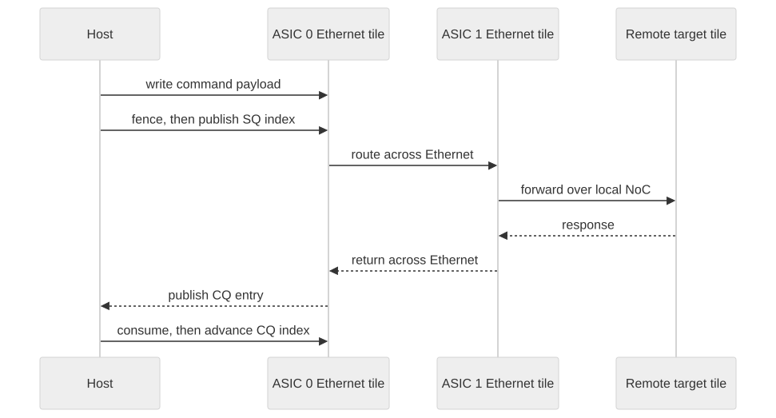

# Part 4 — A touch of Ethernet

<strong>Original article:</strong>
<a href="https://www.corsix.org/content/tt-wh-part4">Corsix, “A touch of Ethernet”</a> ·
<strong>Source class:</strong> community firmware experiment · verify against current runtime ·
<strong>Reviewed:</strong> 2026-07-31

**Learning goal:** trace a request from the PCIe-attached host through firmware
queues, an Ethernet link, and a remote ASIC—and explain the ownership and
ordering rules that keep the route correct.

{ .atlas-diagram }

<small>[Open full-size diagram](../../assets/diagrams/corsix-part4-ethernet-flow.svg) · [Diagram source](https://github.com/buicongnguyen/tenstorrent_work/blob/main/diagram_sources/corsix-part4-ethernet-flow.mmd)</small>

## Follow the reasoning

1. Establish the constraint: only the first n300 ASIC has a direct PCIe path.
2. Locate the base-firmware submission and completion queues on an Ethernet
   tile reachable from the host.
3. Encode the destination at tile, ASIC/shelf, and rack scope.
4. Write the payload before publishing the submission index.
5. Let firmware choose local execution, local-NoC forwarding, or Ethernet
   forwarding.
6. Observe completion ownership and return the response to the host.

## Architecture review

| Design choice | Optimization goal | Why it is effective | Cost or caveat |
|---|---|---|---|
| Ethernet tiles with firmware | route without host intervention at every hop | programmable forwarding composes NoC and off-chip links | firmware ABI can drift and is not the preferred public API |
| Submission/completion rings | decouple producer and consumer timing | bounded queues need only indices and fixed slots | full/empty handling and memory ordering are correctness-critical |
| One writer per index | avoid shared atomic updates | ownership makes synchronization simple and fast | multiple host threads require external serialization |
| Inline, local-block, or DMA payload | fit control and bulk traffic efficiently | avoids DMA setup for tiny messages and copies for large ones | buffer lifetime differs by mode |
| Hierarchical coordinates | scale routing beyond one chip | locality is represented directly at tile/ASIC/rack scopes | topology changes must be managed consistently |

!!! note "Expert interpretation"
    This is a small control-plane/data-plane design. Queue descriptors express
    intent; Ethernet-tile firmware owns forwarding; NoC and Ethernet carry the
    data. It is efficient because the host does not micromanage every link.
    Modern applications should use maintained TT-Metal distributed and Fabric
    APIs—the article's queue is a learning window into the substrate, not a
    stable application contract.

## Questions and guided answers

### 1. Trace a request to the second ASIC and its response.

??? note "Guided answer"
    The host reaches an Ethernet tile on ASIC 0 through PCIe and the local NoC,
    places a routing command in its submission queue, then publishes the write
    index. Firmware consumes the command, forwards it across the internal
    Ethernet link, and the remote Ethernet tile routes it over ASIC 1's NoC to
    the target. A response follows the reverse logical chain and appears in the
    completion queue for the host to consume.

### 2. Who writes and reads each queue index?

??? note "Guided answer"
    For the submission queue, the host writes `wr_idx` and firmware writes
    `rd_idx`; both may read both. For the completion queue, firmware writes
    `wr_idx` and the host writes `rd_idx`. This single-writer rule avoids
    contended read-modify-write operations. Payload-slot ownership transfers
    when the producer publishes an index and returns when the consumer advances
    its index.

### 3. What prevents an index from becoming visible before its payload?

??? note "Guided answer"
    The producer writes the command or data first, issues the required ordering
    operation, and only then updates the producer index. The article uses a
    host fence in this role. The consumer observes the index as the publication
    event. Exact cacheability, device-memory, and fence semantics must be
    verified for the current driver and platform.

### 4. Which fields select tile, ASIC, shelf, and rack?

??? note "Guided answer"
    The command separates NoC coordinates for the destination tile from
    shelf-level coordinates for the ASIC and rack-level coordinates for the
    larger installation. The useful idea is hierarchical addressing: each
    forwarding stage consumes the scope it understands. Treat the article's
    bit layout as historical evidence, not a current public ABI.

### 5. Which behavior is documented, observed, or inferred?

??? note "Guided answer"
    Header structures and flags are code-derived; returned masks and error
    responses are observations on one system; the complete firmware algorithm
    and reasons for several design details are partly inferred. A precise note
    cites the exact header commit and records firmware/software versions along
    with the observed result.

### 6. How does this meet routing, transport, Fabric, and collectives?

??? note "Guided answer"
    The queue command and forwarding path provide low-level reachability and a
    request/response transport. TT-Fabric adds maintained routing, channels,
    topology management, reliability expectations, and integration with the
    runtime. Collectives build coordinated multi-device algorithms on top.
    One raw routed read is therefore a substrate example, not a collective or
    a complete distributed programming model.

## What is optimized—and what is not

The design minimizes host interfaces, small-message overhead, index
contention, and unnecessary copies. It does not by itself optimize collective
topology, congestion, reliable long-running channels, or overlap with model
compute. Those belong to the maintained distributed runtime. The architectural
lesson is to separate route discovery, queue ownership, and payload movement
so each can evolve without changing the whole programming model.

## Verify and extend

- Compare with the pinned [Basic Ethernet guide](https://github.com/tenstorrent/tt-metal/blob/992f3ca634aac8733c70e48da395aab5361b4166/tech_reports/EthernetMultichip/BasicEthernetGuide.md)
  and [TT-Fabric architecture](https://github.com/tenstorrent/tt-metal/blob/992f3ca634aac8733c70e48da395aab5361b4166/tech_reports/TT-Fabric/TT-Fabric-Architecture.md).
- Draw submission and completion ownership separately; label every publication
  and reclamation point.
- Compare inline, local-buffer, and DMA payload paths by setup cost, copy count,
  and lifetime.
- Mark this lesson as a bridge to Atlas Level 6, not a replacement for current
  multi-device APIs.

[← Part 3 — NoC propagation delay](part3-noc-latency.md){ .md-button }
[Part 5 — Taking apart T tiles →](part5-tile-architecture.md){ .md-button .md-button--primary }
