# Part 5 — Taking apart T tiles

<strong>Original article:</strong>
<a href="https://www.corsix.org/content/tt-wh-part5">Corsix, “Taking apart T tiles”</a> ·
<strong>Source class:</strong> community reconstruction · compare with official ISA ·
<strong>Reviewed:</strong> 2026-07-31

**Learning goal:** understand a Tensix tile as a decoupled pipeline: small
RISC-V cores schedule movement and compute, instruction pipes compress and
replay commands, synchronization protects shared engines, and specialized
back ends operate on local state.

{ .atlas-diagram }

<small>[Open full-size diagram](../../assets/diagrams/corsix-part5-tensix-pipeline.svg) · [Diagram source](https://github.com/buicongnguyen/tenstorrent_work/blob/main/diagram_sources/corsix-part5-tensix-pipeline.mmd)</small>

## Follow the reasoning

1. Start at L1: local SRAM is the rendezvous point for NoC traffic and tile
   programs.
2. Separate control from throughput: five small RISC-V cores run bare-metal
   control while Tensix engines perform specialized high-volume work.
3. Follow a Tensix instruction from a T core into its pipe, through macro-op or
   replay expansion, then shared synchronization.
4. Identify the engine and its private state: Unpack/Src, Matrix, Vector/Dst,
   Pack, scalar/configuration, or movement support.
5. Observe the LLK pattern: configure reusable state once, then issue a compact
   runtime sequence repeatedly.

## Architecture review

| Design choice | Constraint it addresses | Optimization benefit | Cost or caveat |
|---|---|---|---|
| Several small control cores | data movement, compute, and packing must progress concurrently | independent schedulers overlap pipeline stages | explicit coordination and role conventions |
| Bare-metal execution | microsecond-scale kernels need predictable control | low runtime overhead and direct hardware access | limited protection and difficult recovery/debugging |
| Specialized engines | matrix, vector, format conversion, and movement have different datapaths | high performance and energy efficiency | configuration surface is large and architecture-specific |
| MOP and replay expansion | one RISC-V core cannot issue every repeated Tensix command cheaply | compact setup can sustain near one expanded instruction per cycle | templates are constrained and require correct preconfiguration |
| Shared sync, mutexes, semaphores | three pipes target shared state and engines | hardware-enforced ordering avoids busy host coordination | a bad wait or ownership protocol can deadlock the tile |
| Init/runtime LLK split | configuration changes more slowly than loop iterations | amortizes setup and exposes a simple hot path | cached state becomes an invariant the caller must preserve |

!!! note "Expert interpretation"
    This architecture is a form of **spatial pipeline with programmable
    control**. General-purpose cores handle irregular sequencing; fixed
    engines handle dense work. It is a good NPU choice because the expensive
    transistors are spent on repeated math and movement rather than speculative
    CPUs. The price is a software stack that must schedule, synchronize, and
    configure the pipeline correctly.

## Questions and guided answers

### 1. Which work belongs to BRISC/NCRISC and which to T0/T1/T2?

??? note "Guided answer"
    The conventional software mapping gives the B/BRISC and NC/NCRISC cores
    data-movement and network responsibilities, while T0, T1, and T2 drive
    Unpack, Math (Matrix/SFPU), and Pack. This division encourages overlap and
    keeps each control loop small. It is a software convention enabled by the
    hardware—not a claim that only one core can ever address a given router or
    engine.

### 2. Why can RISC-V execution continue after issuing a Tensix instruction?

??? note "Guided answer"
    Issuing a Tensix command enqueues work into a separate instruction pipe and
    backend. The control core is therefore decoupled from the engine's full
    execution latency unless a dependency, full pipe, or explicit wait stalls
    it. This lets the core prepare addresses, loop state, or future commands
    while the coprocessor works.

### 3. What do macro-op and replay mechanisms save?

??? note "Guided answer"
    They save RISC-V issue bandwidth and instruction-fetch/control overhead.
    MOP expands a configured loop-like template; replay records and emits a
    previously seen sequence. Before either is useful, opcodes, counts,
    address modifiers, formats, and engine configuration must describe the
    intended hot loop. The optimization moves work from repeated runtime issue
    into amortized setup.

### 4. What can stall a pipe, and what synchronization state is shared?

??? note "Guided answer"
    A pipe can wait for mutex ownership, semaphore conditions, source/dest
    validity, or busy execution resources; downstream backpressure can also
    stop progress. The synchronization block arbitrates commands from all
    three pipes and holds shared mutex/semaphore state. Correctness therefore
    depends on a global ownership protocol, even though each T core executes
    independently.

### 5. Why are L1, `SrcA`, `SrcB`, and `Dst` not interchangeable memories?

??? note "Guided answer"
    L1 is addressable tile SRAM used by cores and NoC traffic. `SrcA` and
    `SrcB` are operand staging state shaped for the matrix path. `Dst` is
    accumulator/result state shared with Matrix, SFPU, and Pack. Each has
    different ports, formats, lifetime rules, and producers/consumers; moving
    between them is an explicit pipeline operation, not a normal pointer copy.

### 6. Where is the article least certain?

??? note "Guided answer"
    The article clearly marks a reconstructed tile diagram and uncertainty
    around some L0 behavior and detailed configuration semantics. Treat those
    sections as hypotheses generated from instruction descriptions and code.
    Official ISA pages can confirm visible state and operations but may still
    not disclose the physical microarchitecture behind them.

### 7. How does the LLK init/runtime split use these mechanisms?

??? note "Guided answer"
    Initialization programs MOP/replay templates, scalar registers, format
    state, address modifiers, and engine-specific configuration. Runtime calls
    then issue short, repeated sequences against that prepared state. This is
    fast because setup is amortized; it is correct only while formats, layout,
    buffer roles, and synchronization assumptions match the initialized
    configuration.

## What is optimized

The tile optimizes pipeline overlap, local data reuse, control efficiency, and
energy per operation. It deliberately does not optimize for a simple uniform
ISA or protected multitasking. From an architect's viewpoint, that is a sound
accelerator trade: make the frequent tensor path cheap, then use software
layers to hide the irregular machinery from most application developers.

## Verify and extend

- Compare with the official [Tensix Coprocessor overview](https://github.com/tenstorrent/tt-isa-documentation/blob/main/WormholeB0/TensixTile/TensixCoprocessor/README.md),
  [MOP](https://github.com/tenstorrent/tt-isa-documentation/blob/main/WormholeB0/TensixTile/TensixCoprocessor/MOP.md), and
  [REPLAY](https://github.com/tenstorrent/tt-isa-documentation/blob/main/WormholeB0/TensixTile/TensixCoprocessor/REPLAY.md).
- Locate one mechanism in [`tt-llk`](https://github.com/tenstorrent/tt-llk), then
  find the corresponding TT-Metal compute-kernel wrapper.
- Draw three timelines—Unpack, Math, Pack—and mark the wait that protects every
  shared buffer transition.
- Use the [kernel code-indexing chapter](../../rewrites/code-indexing/kernel-code-indexing.md)
  to connect the hardware nouns to source symbols.

[← Part 4 — A touch of Ethernet](part4-ethernet.md){ .md-button }
[Part 6 — Vector instruction set →](part6-vector-isa.md){ .md-button .md-button--primary }
