# Part 6 — Vector instruction set

<strong>Original article:</strong>
<a href="https://www.corsix.org/content/tt-wh-part6">Corsix, “Vector instruction set”</a> ·
<strong>Source class:</strong> community ISA analysis · Wormhole-specific · verify instruction semantics ·
<strong>Reviewed:</strong> 2026-07-31

**Learning goal:** understand why Tensix adds a programmable 32-lane SFPU
beside the fixed matrix pipeline, how values move through `Dst`, and how
predication, LUTs, and software-managed hazards trade flexibility for cost.

{ .atlas-diagram }

<small>[Open full-size diagram](../../assets/diagrams/corsix-part6-sfpu-flow.svg) · [Diagram source](https://github.com/buicongnguyen/tenstorrent_work/blob/main/diagram_sources/corsix-part6-sfpu-flow.mmd)</small>

## Follow the reasoning

1. Matrix/Unpack/Pack efficiently handle regular linear algebra but cannot
   express every activation, reduction, comparison, or conversion.
2. SFPU supplies a programmable SIMD path with eight vector registers, fixed
   and programmable constants, flags, and a small flag stack.
3. Values enter from `Dst` through `SFPLOAD`, execute as fp32/int32/sign-magnitude
   lane operations, and return through `SFPSTORE`.
4. Predication refines active lanes instead of branching thirty-two ways.
5. LUT and fused multiply-add instructions approximate nonlinear functions
   locally, avoiding a host or L1 round trip.
6. Latency hazards and generation differences remain visible to toolchain and
   low-level code.

## Architecture review

| Design choice | Optimization goal | Why it is effective | Cost or caveat |
|---|---|---|---|
| Separate programmable SFPU | support non-matrix operations without bloating Matrix | flexibility sits next to accumulator data | another ISA, compiler, and configuration domain |
| 32 SIMD lanes | apply one instruction across a tile fragment | high control amortization for elementwise work | divergence becomes masked-lane inefficiency |
| Access through `Dst` | fuse post-processing with matrix results | avoids L1 store/reload between MatMul and activation | SFPU cannot directly use arbitrary L1 pointers |
| Per-lane flags and stack | express nested conditions without scalar branches | preserves SIMD execution under conditional logic | limited depth and subtle state management |
| Piecewise-linear LUT operations | approximate nonlinear functions cheaply | lookup plus FMA replaces long polynomial sequences | range selection and precision need validation |
| Software-visible latency on Wormhole | simplify hardware scheduling | smaller control machinery | compiler/hand code must insert hazard delays |

!!! note "Expert interpretation"
    SFPU fills the gap between a very efficient fixed matrix engine and the
    long tail of model operations. Sharing `Dst` enables fusion: keep MatMul
    results on tile, apply an activation or conversion, then pack once. This is
    often more valuable than the vector arithmetic alone because it removes
    movement and synchronization.

## Questions and guided answers

### 1. Why can SFPU operate on `Dst` but not directly on L1?

??? note "Guided answer"
    `Dst` is the on-pipeline result/accumulator state already connected to the
    Math engines. Restricting SFPU to this path reduces ports and address
    machinery while enabling cheap post-processing of matrix outputs. Direct
    L1 access would increase flexibility but add load/store, arbitration, and
    cache/scratchpad complexity. Unpack and Pack remain the intended bridges to
    memory.

### 2. What is one vector register and how is lane type chosen?

??? note "Guided answer"
    A Wormhole SFPU vector register contains 32 lanes of 32 bits. The bits have
    no permanent type; an instruction interprets them as fp32, int32, or a
    sign-magnitude representation. This is storage reuse rather than dynamic
    typing—software and the selected opcode must agree on meaning.

### 3. How do flags represent conditional execution?

??? note "Guided answer"
    When flagging is active, each lane has an enable bit. A comparison refines
    the mask: failing lanes become inactive while already inactive lanes stay
    inactive. Push/pop state supports nested conditions. Instructions still
    follow one SIMD control stream, so predication avoids branch divergence but
    does not recover work from disabled lanes.

### 4. Which operations have hazards, and who inserts delays on Wormhole?

??? note "Guided answer"
    Multi-cycle operations such as SFPU fused arithmetic, some shifts, and
    swaps can produce a result later than the next instruction would consume
    it. Wormhole low-level code or the compiler must schedule independent work
    or insert `SFPNOP`; later architectures may interlock more cases. Verify the
    exact hazard table for the target architecture instead of generalizing.

### 5. Which behaviors are architecture-specific?

??? note "Guided answer"
    Lane count, opcodes, hazard rules, comparison modes, right-shift behavior,
    cross-lane quirks, PRNG behavior, and format conversions can differ across
    Wormhole and Blackhole. The transferable concepts are SIMD, predication,
    fusion, and explicit data movement; the exact encodings and workarounds are
    not transferable.

### 6. What abstraction does SFPI provide?

??? note "Guided answer"
    SFPI provides C++-style vector operations, types, conditions, and
    intrinsics that the toolchain lowers to raw SFPU instructions and required
    scheduling. It protects kernel authors from most encoding and hazard
    details while preserving an escape path for specialized operations. Always
    check generated code when a performance claim depends on instruction count.

### 7. How might `tanh` use the vector pipeline?

??? note "Guided answer"
    A plausible path loads values from `Dst`, performs range reduction and
    sign/absolute-value handling, uses a LUT or polynomial built from FMA and
    constants, applies lane predicates for exceptional ranges, then stores the
    result to `Dst`. This is a reasoning model, not a claim about one current
    implementation; inspect the linked `tt-llk`/SFPI source and disassembly to
    confirm the actual sequence.

## What is optimized

The SFPU design optimizes fusion, local reuse, and instruction-level
parallelism for elementwise work. Its unusual instructions are best evaluated
by the sequences they remove: a LUT-FMA primitive or cross-lane transpose can
be worthwhile even if it looks specialized. The counterweight is verification:
precision behavior, hazards, and generation changes can matter more than raw
instruction count.

## Verify and extend

- Start with official [`Dst`](https://github.com/tenstorrent/tt-isa-documentation/blob/main/WormholeB0/TensixTile/TensixCoprocessor/Dst.md),
  [`SFPLOAD`](https://github.com/tenstorrent/tt-isa-documentation/blob/main/WormholeB0/TensixTile/TensixCoprocessor/SFPLOAD.md), and
  [`SFPMAD`](https://github.com/tenstorrent/tt-isa-documentation/blob/main/WormholeB0/TensixTile/TensixCoprocessor/SFPMAD.md).
- Find one SFPI intrinsic and follow its lowering to the architecture-specific
  instruction sequence.
- Compare a fused MatMul+activation with an L1 round-trip version by bytes moved,
  barriers, and cycles—not only SFPU instruction count.
- Keep a separate Wormhole/Blackhole differences table.

[← Part 5 — Taking apart T tiles](part5-tile-architecture.md){ .md-button }
[Part 7 — Bits of the MatMul →](part7-matmul.md){ .md-button .md-button--primary }
