# Part 7 — Bits of the MatMul

<strong>Original article:</strong>
<a href="https://www.corsix.org/content/tt-wh-part7">Corsix, “Bits of the MatMul”</a> ·
<strong>Source class:</strong> community architecture analysis · hypotheses must be verified ·
<strong>Reviewed:</strong> 2026-07-31

**Learning goal:** trace the complete L1-to-L1 matrix pipeline and explain the
central Wormhole tradeoff: narrow multipliers and selectable fidelity reduce
area/energy, while extra phases recover precision at lower throughput.

{ .atlas-diagram }

<small>[Open full-size diagram](../../assets/diagrams/corsix-part7-matmul-flow.svg) · [Diagram source](https://github.com/buicongnguyen/tenstorrent_work/blob/main/diagram_sources/corsix-part7-matmul-flow.mmd)</small>

## Follow the reasoning

1. Begin with the required L1-to-L1 operation, not the Matrix unit alone.
2. Unpack reads tiles, converts/formats operands, and fills `SrcA`/`SrcB`.
3. Matrix repeatedly applies its native 8×16-by-16×16 primitive into `Dst`;
   several primitives compose one software-visible 32×32 tile operation.
4. Optional SFPU work modifies `Dst` without leaving the tile pipeline.
5. Pack converts, rounds, optionally applies supported post-processing, and
   writes the result to L1.
6. Compare stage rates: once low-precision Matrix throughput exceeds movement,
   Unpack/Pack or the surrounding data path becomes the roofline.

## Architecture review

| Design choice | Constraint it addresses | Optimization benefit | Cost or caveat |
|---|---|---|---|
| Separate Unpack and Pack | Matrix ports should be spent on math, not general memory formats | conversion and movement overlap compute | buffers and synchronization must be scheduled correctly |
| Native smaller matrix primitive | a fixed regular array is efficient to route and clock | massive multiply-accumulate density | software composes larger tiles and handles edge shapes |
| `Dst` accumulation | partial products should stay near compute | reuse avoids repeated L1 traffic and rounding | finite accumulator capacity constrains blocking |
| Narrow 7b×5b multipliers | full-width multipliers replicated thousands of times cost area/energy | more parallel multipliers fit on each tile | high-precision formats need multiple fidelity phases |
| Selectable fidelity | workloads value accuracy and speed differently | software chooses precision/throughput point | more phases add latency and intermediate rounding |
| MOP/replay-driven issue | repeated matrix schedules must sustain engine rate | command expansion frees RISC-V control cycles | rigid templates reward regular loops |

!!! note "Expert interpretation"
    The important design is not “a fast matrix unit”; it is a **balanced local
    pipeline**. A wider matrix array would be wasted if operands or results
    could not arrive fast enough. Wormhole exposes fidelity because the best
    area/energy point depends on data format and acceptable error. The correct
    optimization target is therefore end-to-end tiles per second, not isolated
    multiplier count.

## Questions and guided answers

### 1. Why can Matrix not complete the L1-to-L1 operation alone?

??? note "Guided answer"
    Matrix consumes staged operands in `SrcA`/`SrcB` and accumulates into `Dst`;
    it does not perform the complete general L1 load, format conversion, and
    L1 store path. Unpack and Pack provide those boundaries. This separation
    lets each engine specialize and overlap, but correctness requires buffer
    availability and format state to agree across all three.

### 2. Which core drives Unpack, Matrix/SFPU, and Pack—is that mandatory?

??? note "Guided answer"
    The traditional mapping is T0→Unpack, T1→Math, T2→Pack. It creates three
    concurrent control streams that align with pipeline stages. Part 7 notes
    that engines can be addressed more flexibly; the mapping is a productive
    convention, not a universal hard-wired exclusivity rule. Current source is
    authoritative for supported dispatch relationships.

### 3. How does the primitive compose into a 32×32 tile operation?

??? note "Guided answer"
    One native operation updates an 8×16 destination slice using a 16-term
    reduction. A 32×32 result is partitioned into destination slices and the K
    dimension is covered in chunks. For the arrangement analyzed in the
    article, sixteen primitive updates cover one 32×32 block. The key idea is
    spatial and reduction tiling; exact issue order depends on layout and LLK.

### 4. Where can precision work occur?

??? note "Guided answer"
    Unpack can decode storage formats and prepare exponent/mantissa fragments;
    Matrix multiplies selected fragments and accumulates partial products;
    `Dst` preserves intermediate accumulation; Pack converts and rounds to the
    output format. SFPU can add programmable transformations. Moving work among
    stages can simplify the replicated Matrix datapath, but may increase
    movement or configuration complexity.

### 5. Why do more fidelity phases improve precision but reduce throughput?

??? note "Guided answer"
    A narrow multiplier consumes only part of wider mantissas in one phase.
    Additional phases multiply more bit fragments and combine their weighted
    partial products, recovering precision. The same matrix resources spend
    more cycles per logical operation, and intermediate rounding may occur, so
    peak operations per second fall as fidelity rises.

### 6. What does the advertised-throughput cross-check reveal?

??? note "Guided answer"
    The article derives per-unit rates from multiplier count, clock, fidelity
    phases, and usable tile count, then compares them with product figures.
    Agreement for some formats supports the model. A lower-than-compute-only
    result at the lowest precision suggests another stage—such as Unpack, Pack,
    L1 access, or issue cadence—has become the bottleneck. It is evidence for a
    pipeline roofline, not proof of one exact stage.

### 7. Which claims are specifications and which are hypotheses?

??? note "Guided answer"
    Native shapes, visible formats, instructions, and fidelity controls can be
    checked against official ISA and TT-Metal reports. The exact internal
    decomposition of floating-point work, physical multiplier arrangement,
    and reason behind a throughput gap include architectural inference. Keep
    derived arithmetic reproducible and label microarchitectural explanations
    as models until confirmed.

## What is optimized

Wormhole optimizes replicated math density, local accumulation, configurable
precision, and stage overlap. The best choice is good because it avoids paying
full fp16/tf32 multiplier cost for every low-precision workload. The tradeoff
is software-visible fidelity and a more complex pipeline. A performance engineer
should measure Unpack, Math, and Pack timelines together and choose fidelity
from an accuracy target—not from peak TFLOP/s alone.

## Verify and extend

- Compare the path with official [Unpackers](https://github.com/tenstorrent/tt-isa-documentation/blob/main/WormholeB0/TensixTile/TensixCoprocessor/Unpackers/README.md),
  [Matrix Unit](https://github.com/tenstorrent/tt-isa-documentation/blob/main/WormholeB0/TensixTile/TensixCoprocessor/MatrixUnit.md), and
  [Packers](https://github.com/tenstorrent/tt-isa-documentation/blob/main/WormholeB0/TensixTile/TensixCoprocessor/Packers/README.md).
- Compare the software view with the [Matrix engine learner chapter](../../rewrites/matrix_engine/matrix_engine.md).
- Build a table for one format: fidelity phases, expected cycles, measured
  cycles, accuracy metric, and the stage that limits throughput.
- Explain how the same narrow-multiplier tradeoff would change if memory
  bandwidth doubled but accumulator capacity did not.

[← Part 6 — Vector instruction set](part6-vector-isa.md){ .md-button }
[Course overview and capstone →](../corsix-reading-workbook.md){ .md-button .md-button--primary }
