# How to use the TT-Metal DeepWiki

<p class="source-note">
<strong>Original resource:</strong>
<a href="https://deepwiki.com/tenstorrent/tt-metal">DeepWiki · <code>tenstorrent/tt-metal</code></a>
· <strong>Trust:</strong> discovery index · verify against official sources
· <strong>Checked:</strong> 2026-07-31
</p>

DeepWiki is most useful as a **map into a large, changing codebase**. It groups
subsystems, draws relationships, and lists relevant source files. It is not the
authority for an API contract, performance number, architecture detail, or
interview answer. Use it to discover what to inspect; use official source,
documentation, and measurements to decide what is true.

!!! warning "The index can drift page by page"
    On 2026-07-31 the [DeepWiki home page](https://deepwiki.com/tenstorrent/tt-metal)
    reported repository commit
    [`96d1d1`](https://github.com/tenstorrent/tt-metal/commit/96d1d1)
    from 2026-07-02. The
    [LLK page](https://deepwiki.com/tenstorrent/tt-metal/3-low-level-kernel-apis-%28llk%29)
    displayed a different indexed commit and date. Record the **page's own**
    “Last indexed” value every time; do not assume the home-page value applies
    everywhere.

## The evidence loop

{ .atlas-diagram }

<small>[Open full-size diagram](../assets/diagrams/deepwiki-evidence-loop.svg) · [Diagram source](https://github.com/buicongnguyen/tenstorrent_work/blob/main/diagram_sources/deepwiki-evidence-loop.mmd)</small>

Use the same seven steps for every topic:

1. **Ask one concrete question.** “Why is the first run slow?” is researchable;
   “How is TT-Metal fast?” is too broad.
2. **Open the narrowest DeepWiki page.** Read its diagrams and terminology as a
   proposed map, not as a final explanation.
3. **Record provenance.** Save the page URL, its displayed indexed commit and
   date, and your access date.
4. **Follow “Relevant source files.”** Inspect the implementation and tests at
   the indexed commit. If a link resolves to `main`, pin it before taking notes.
5. **Compare official material.** Start with this Atlas's
   [pinned report catalog](../reference/report-catalog.md), then check current
   [TT-Metalium documentation](https://docs.tenstorrent.com/tt-metal/latest/tt-metalium/)
   for behavior that may have changed.
6. **Separate evidence from inference.** Do not silently turn a class name,
   test, or comment into a guaranteed API or performance claim.
7. **Predict and measure.** Run a small A/B experiment using the same workload,
   then publish the observation and original links with the learner note.

## Evidence labels for notes

| Label | Meaning | Acceptable evidence |
|---|---|---|
| **Official · pinned** | Reproducible Tenstorrent text or code at an exact commit | Atlas snapshot or commit-pinned GitHub link |
| **Official · living** | Current Tenstorrent behavior that can change | `main` source or `latest` documentation, with access date |
| **DeepWiki map** | Generated explanation or relationship worth investigating | Exact DeepWiki page plus its displayed indexed commit |
| **Observed** | Result reproduced in a controlled run | Command, configuration, metric, and output artifact |
| **Inferred** | Explanation consistent with evidence but not explicitly guaranteed | Reasoning plus the evidence it depends on |
| **Open** | Unresolved contradiction or untested hypothesis | A precise next check |

!!! tip "A useful disagreement is not a failure"
    If DeepWiki, the pinned report, and current code disagree, preserve all
    three references. The difference may reveal an API migration, an
    architecture boundary, or a generated-summary error.

## Structured reading map

The full DeepWiki contains many pages. Start with this smaller route and stop
when it answers your question.

### Orientation and runtime

| Read | Use it to ask | Verify or continue with |
|---|---|---|
| [Overview](https://deepwiki.com/tenstorrent/tt-metal) | Where are TT-NN, TT-Metalium, LLRT, and hardware boundaries? | [Architecture mental model](../start/architecture-mental-model.md) and pinned [`METALIUM_GUIDE.md`](https://github.com/tenstorrent/tt-metal/blob/992f3ca634aac8733c70e48da395aab5361b4166/METALIUM_GUIDE.md) |
| [System architecture](https://deepwiki.com/tenstorrent/tt-metal/1.2-system-architecture-overview) | Which runtime components initialize and own resources? | [Learning path](../start/learning-path.md) |
| [Core runtime](https://deepwiki.com/tenstorrent/tt-metal/2-core-runtime-system-%28tt-metalium%29) | How does host state reach a device? | Official [TT-Metalium examples](https://docs.tenstorrent.com/tt-metal/latest/tt-metalium/tt_metal/examples/index.html) |
| [Program and kernel system](https://deepwiki.com/tenstorrent/tt-metal/2.4-program-and-kernel-system) | What is compile-time, runtime, and per-core? | [Kernel code indexing](../rewrites/code-indexing/kernel-code-indexing.md) |
| [Fast Dispatch and command queues](https://deepwiki.com/tenstorrent/tt-metal/2.5-fast-dispatch-and-command-queue-system) | How do issue, prefetch, dispatch, worker, and completion stages connect? | [Advanced model optimizations](../rewrites/AdvancedPerformanceOptimizationsForModels/AdvancedPerformanceOptimizationsForModels.md) and the official [Metalium Guide](https://github.com/tenstorrent/tt-metal/blob/main/METALIUM_GUIDE.md#fast-dispatch) |

### Memory and dataflow

| Read | Use it to ask | Verify or continue with |
|---|---|---|
| [Memory management and allocators](https://deepwiki.com/tenstorrent/tt-metal/2.7-memory-management-and-allocators) | Who owns DRAM/L1 regions and bank placement? | [Device allocator](../rewrites/memory/allocator.md) |
| [Data movement and buffer operations](https://deepwiki.com/tenstorrent/tt-metal/2.12-data-movement-and-buffer-operations) | How do buffers and transfers enter an execution flow? | [TensorAccessor](../rewrites/tensor_accessor/tensor_accessor.md) and [NoC tile transfer](../rewrites/prog_examples/NoC_tile_transfer/NoC_tile_transfer.md) |
| [Program configuration and optimization](https://deepwiki.com/tenstorrent/tt-metal/4.10-program-configuration-and-optimization) | Which shapes, layouts, sharding choices, precision modes, and program hashes select a path? | [Tensor and memory layouts](../rewrites/tensor_layouts/tensor_layouts.md), [data formats](../rewrites/data_formats/data_formats.md), and current operation source |

### Optimization and proof

| Read | Use it to ask | Verify or continue with |
|---|---|---|
| [Performance optimization techniques](https://deepwiki.com/tenstorrent/tt-metal/7.4-performance-optimization-techniques) | Which gap is trace, multiple CQs, async execution, or memory placement intended to remove? | [Performance optimization track](../start/optimization-path.md) and the [pinned advanced-optimization report](https://github.com/tenstorrent/tt-metal/blob/992f3ca634aac8733c70e48da395aab5361b4166/tech_reports/AdvancedPerformanceOptimizationsForModels/AdvancedPerformanceOptimizationsForModels.md) |
| [Profiling and performance analysis](https://deepwiki.com/tenstorrent/tt-metal/8.4-profiling-and-performance-analysis) | Which host, device, NoC, or counter evidence can test the hypothesis? | [Metal profiler](../rewrites/MetalProfiler/metal-profiler.md), [performance counters](../rewrites/PerfCounters/perf-counters.md), and official [Tracy guide](https://docs.tenstorrent.com/tt-metal/latest/tt-metalium/tools/tracy_profiler.html) |
| [Model tracer and operation extraction](https://deepwiki.com/tenstorrent/tt-metal/9.7-model-tracer-and-operation-extraction) | How can a model be reduced to the operation or program that needs study? | [Graph tracing](../rewrites/ttnn/graph-tracing.md) and [operation tracing](../rewrites/ttnn/operation-tracing.md) |

### Lowest layers

| Read | Use it to ask | Verify or continue with |
|---|---|---|
| [Low-Level Kernel APIs](https://deepwiki.com/tenstorrent/tt-metal/3-low-level-kernel-apis-%28llk%29) | Which compute API reaches Unpack, Math/SFPU, and Pack behavior? | [Official ISA route](isa-reference.md), [matrix engine](../rewrites/matrix_engine/matrix_engine.md), and architecture-matched source |

Do not descend to LLK or ISA merely because a page exists. Descend after the
profiler or a correctness question identifies a lower-layer mechanism.

## Optimization-oriented DeepWiki pass

Use five passes instead of reading the wiki front to back:

1. **Runtime pass:** program construction → program cache → issue queue →
   command prefetch → dispatch → completion.
2. **Iteration pass:** Metal Trace → multiple command queues → events →
   non-blocking host/device execution.
3. **Memory pass:** tensor layout → sharding → DRAM/L1 placement → reuse →
   resharding and conversion costs.
4. **Kernel pass:** reader → circular buffers → compute → writer, including
   double buffering, multicast, and core work balance.
5. **Proof pass:** host timeline → device zones → NoC/DRAM utilization →
   hardware counters → architecture-specific LLK/ISA only if needed.

## Keep the two meanings of prefetch separate

| Term | Object being prefetched | Layer | Typical evidence |
|---|---|---|---|
| **Dispatch prefetch** | Command pages from the host issue queue | Runtime / Fast Dispatch | Dispatch timeline or firmware/source inspection |
| **Data prefetch / pipelining** | Future tensor pages or tiles into a circular buffer | Kernel dataflow | Reader/compute overlap, CB stalls, NoC and DRAM measurements |

They share the principle of preparing future work before a consumer needs it,
but they are not the same API, buffer, processor, or optimization.

## Reusable research-note template

```markdown
# Question

## Bottleneck and visible symptom

## Stack level and actors

## Before / after flow

## Mechanism and removed overhead

## Correctness invariants

## A/B experiment
- Architecture, software commit, firmware:
- Shape, dtype, layout, memory config:
- Warm-up and iteration count:
- Baseline:
- One changed variable:
- Predicted observation:
- Actual observation:

## Transfer to another NPU

## Interview explanation

## Source ledger
| Class | URL | Commit/version | Accessed | Claim supported |
|---|---|---|---|---|
| DeepWiki map |  |  |  |  |
| Official pinned |  |  |  |  |
| Official living |  |  |  |  |
| Observed artifact |  |  |  |  |

## Open questions
```

## What not to copy

- Do not mirror DeepWiki pages verbatim. Write an independent explanation from
  the verified evidence and link the original location.
- Do not copy a diagram without checking whether its edges are explicit in
  source or are generated inference.
- Do not retain a performance adjective such as “fast” without naming the
  baseline, metric, workload, architecture, and version.
- Do not generalize a Wormhole register, queue limit, memory size, or
  instruction rule to Blackhole or a future architecture.
- Do not report a cache hit, async enqueue, or trace capture as an end-to-end
  speedup until the same steady-state workload is measured.

## Questions before publishing a learner page

1. Can every factual claim be traced to a source row or experiment?
2. Did you distinguish pinned historical behavior from current behavior?
3. Did you record the DeepWiki page's own indexed commit?
4. Is the bottleneck visible in a named metric or timeline?
5. Does the optimization preserve tensor addresses, ownership, ordering, and
   synchronization where required?
6. Which part is Tenstorrent-specific, and which principle transfers to another
   NPU runtime?
