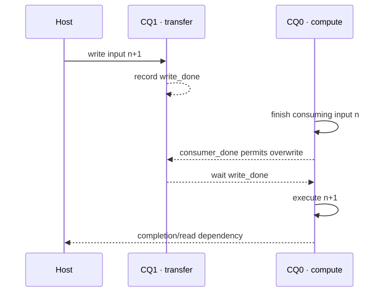

# Lesson 4 — Design command queues, events, and buffer ownership

<strong>Original DeepWiki pages:</strong>
<a href="https://deepwiki.com/tenstorrent/tt-metal/2.5-fast-dispatch-and-command-queue-system">Fast Dispatch and Command Queue System</a> ·
<a href="https://deepwiki.com/tenstorrent/tt-metal/7.4-performance-optimization-techniques">Performance Optimization Techniques</a>
· <strong>Official report:</strong>
<a href="https://github.com/tenstorrent/tt-metal/blob/9e8204b685b523ceb396eae2693e3252245c404b/tech_reports/AdvancedPerformanceOptimizationsForModels/AdvancedPerformanceOptimizationsForModels.md#2-multiple-command-queues">Multiple Command Queues at <code>9e8204b</code></a>
· <strong>Worked official example:</strong>
<a href="https://github.com/tenstorrent/tt-metal/blob/9e8204b685b523ceb396eae2693e3252245c404b/tt_metal/programming_examples/distributed/4_distributed_trace_and_events/distributed_trace_and_events.cpp"><code>distributed_trace_and_events.cpp</code></a>
· <strong>Checked:</strong> 2026-07-31

Multiple command queues create concurrency; events make that concurrency
correct. The expert method is to design ownership first and assign queue numbers
second.

## Start from ordering semantics

{ .atlas-diagram }

<small>[Open full-size diagram](../../assets/diagrams/deepwiki-command-queues.svg) · [Diagram source](https://github.com/buicongnguyen/tenstorrent_work/blob/main/diagram_sources/deepwiki-command-queues.mmd)</small>

Within one command queue, commands execute in queue order. Across independent
queues, textual host order does not create device order. If the host enqueues a
write on CQ1 and a compute program on CQ0, compute may observe the buffer before
the write completes unless an event creates a happens-before edge.

That yields two fundamental hazards for a reused input buffer:

1. **read-before-produce:** compute consumes before transfer completes;
2. **overwrite-before-consume:** the next transfer overwrites while the previous
   compute still reads.

One directional event fixes only one hazard. Safe reuse normally needs both a
producer-complete edge and a consumer-complete edge.

## Write the ownership table before code

For double-buffered model input:

| Buffer slot | Current producer | Next consumer | May be overwritten when |
|---|---|---|---|
| input A for iteration `n` | CQ1 write | CQ0 first operation | CQ0 records consumer-done |
| input B for iteration `n+1` | CQ1 write | CQ0 first operation | CQ0 records consumer-done |
| output A for iteration `n` | CQ0 last operation | CQ1/host read | readback records done |
| output B for iteration `n+1` | CQ0 last operation | CQ1/host read | readback records done |

The slots alternate. At any moment, one can be consumed while the other is
filled. If both iterations use one address, “overlap” becomes a race unless the
write waits for consumption, which may eliminate the intended overlap.

## Derive the minimum event graph

For each buffer transition, create an edge only where ownership changes:

- CQ1 writes input → record `write_done` → CQ0 waits before consuming;
- CQ0 finishes the last read → record `consumer_done` → CQ1 waits before reuse;
- CQ0 produces output → record `output_done` → readback queue waits;
- readback finishes → record `read_done` → CQ0 waits before overwriting output.

Events are cheaper and more precise than globally synchronizing the device, but
more events are not automatically safer. Redundant or cyclic edges serialize the
pipeline or deadlock it. Draw a directed acyclic graph for one steady-state
iteration before writing the loop.

## Worked investigation: adding CQ1 made no improvement

**Observation:** Input writes were moved to CQ1, but iteration latency stayed
flat.

### Step 1 — ask whether overlap is possible

Let `Tcompute` be model execution time and `Twrite` input transfer time. An ideal
two-stage steady-state pipeline approaches `max(Tcompute, Twrite)`, not zero and
not `Tcompute + Twrite`. If the write is only 2% of iteration time, even perfect
overlap has little potential.

### Step 2 — inspect the critical path

Common reasons CQ1 does not help:

- the host synchronizes immediately after the write;
- CQ0 waits for `write_done` before it could have done independent work;
- only one input buffer exists, so CQ1 must wait for CQ0 before every write;
- allocation or layout conversion occurs inside the timed loop;
- readback shares CQ1 and extends its critical path;
- both queues contend for the same PCIe, DRAM, or NoC resource;
- compute already dominates, so hidden transfer does not change throughput.

### Step 3 — predict a timeline

The desired steady state shows write `n+1` overlapping compute `n`, followed by
a short event edge into compute `n+1`. If the timeline instead shows
write → wait → compute → wait, concurrency exists in configuration only.

### Step 4 — preserve correctness under stress

Use distinctive per-iteration input patterns and delayed consumers. A constant
input can hide stale reads, while a fast consumer can hide overwrite races.
Verify many iterations and both buffer slots.

## Queue design tradeoffs

| Decision | Benefit | Cost/risk |
|---|---|---|
| second queue | independent progress and possible overlap | explicit cross-queue dependencies |
| double buffering | decouples producer and consumer | more memory and lifetime state |
| non-blocking read/write | lets host submit ahead | host data unusable until completion |
| narrow event waits | preserves unrelated concurrency | more reasoning than global sync |
| global synchronize | simple phase boundary | destroys overlap if placed in loop |

Queue count and capabilities are version-sensitive. The researched official
report describes up to two Fast Dispatch queues for that snapshot; verify the
target device/runtime rather than treating that as an eternal hardware fact.

## Questions and expert answers

### 1. Why is enqueue order in the host thread insufficient across two queues?

???+ note "Expert answer — reasoning"
    Enqueue order establishes when commands enter each independent stream, not
    how the device interleaves those streams. Each queue preserves its own order,
    but no implicit cross-queue edge says that CQ1's write finishes before CQ0's
    read. Record an event after the producer and wait for it in the consumer.

### 2. Why are two events often needed for one reused input buffer?

???+ note "Expert answer — reasoning"
    Data moves through a cycle of ownership. Producer-done prevents the consumer
    from reading too early. Consumer-done prevents the next producer from
    overwriting too early. Those are different hazards in opposite directions;
    one event cannot generally encode both transitions safely.

### 3. What is the upper bound on benefit from overlapping transfer and compute?

???+ note "Expert answer — reasoning"
    In steady state, serial time is approximately `Twrite + Tcompute`; perfect
    overlap approaches `max(Twrite, Tcompute)` plus unavoidable dependencies.
    The shorter stage can be hidden, but the longer remains. Contention and
    pipeline fill/drain reduce the realized gain, so measure multiple iterations.

## Experiment to complete

Draw the ownership table and event DAG for input, output, and readback in your
actual loop. Then compare one queue, two queues with a global wait, and two queues
with narrow events using identical buffer placement and correctness checks.

**Previous:** [Program-cache identity](program-cache.md) ·
**Next:** [Metal Trace](metal-trace.md) ·
[Course index](../deepwiki-research-guide.md)
