# Lesson 2 — Reconstruct Fast Dispatch as a command lifecycle

<strong>Original DeepWiki page:</strong>
<a href="https://deepwiki.com/tenstorrent/tt-metal/2.5-fast-dispatch-and-command-queue-system">Fast Dispatch and Command Queue System</a>
· <strong>Official guide:</strong>
<a href="https://github.com/tenstorrent/tt-metal/blob/9e8204b685b523ceb396eae2693e3252245c404b/METALIUM_GUIDE.md#fast-dispatch"><code>METALIUM_GUIDE.md</code> at <code>9e8204b</code></a>
· <strong>Firmware:</strong>
<a href="https://github.com/tenstorrent/tt-metal/blob/9e8204b685b523ceb396eae2693e3252245c404b/tt_metal/impl/dispatch/kernels/cq_prefetch.cpp"><code>cq_prefetch.cpp</code></a> ·
<a href="https://github.com/tenstorrent/tt-metal/blob/9e8204b685b523ceb396eae2693e3252245c404b/tt_metal/impl/dispatch/kernels/cq_dispatch.cpp"><code>cq_dispatch.cpp</code></a>
· <strong>Checked:</strong> 2026-07-31

Fast Dispatch is not simply a flag that makes kernels faster. It changes **who
drives command progress**. The architecture question is whether host submission
can be decoupled from worker execution without losing ordering, flow control, or
completion visibility.

## Build the mechanism from the bottleneck

{ .atlas-diagram }

<small>[Open full-size diagram](../../assets/diagrams/deepwiki-fast-dispatch.svg) · [Diagram source](https://github.com/buicongnguyen/tenstorrent_work/blob/main/diagram_sources/deepwiki-fast-dispatch.mmd)</small>

Assume a host launches many small programs. If it synchronously constructs,
transfers, launches, and waits for every one, worker cores can finish one program
before the host makes the next visible. Kernel optimization cannot remove that
empty interval.

Fast Dispatch introduces a pipeline:

1. Host runtime encodes commands and places them in an issue region in system
   memory.
2. A device-side prefetcher obtains command pages ahead of the dispatcher.
3. The dispatcher decodes commands, coordinates worker launch/data movement,
   and respects ordering and resource constraints.
4. Worker kernels perform the actual tensor work.
5. Completion information returns through the completion region so queue space,
   read results, and synchronization can progress.

The prefetch and dispatch cores are control processors. Moving control closer to
the device reduces repeated host intervention; it does not reduce the bytes or
instructions executed by a worker kernel.

## Why prefetch and dispatch are separate stages

The consumer of command data should not wait for transport if transport can run
ahead. Separating the stages permits overlap, but creates bounded-buffer
questions:

| State | Producer | Consumer | Backpressure condition |
|---|---|---|---|
| host issue queue | host runtime | prefetch core | producer catches unread region |
| prefetch/command-data region | prefetch core | dispatch core | dispatcher cannot retire data fast enough |
| worker launch/credits | dispatcher | worker cores | workers or dependent resources are unavailable |
| completion queue | dispatcher/device | host runtime | host has not reclaimed completion space |

This table is more useful than memorizing class names because it predicts where
a stall must propagate. If completion is not drained, dispatch cannot recycle
space indefinitely; if dispatch is backpressured, prefetch eventually stops; if
prefetch stops, issue cannot advance forever.

The current prefetch firmware contains explicit queue pointers, wrap handling,
in-flight reads, and stall state. The dispatch firmware manages completion-queue
pointers and worker-related state. Those files support the pipeline model; they
do not by themselves tell you which stage limits a specific run.

## Fast Dispatch versus slow dispatch

The official guide describes Fast Dispatch as the production path and slow
dispatch as a debugging path. Slow mode bypasses asynchronous command-queue
behavior and makes the CPU actively manage operations. Therefore:

- do not describe slow mode as an equal performance backend;
- do not assume an application using async APIs can switch modes unchanged;
- use it to isolate whether failure lives in command queuing/dispatch or in the
  worker program;
- compare correctness paths before comparing their latency.

The useful debugging question is: **Does the failure survive when the dispatch
pipeline is removed?** If yes, inspect program construction, runtime arguments,
buffers, and kernels. If no, inspect command encoding, queue state, dispatch
topology, and completion handling.

## Command prefetch is not tensor prefetch

| Question | Dispatch prefetch | Kernel data prefetch |
|---|---|---|
| What moves? | encoded command pages | tensor pages or tiles |
| Consumer | dispatch firmware | compute or writer stage |
| Buffering | dispatch queues/command-data region | L1 circular buffers |
| Expected benefit | fewer command starvation gaps | overlap data movement with compute |
| Failure signal | dispatch pipeline backpressure | CB waits, NoC/DRAM stalls |

Both are producer-consumer pipelines. Confusing them leads to the wrong metric:
DRAM tile traffic does not prove command starvation, and a dispatch timeline
does not show whether an input circular buffer is empty.

## Worked investigation: short kernels, large gaps

**Observation:** Warm execution contains 25 μs kernels separated by 15 μs empty
device intervals.

### Reasoning path

1. Because the run is warm, compile cost is less likely to explain every gap.
2. Because individual kernels are short, fixed submission cost is a significant
   fraction of total latency.
3. Check whether commands are queued ahead. A host timeline with serial
   enqueue/wait behavior supports a host-feeding hypothesis.
4. Check whether worker start follows dispatch promptly. If not, dispatch
   backpressure, resource dependency, or synchronization remains plausible.
5. Confirm no blocking read or device synchronize sits between operations.
6. Only then compare a stable repeated sequence with trace replay. Fast Dispatch
   is already the transport; trace may remove repeated command construction and
   per-operation issue overhead above it.

### What success looks like

If command delivery is the limit, removing unnecessary host waits or replaying a
stable sequence should reduce inter-operation gaps while worker-kernel duration
stays roughly constant. If kernel duration falls instead, another variable
changed and the experiment is confounded.

## Source-reading route

Follow the path in this order:

1. [`METALIUM_GUIDE.md` Fast Dispatch section](https://github.com/tenstorrent/tt-metal/blob/9e8204b685b523ceb396eae2693e3252245c404b/METALIUM_GUIDE.md#fast-dispatch) for the supported model;
2. [`system_memory_manager.cpp`](https://github.com/tenstorrent/tt-metal/blob/9e8204b685b523ceb396eae2693e3252245c404b/tt_metal/impl/dispatch/system_memory_manager.cpp) for host-visible issue/completion management;
3. [`cq_prefetch.cpp`](https://github.com/tenstorrent/tt-metal/blob/9e8204b685b523ceb396eae2693e3252245c404b/tt_metal/impl/dispatch/kernels/cq_prefetch.cpp) for fetching, wrap, stall, and in-flight state;
4. [`cq_dispatch.cpp`](https://github.com/tenstorrent/tt-metal/blob/9e8204b685b523ceb396eae2693e3252245c404b/tt_metal/impl/dispatch/kernels/cq_dispatch.cpp) for command interpretation, worker coordination, and completion;
5. dispatch tests and microbenchmarks for asserted ordering and throughput.

Avoid starting at a 2,000-line firmware loop without the lifecycle model. You
need to know which state transition you are trying to verify.

## Questions and expert answers

### 1. Why can Fast Dispatch improve application latency without changing a kernel?

???+ note "Expert answer — reasoning"
    Application latency includes idle intervals around kernels. Fast Dispatch
    lets device-side control processors consume queued work without requiring
    the CPU to synchronously drive every operation. If submission was starving
    workers, utilization rises even though the worker binary and its duration
    are unchanged. The proof is smaller gaps, not a faster kernel zone.

### 2. Why does the pipeline need a completion queue?

???+ note "Expert answer — reasoning"
    Asynchronous issue separates “accepted” from “finished.” The host needs a
    way to learn when reads, events, and commands complete and when ring space
    can be reclaimed. Without returned progress, bounded queues eventually fill
    or the host would reuse state before the device is done. Completion is part
    of flow control and correctness, not only status reporting.

### 3. A dispatch core is busy. Does that prove dispatch is the bottleneck?

???+ note "Expert answer — reasoning"
    No. Busy is not the same as limiting. Determine whether workers wait for
    commands and whether a faster dispatch stage could shorten the measured
    critical path. If workers are continuously occupied or blocked on DRAM, the
    dispatch core can be active without limiting throughput. Compare queue
    occupancy, dispatch-to-worker latency, and worker idle gaps.

## Experiment to complete

Capture one warm host/device timeline. Mark command issue, dispatch, worker
start/end, and completion. Explain one gap using queue state and name the
observation that would falsify your explanation.

**Previous:** [Research method](research-method.md) ·
**Next:** [Program-cache identity](program-cache.md) ·
[Course index](../deepwiki-research-guide.md)
