# Lesson 7 — Pipeline tiles through reader, compute, and writer

<strong>Original DeepWiki pages:</strong>
<a href="https://deepwiki.com/tenstorrent/tt-metal/2.12-data-movement-and-buffer-operations">Data Movement and Buffer Operations</a> ·
<a href="https://deepwiki.com/tenstorrent/tt-metal/2.4-program-and-kernel-system">Program and Kernel System</a>
· <strong>Official guide:</strong>
<a href="https://github.com/tenstorrent/tt-metal/blob/9e8204b685b523ceb396eae2693e3252245c404b/METALIUM_GUIDE.md"><code>METALIUM_GUIDE.md</code> at <code>9e8204b</code></a>
· <strong>CB API:</strong>
<a href="https://github.com/tenstorrent/tt-metal/blob/9e8204b685b523ceb396eae2693e3252245c404b/tt_metal/hw/inc/api/compute/cb_api.h"><code>cb_api.h</code></a>
· <strong>Checked:</strong> 2026-07-31

Kernel optimization begins with a bounded producer-consumer system. Reader,
compute, and writer can overlap because NoC engines and compute units progress
independently, but only when circular-buffer capacity and synchronization keep
each stage supplied without overwriting live data.

## Reconstruct the tile lifecycle

{ .atlas-diagram }

<small>[Open full-size diagram](../../assets/diagrams/deepwiki-kernel-pipeline.svg) · [Diagram source](https://github.com/buicongnguyen/tenstorrent_work/blob/main/diagram_sources/deepwiki-kernel-pipeline.mmd)</small>

For one input tile:

1. Reader reserves a free input-CB slot.
2. Reader issues an asynchronous NoC read into that slot.
3. Reader waits for the transfer to complete before publishing the tile.
4. Compute waits for a published tile, unpacks it, performs math/SFPU work, and
   reserves output capacity.
5. Pack writes the result into the output CB and publishes it.
6. Compute releases consumed input slots.
7. Writer waits for output, issues an asynchronous NoC write, waits for safe
   completion, and releases the output slot.

The four CB operations express ownership:

| Operation | Meaning |
|---|---|
| `cb_reserve_back` | producer owns free slots but has not published data |
| `cb_push_back` | producer publishes completed data to the consumer |
| `cb_wait_front` | consumer waits until published data exists |
| `cb_pop_front` | consumer releases slots for future production |

Reordering them is not a cosmetic change. Publishing before the NoC read is
complete exposes partial data; popping before the consumer is finished permits
overwrite; reserving without pushing can deadlock the producer side.

## Data prefetch means controlled look-ahead

A deeper input CB lets the reader fetch tile `n+1` while compute consumes tile
`n`. This is tensor/data prefetch—not Fast Dispatch command prefetch.

Let stage times be `Tr`, `Tc`, and `Tw`. After fill, ideal throughput tends
toward `max(Tr, Tc, Tw)`, while single-tile serial execution costs approximately
`Tr + Tc + Tw`. Buffering enables this overlap but cannot make the slowest stage
disappear.

Increasing CB depth helps until:

- enough in-flight work hides normal latency variation;
- the slowest stage remains continuously limiting;
- L1 capacity taken by extra slots hurts other buffers/resident tensors;
- larger batches increase tail latency or complicate synchronization without
  improving throughput.

## Worked investigation: compute spends time in `cb_wait_front`

**Observation:** Compute zones are short, but the compute RISC frequently waits
for input.

### Step 1 — identify what an empty CB proves

It proves the consumer has no published input at that moment. It does not prove
DRAM bandwidth is the cause. The reader may be late because of:

- DRAM/NoC latency or bandwidth;
- bank contention;
- poor page/address calculation;
- unbalanced tile assignment;
- serialization from immediate barriers;
- insufficient CB depth;
- another dependency before the reader can issue.

### Step 2 — separate latency hiding from bandwidth

Increase CB depth while preserving work and placement. If waits shrink and
throughput improves, the pipeline lacked look-ahead. If waits remain and DRAM is
saturated, buffering cannot create bandwidth. If one core remains late, inspect
mapping and balance rather than global depth.

### Step 3 — batch NoC operations carefully

Issuing several independent async reads before one barrier can expose more
parallelism than read → barrier for every tile. Correctness still requires that
each destination slot remains reserved and no tile is pushed before its data is
complete.

### Step 4 — reduce traffic, not only wait time

For reused operands, multicast or retaining data in L1 can remove repeated reads.
This changes the demand placed on the reader stage; it can shift the bottleneck
to compute or writer, so re-profile the whole pipeline.

## Diagnose from the wait signature

| Visible wait | First interpretation | Follow-up evidence |
|---|---|---|
| compute waits on input CB | reader production is late | reader/NoC zones, DRAM traffic, per-core mapping |
| reader waits to reserve | compute is not releasing input slots | compute duration, CB depth, pop protocol |
| compute waits to reserve output | writer is not draining | writer/NoC zones, output placement |
| writer waits on output CB | compute production is late | unpack/math/pack zones and input availability |
| all stages vary by core | work or traffic imbalance | tile counts, shard edges, bank paths |

Wait time is relational: it identifies which neighbor failed to supply or drain,
not necessarily the root physical resource.

## Controlled experiment

Hold tensor placement and tile count fixed. Compare CB depth 1, 2, and 4 while
recording:

- reader, compute, and writer active time;
- CB wait/reserve time if instrumented;
- NoC/DRAM bytes and utilization;
- L1 footprint;
- steady-state tiles per cycle;
- output correctness.

Then test a traffic-reduction change separately. Do not combine deeper buffers
and multicast in one comparison or you cannot attribute the improvement.

## Questions and expert answers

### 1. Why is `cb_push_back` a correctness boundary?

???+ note "Expert answer — reasoning"
    Push transfers logical ownership from producer to consumer. Before push, the
    producer may still be filling the slot. After push, the consumer may unpack
    it immediately. Therefore all writes and required NoC barriers must complete
    first. The operation is a publication event, not merely pointer arithmetic.

### 2. Why can a deeper circular buffer reduce throughput?

???+ note "Expert answer — reasoning"
    Extra depth consumes scarce L1. That can displace persistent data, reduce
    other CBs, or force a less favorable program configuration. Once enough
    buffering hides latency, more slots do not improve the slowest stage. The
    correct depth maximizes end-to-end throughput under the total L1 budget.

### 3. Compute waits for input. Why not immediately optimize DRAM reads?

???+ note "Expert answer — reasoning"
    An empty input CB reveals late production, but production includes mapping,
    synchronization, NoC issue, bank service, and per-core work. Measure the
    reader path and compare cores. Optimizing raw DRAM access is useful only if
    the evidence identifies DRAM service rather than a software dependency or
    imbalance.

## Experiment to complete

Trace two adjacent tiles through every reserve, transfer, barrier, push, wait,
pack, write, and pop. Mark where ownership changes and which two operations can
overlap. Then predict the effect of one extra CB slot.

**Previous:** [Memory placement](memory-placement.md) ·
**Next:** [Profiling investigation](profiling.md) ·
[Course index](../deepwiki-research-guide.md)
