# Lesson 10 — Descend to TT-LLK and ISA only when evidence requires it

<strong>Original DeepWiki page:</strong>
<a href="https://deepwiki.com/tenstorrent/tt-metal/3-low-level-kernel-apis-%28llk%29">Low-Level Kernel APIs (LLK)</a>
· <strong>Official current source examples:</strong>
<a href="https://github.com/tenstorrent/tt-metal/blob/9e8204b685b523ceb396eae2693e3252245c404b/tt_metal/hw/ckernels/wormhole_b0/metal/llk_api/llk_unpack_A_api.h">Wormhole B0 Unpack API</a> ·
<a href="https://github.com/tenstorrent/tt-metal/blob/9e8204b685b523ceb396eae2693e3252245c404b/tt_metal/hw/ckernels/blackhole/metal/llk_api/llk_unpack_A_api.h">Blackhole Unpack API</a>
· <strong>Official ISA reference:</strong>
<a href="https://github.com/tenstorrent/tt-isa-documentation/tree/main">Tenstorrent ISA documentation</a>
· <strong>Checked:</strong> 2026-07-31

Low-level study is valuable when a public kernel API, profiler zone, or
correctness failure leaves a specific mechanism unexplained. Descending without
that question produces trivia; descending with it produces a proof chain.

## Maintain an evidence chain across abstraction levels

{ .atlas-diagram }

<small>[Open full-size diagram](../../assets/diagrams/deepwiki-llk-isa.svg) · [Diagram source](https://github.com/buicongnguyen/tenstorrent_work/blob/main/diagram_sources/deepwiki-llk-isa.mmd)</small>

At each descent, preserve the question:

| Level | Question |
|---|---|
| operation | which program/configuration produced the symptom? |
| public kernel API | which dataflow or compute primitive expresses the work? |
| architecture API wrapper | which Wormhole/Blackhole/Quasar path is compiled? |
| TT-LLK implementation | which unit setup, state, and sequencing are emitted? |
| ISA/register docs | which documented instruction or register behavior matters? |
| microbenchmark | what observable result separates the explanation? |

If you cannot state the carried question at the next level, stop descending.

## Architecture names are part of every low-level claim

Current source has distinct architecture directories for Wormhole B0,
Blackhole, and Quasar LLK/API implementations. Similar function names express a
portable programming intention; their internal setup, registers, or instruction
sequence need not match.

Therefore write:

> On Wormhole B0 at commit `9e8204b`, this API reaches this architecture wrapper
> and LLK path; the corresponding official Wormhole ISA page documents the unit
> behavior used by the hypothesis.

Do not write “Tensix always does X” after reading one Wormhole header.

## Worked investigation: lower fidelity changes accuracy and speed

**Observation:** A matmul becomes faster with a different math fidelity, but a
small subset of outputs exceeds the error budget.

### Step 1 — keep the model-level contract

Record input distribution, dtype, accumulation/output format, tolerance, and the
operation's contribution to model quality. A low-level answer that ignores the
accepted error metric is not an optimization answer.

### Step 2 — localize the divergence

Compare high- and lower-fidelity results tile by tile. Determine whether error
tracks magnitude, special values, accumulation length, or particular edge
shapes. This tells you whether to inspect unpack conversion, matrix math, SFPU,
or pack/output behavior.

### Step 3 — follow the compiled path

Start from the public matmul/compute call and target architecture. Identify the
architecture-specific wrapper and LLK implementation chosen by fidelity and
formats. Only then consult the matching ISA unit documentation.

### Step 4 — form a unit-level hypothesis

For example: the fidelity choice reduces internal work/precision in the matrix
path, improving throughput but accumulating more error for this reduction
length. This remains a hypothesis until the official docs/source and a targeted
test support it.

### Step 5 — design a discriminating microbenchmark

Vary one axis at a time:

- reduction length;
- input magnitude/distribution;
- input and accumulator format;
- fidelity setting;
- presence of NaN, infinity, subnormal, or saturation-relevant values.

Measure device cycles and an error distribution—not only maximum error. Predict
which curve should change if the hypothesis is correct.

### Step 6 — return upward

Choose the lowest fidelity that satisfies the application error budget, then
measure the original operation and model. The microbenchmark establishes the
mechanism; the upper layers establish value.

## When ISA descent is justified

Good triggers include:

- a specific Unpack/Math/SFPU/Pack zone dominates after dataflow is optimized;
- architecture-dependent numerical behavior remains unexplained;
- a public API's synchronization or register effect is ambiguous;
- instruction scheduling or unit occupancy is the remaining measured limit;
- source comparison shows architecture-specific divergence relevant to a bug.

Poor triggers include curiosity during a host-dispatch bottleneck or attempting
to fix DRAM saturation by studying matrix instructions.

## Cross-check route

Use three sources together:

1. [Atlas official ISA route](../isa-reference.md) to select the exact
   architecture/unit document;
2. current architecture-specific API and TT-LLK source at a pinned commit;
3. [Corsix Wormhole guided course](../corsix-reading-workbook.md) for an
   experiment-driven mental model, clearly labeled as independent analysis.

The official ISA source establishes documented behavior. TT-LLK establishes how
software uses it. Corsix can suggest useful experiments but cannot replace either.

## Questions and expert answers

### 1. Why should the public API remain the start of an ISA investigation?

???+ note "Expert answer — reasoning"
    It connects the low-level mechanism to the program that actually ran. An ISA
    instruction can exist without being emitted on your path. Following the
    selected API wrapper and LLK implementation proves relevance and preserves
    the compile-time configuration that chose the sequence.

### 2. What can be transferred across Wormhole and Blackhole safely?

???+ note "Expert answer — reasoning"
    Transfer the constraint and method first: unpack converts data into source
    state, math/SFPU transforms it, pack materializes results, and synchronization
    protects ownership. Re-verify register maps, instructions, formats, widths,
    and hazards in each architecture's source and ISA directory. Shared naming
    is evidence of intent, not binary equivalence.

### 3. When is a low-level optimization complete?

???+ note "Expert answer — reasoning"
    When the source/ISA mechanism predicts a measurable change, a targeted test
    observes it without violating correctness, and the improvement survives in
    the original kernel/operation/model boundary. An instruction-count reduction
    that does not shorten the critical path—or exceeds the error budget—is not a
    completed application optimization.

## Experiment to complete

Choose one public compute API. Trace it to an architecture wrapper, TT-LLK
implementation, and official ISA unit page. Write one predicted timing or
numerical behavior and design the smallest microbenchmark that could refute it.

**Previous:** [Model to operation](model-to-operation.md) ·
[Course index](../deepwiki-research-guide.md) ·
[Continue with the official ISA route](../isa-reference.md)
