# Lesson 6 — Shorten the path through tensor and memory decisions

<strong>Original DeepWiki pages:</strong>
<a href="https://deepwiki.com/tenstorrent/tt-metal/2.7-memory-management-and-allocators">Memory Management and Allocators</a> ·
<a href="https://deepwiki.com/tenstorrent/tt-metal/2.12-data-movement-and-buffer-operations">Data Movement and Buffer Operations</a> ·
<a href="https://deepwiki.com/tenstorrent/tt-metal/4.10-program-configuration-and-optimization">Program Configuration and Optimization</a>
· <strong>Official implementation:</strong>
<a href="https://github.com/tenstorrent/tt-metal/blob/9e8204b685b523ceb396eae2693e3252245c404b/tt_metal/impl/allocator/bank_manager.hpp"><code>bank_manager.hpp</code> at <code>9e8204b</code></a>
· <strong>Checked:</strong> 2026-07-31

“Put it in L1” is not a memory plan. Performance depends on the complete
physical tensor contract: representation, distribution, address mapping,
movement path, reuse distance, and lifetime.

## Derive the physical contract

{ .atlas-diagram }

<small>[Open full-size diagram](../../assets/diagrams/deepwiki-memory-placement.svg) · [Diagram source](https://github.com/buicongnguyen/tenstorrent_work/blob/main/diagram_sources/deepwiki-memory-placement.mmd)</small>

For every important tensor, write:

| Dimension | Questions that determine cost |
|---|---|
| logical | shape, dtype, batch/sequence role, read/write frequency |
| representation | tiled or row-major, padded dimensions, data format |
| distribution | interleaved or sharded, shard shape, core grid, orientation |
| placement | DRAM or L1, bank mapping, address range, alignment |
| movement | unicast, multicast, gather, reshard, layout conversion |
| lifetime | temporary, persistent, double-buffered, trace-stable |

Two tensors with the same logical shape can have radically different physical
cost because one is already sharded for the consumer while the other requires a
conversion and repeated NoC traffic.

## Why explicit memory changes the architecture problem

The official Metalium guide describes Tensix L1 as addressable SRAM rather than
a transparent cache. This removes automatic eviction/coherence behavior but
places locality decisions in software. The advantage is predictability and the
ability to keep intermediates resident; the cost is that incorrect placement
or lifetime planning becomes visible as excess movement, capacity failure, or
bank/core imbalance.

An allocator answers whether and where storage can be reserved. It does not
decide whether that storage is useful to the next operator. Current
`BankManager` interfaces expose bank counts, offsets, allocation/deallocation,
occupied ranges, and dependencies between allocators. Those are mechanisms for
safe address management—not an automatic data-locality optimizer.

## Worked investigation: a sharded matmul is slower

**Observation:** Moving inputs from interleaved DRAM to sharded L1 increased
latency.

### Step 1 — reject the placement-only model

L1 has lower access distance, but the comparison may have added:

- host-to-device conversion into the shard layout;
- resharding between adjacent operators;
- padding or a larger physical footprint;
- uneven work because shard dimensions do not divide the tensor well;
- less useful core-grid selection;
- L1 pressure that reduces circular-buffer depth;
- repeated movement of an operand that multicast could share.

### Step 2 — count bytes at graph boundaries

Compare whole subgraphs, not only the matmul call:

`cost = input conversion + operand movement + compute + output conversion`

If sharding saves traffic inside one operation but forces two resharding steps
around it, the local win can lose globally. Track each materialization and count
logical versus padded bytes.

### Step 3 — inspect the consumer contract

Ask which cores need each operand. For matrix multiplication, one operand may be
reused across a row or column of output cores. Replicating it independently from
DRAM multiplies traffic; multicast can move it once along the sharing pattern.
The correct shard orientation follows the consumer geometry, not a generic
preference for height or width sharding.

### Step 4 — test capacity against pipeline depth

L1 stores persistent tensors, circular buffers, runtime structures, and other
state. A large resident shard may force shallower input/output CBs, reducing
reader-compute-writer overlap. Placement optimization must include the capacity
it removes from the pipeline.

### Step 5 — validate load balance

Measure per-core work and duration. A faster average core does not reduce the
operation tail if edge shards or uneven tile counts leave a few cores late.

## Addressing and bank reasoning

For an interleaved tensor, consecutive pages are distributed across banks by a
mapping policy. For a sharded tensor, a logical page maps through shard geometry
to a core and local offset. Therefore a kernel's accessor must agree with:

- page size and element/tile representation;
- buffer type and base address;
- interleaving or shard specification;
- logical-to-physical coordinate mapping;
- bounds/padding behavior.

A wrong contract can look like a performance problem—extra copies, fallback
paths, or bank hot spots—or become a correctness error.

## Controlled experiment

Compare three variants with the same math and output check:

1. interleaved DRAM baseline;
2. sharded L1 including conversion cost;
3. sharded L1 with input already resident from the previous operator.

Record allocation footprint, padded bytes, conversion/reshard time, DRAM and
NoC traffic, per-core duration, and end-to-end subgraph latency. Variant 3 asks
whether the layout is valuable when residency is part of a graph design rather
than paid inside a single operation.

## Questions and expert answers

### 1. Why can an L1-resident tensor still cause NoC traffic?

???+ note "Expert answer — reasoning"
    L1 is distributed among cores. A consumer may need data held in another
    core's SRAM, so access still crosses the NoC. Placement “in L1” says little
    about locality until the shard-to-consumer mapping is known. Co-locating the
    needed shard or using multicast/reuse determines the traffic.

### 2. Why should layout be optimized across an operator chain?

???+ note "Expert answer — reasoning"
    Layout conversion is real work and often materializes data. Choosing the
    locally fastest layout for every operator can insert conversions between all
    of them. The architecture objective is minimum end-to-end movement under
    capacity and compatibility constraints, which may favor a slightly slower
    operator that preserves a shared physical contract.

### 3. What does an allocator prove about performance?

???+ note "Expert answer — reasoning"
    It proves that a region can be assigned without violating its allocation
    rules. It does not prove balanced bank access, consumer locality, useful
    lifetime, or reduced bytes. Those require access-pattern analysis and
    measurement. Allocation success is a correctness prerequisite, not a
    performance conclusion.

## Experiment to complete

Build the six-dimension physical contract for one hot tensor. Draw every
conversion and transfer from its producer to final consumer, then propose one
change that removes bytes without violating capacity or ownership.

**Previous:** [Metal Trace](metal-trace.md) ·
**Next:** [Kernel pipeline](kernel-pipeline.md) ·
[Course index](../deepwiki-research-guide.md)
