# Lesson 5 — Decide whether Metal Trace fits the bottleneck

<strong>Original DeepWiki page:</strong>
<a href="https://deepwiki.com/tenstorrent/tt-metal/7.4-performance-optimization-techniques">Performance Optimization Techniques</a>
· <strong>Official report:</strong>
<a href="https://github.com/tenstorrent/tt-metal/blob/9e8204b685b523ceb396eae2693e3252245c404b/tech_reports/AdvancedPerformanceOptimizationsForModels/AdvancedPerformanceOptimizationsForModels.md#1-metal-trace">Metal Trace at <code>9e8204b</code></a>
· <strong>Implementation routes:</strong>
<a href="https://github.com/tenstorrent/tt-metal/blob/9e8204b685b523ceb396eae2693e3252245c404b/ttnn/cpp/ttnn/operations/trace.cpp"><code>trace.cpp</code></a> ·
<a href="https://github.com/tenstorrent/tt-metal/blob/9e8204b685b523ceb396eae2693e3252245c404b/tt_metal/distributed/mesh_trace.cpp"><code>mesh_trace.cpp</code></a>
· <strong>Checked:</strong> 2026-07-31

Metal Trace trades flexibility for lower repeated control overhead. It records a
prepared operation sequence and replays it from device-accessible trace storage.
The correct first question is not “How do I enable trace?” but **“Is repeated
host construction or per-operation dispatch on my critical path?”**

## Trace is a lifecycle, not a mode

{ .atlas-diagram }

<small>[Open full-size diagram](../../assets/diagrams/deepwiki-metal-trace.svg) · [Diagram source](https://github.com/buicongnguyen/tenstorrent_work/blob/main/diagram_sources/deepwiki-metal-trace.mmd)</small>

The lifecycle follows from what replay means:

1. Enable and warm the program cache so target operations are already compiled.
2. Allocate device tensors whose address/lifetime must survive replay.
3. Begin capture on the intended command queue.
4. Execute exactly the operation sequence to encode.
5. End capture and retain the trace identifier and required tensors.
6. Change input **contents** through a supported path without invalidating the
   captured address/configuration assumptions.
7. Enqueue trace execution.
8. Synchronize only where another queue or the host needs completed data.
9. Release trace resources after the last replay.

The official report at the researched commit states that capture supports
operations rather than arbitrary input/output commands, and requires target
operations to be compiled with program cache before capture. Re-check current
APIs when applying this to a newer release.

## Separate encoded state from mutable state

Audit every value referenced by the captured sequence:

| State | Typical replay treatment | Failure if mishandled |
|---|---|---|
| program binaries and configuration | prepared before capture | compilation or incompatible program during capture |
| input/output addresses | persistent or deliberately recreated identically | trace reads/writes stale or unrelated storage |
| input payload | updated between replays | repeated old input |
| shapes/layouts/sharding | remain capture-compatible | encoded commands no longer describe buffers |
| trace buffer and ID | live until explicit release | invalid replay/resource leak |
| completion dependency | explicit event/sync before consumption | host or queue observes unfinished output |

“Persistent tensor” is therefore a correctness concept, not just a memory
optimization. Trace can encode an address relationship that outlives the Python
or C++ expression which originally produced it.

## Worked investigation: should a decoder use one trace?

**Scenario:** Token decoding repeats a similar operation graph, but sequence
length and cache positions evolve.

### Step 1 — identify stable and dynamic dimensions

The operation order may be stable while runtime values change. Ask for each
change whether it affects only tensor contents/runtime arguments or changes
program selection, buffer shape, or encoded addresses.

### Step 2 — choose a trace strategy

Possible strategies include:

- one trace if the graph and physical contracts remain compatible;
- a small family of traces for discrete shape/configuration buckets;
- padding to a fixed compatible shape, accepting extra compute;
- no trace for highly dynamic regions, while tracing a stable subgraph.

The best choice minimizes total cost, not trace count. Padding may remove host
gaps yet add enough device work to lose overall.

### Step 3 — estimate the bound

Let warm time be `Thost + Tdevice`. Trace can mainly reduce the replayable part
of `Thost`; it does not eliminate `Tdevice`. If `Tdevice` is 95% of latency, the
maximum benefit is small even with perfect host-overhead removal.

### Step 4 — verify the mechanism

Compare:

1. cold call;
2. warm cached execution without trace;
3. trace replay with identical tensor contracts.

Inspect host/inter-op gaps and individual kernel zones. Expected trace evidence
is smaller control gaps with similar kernel durations and identical output.

## When trace is the wrong optimization

Do not choose trace first when:

- a reader is DRAM-bound;
- compute dominates and workers are continuously occupied;
- per-core imbalance creates the tail;
- shapes or program choices change every iteration;
- required persistent buffers exceed practical L1/DRAM capacity;
- the real gap is input/output transfer that could overlap through queues;
- correctness requires frequent host inspection between operations.

Trace and multiple command queues solve different gaps. Trace compresses a
stable operation-submission sequence; queues/events overlap independent work.
They can be combined, but each must earn its complexity through evidence.

## Questions and expert answers

### 1. Why must program cache be warm before trace capture?

???+ note "Expert answer — reasoning"
    Capture is intended to record an executable command sequence, not to include
    one-time operation compilation and construction. If a target operation is
    unprepared, capture either encounters unsupported work or records a path
    unlike steady-state replay. Warming establishes the programs and isolates
    the overhead trace is designed to remove.

### 2. Why can recreating a tensor with the same shape still break replay?

???+ note "Expert answer — reasoning"
    Shape describes logical compatibility but not identity of device storage.
    A new allocation can receive a different address or bank placement. If the
    captured commands encode the old address, the replay targets stale storage.
    Preserve the allocation or use a documented technique that deliberately
    recreates the required address and validates it.

### 3. What observation disproves “trace made the kernels faster”?

???+ note "Expert answer — reasoning"
    If per-kernel device durations remain the same while the spaces between them
    shrink, trace improved command/control overhead, not kernels. That is the
    expected mechanism. Claiming faster kernels would require a change inside
    their measured execution zones and a reason their code or inputs changed.

## Experiment to complete

For one repeated graph, list all captured addresses, shapes, program choices,
and lifetimes. Run cold, warm, and replay cases. Report both end-to-end latency
and the fraction attributable to inter-operation gaps.

**Previous:** [Queues and events](command-queues-events.md) ·
**Next:** [Memory placement](memory-placement.md) ·
[Course index](../deepwiki-research-guide.md)
