# Lesson 9 — Reduce a model symptom to a reproducible operation

<strong>Original DeepWiki page:</strong>
<a href="https://deepwiki.com/tenstorrent/tt-metal/9.7-model-tracer-and-operation-extraction">Model Tracer and Operation Extraction</a>
· <strong>Official guide:</strong>
<a href="https://github.com/tenstorrent/tt-metal/blob/9e8204b685b523ceb396eae2693e3252245c404b/model_tracer/GUIDE.md"><code>model_tracer/GUIDE.md</code> at <code>9e8204b</code></a>
· <strong>Tracer implementation:</strong>
<a href="https://github.com/tenstorrent/tt-metal/blob/9e8204b685b523ceb396eae2693e3252245c404b/model_tracer/generic_ops_tracer.py"><code>generic_ops_tracer.py</code></a>
· <strong>Checked:</strong> 2026-07-31

A model-level slowdown is too broad for kernel reasoning, while an isolated
microbenchmark can be too narrow to represent the model. The model tracer helps
preserve the operation configuration and provenance needed to move between
those scales.

## Build the reduction chain

{ .atlas-diagram }

<small>[Open full-size diagram](../../assets/diagrams/deepwiki-model-to-operation.svg) · [Diagram source](https://github.com/buicongnguyen/tenstorrent_work/blob/main/diagram_sources/deepwiki-model-to-operation.mmd)</small>

The current official guide describes a workflow that runs a model with operation
parameter tracing, collects per-operation JSON, deduplicates configurations,
stores provenance in a database, and reconstructs selected configurations for
sweep tests. The architecture value is not the database itself; it is a
repeatable identity for the operation context.

Preserve these fields when reducing:

| Context | Why an isolated operation needs it |
|---|---|
| operation name and complete arguments | selects semantics and program path |
| input/output shapes and dtypes | controls work and precision |
| layout, sharding, memory configuration | controls physical movement |
| hardware and mesh | constrains available topology and implementation |
| `tt-metal` commit | binds behavior to source |
| model/test and exact CLI arguments | explains how the configuration arose |
| occurrence/order information | reveals frequency and surrounding conversions |

Deduplication should combine configurations that are operationally identical,
not erase model provenance. A configuration used once in a setup path and one
used thousands of times in decoding have different optimization value even if
their arguments match.

## Worked investigation: attention is slow at model level

### Step 1 — locate the expensive interval

Profile the model and identify which TT-NN operations or gaps dominate. Do not
start by assuming the operation named “attention” owns all associated layout
conversion, collective, or cache-update cost.

### Step 2 — trace representative configurations

Capture exact model arguments and hardware context. Separate prefill and decode,
because sequence dimensions and reuse patterns differ. Count frequency and total
time per canonical configuration.

### Step 3 — reconstruct a reproducer

The reproducer must recreate physical tensor properties, not merely shapes.
Generate deterministic nontrivial inputs, establish the same program cache
state, and check numerical output against a reference or model sample.

### Step 4 — compare isolated and in-model behavior

If the isolated operation is fast but the model interval is slow, investigate:

- layout or resharding around the operation;
- host gaps and synchronization;
- allocation/lifetime differences;
- collectives or KV-cache updates;
- producer/consumer placement that the isolated test omitted.

If the isolated operation reproduces the long device zone, descend into its
program, kernel, and memory pipeline.

### Step 5 — return the result to model context

An isolated 20% operation speedup matters only in proportion to that operation's
share of model latency and frequency. Re-run the model and verify the predicted
end-to-end change. Amdahl's law is the guardrail between microbenchmark success
and user-visible improvement.

## Config identity is not program-cache identity

The tracer's configuration hash is designed for deduplicating/reconstructing
operation cases with hardware and mesh context. A program-cache hash is designed
to select reusable executable structure inside the runtime. They may include
overlapping fields, but they serve different contracts. Do not infer cache hits
from tracer deduplication or vice versa.

## Design a useful sweep

A sweep should vary dimensions that test an architecture boundary:

- shapes that alter core partitioning or edge tiles;
- layouts/shards that alter movement and balance;
- fidelity/data format that alters compute cost and accuracy;
- memory placements that expose bandwidth versus capacity;
- program configurations that select different algorithms.

Avoid a Cartesian explosion. Start with pairs chosen to separate hypotheses,
then expand around discovered transition points.

## Failure modes in reduction

| Failure | Consequence | Repair |
|---|---|---|
| omit model CLI arguments | configuration cannot be reproduced | store verbatim invocation/provenance |
| use zero/constant inputs | stale-data or indexing bugs can pass | deterministic varied values and reference check |
| drop surrounding conversions | isolated test appears faster | preserve or separately measure boundary costs |
| benchmark only cold run | compilation dominates | report cold and warm paths |
| average all configs | rare large shapes hide hot small shapes | weight by frequency and critical-path time |
| optimize sweep only | model sees no benefit | close the loop with model measurement |

## Questions and expert answers

### 1. Why can an accurate isolated operation benchmark mislead model optimization?

???+ note "Expert answer — reasoning"
    It can accurately measure a boundary that the model does not experience.
    The model may pay conversions, transfers, allocation, synchronization, or
    different cache state around the operation. Preserve the physical input
    contract and compare the isolated interval with the same model timeline
    segment before attributing end-to-end cost.

### 2. Why retain model provenance after deduplicating configurations?

???+ note "Expert answer — reasoning"
    Deduplication identifies equivalent test cases; provenance identifies their
    importance and origin. Frequency, model phase, hardware, and invocation
    arguments determine regression impact and reproducibility. Removing those
    links turns a useful canonical configuration into an orphan benchmark.

### 3. How do you choose the first sweep dimensions?

???+ note "Expert answer — reasoning"
    Start from competing architecture hypotheses. If imbalance is suspected,
    vary divisibility and shard geometry. If bandwidth is suspected, vary reuse
    and placement. If precision is suspected, vary format/fidelity with an error
    bound. Dimensions are valuable when their outcomes distinguish causes, not
    because they increase test count.

## Experiment to complete

Choose one model timeline interval. Produce a canonical operation case plus a
table of costs present before, inside, and after the operation. Demonstrate that
the isolated and model-level measurements agree—or explain exactly why they do
not.

**Previous:** [Profiling investigation](profiling.md) ·
**Next:** [LLK and ISA escalation](llk-isa.md) ·
[Course index](../deepwiki-research-guide.md)
