# Lesson 8 — Build a profiling investigation that can reject hypotheses

<strong>Original DeepWiki page:</strong>
<a href="https://deepwiki.com/tenstorrent/tt-metal/8.4-profiling-and-performance-analysis">Profiling and Performance Analysis</a>
· <strong>Official Tracy guide:</strong>
<a href="https://github.com/tenstorrent/tt-metal/blob/9e8204b685b523ceb396eae2693e3252245c404b/docs/source/tt-metalium/tools/tracy_profiler.rst"><code>tracy_profiler.rst</code> at <code>9e8204b</code></a>
· <strong>Official device-profiler guide:</strong>
<a href="https://github.com/tenstorrent/tt-metal/blob/9e8204b685b523ceb396eae2693e3252245c404b/docs/source/tt-metalium/tools/device_program_profiler.rst"><code>device_program_profiler.rst</code></a>
· <strong>Checked:</strong> 2026-07-31

Profiling is not the act of collecting a large timeline. It is the design of an
observation that separates plausible causes. Start at the highest boundary that
can explain the symptom and descend only when the evidence points lower.

## Use a measurement ladder

{ .atlas-diagram }

<small>[Open full-size diagram](../../assets/diagrams/deepwiki-profiling-ladder.svg) · [Diagram source](https://github.com/buicongnguyen/tenstorrent_work/blob/main/diagram_sources/deepwiki-profiling-ladder.mmd)</small>

Each rung answers a narrower question:

1. **End-to-end boundary:** Is the regression startup, one request, steady-state
   throughput, or tail latency?
2. **Host timeline:** Is time spent building operations, enqueueing, transferring,
   synchronizing, or idle?
3. **Device operation/kernel timeline:** Are gaps outside kernels or long zones
   inside them?
4. **Per-core/per-RISC view:** Is the tail compute, data movement, writer drain,
   or load imbalance?
5. **Traffic/counter evidence:** Is a physical NoC, DRAM, or engine limit active?
6. **LLK/ISA:** Which lower-level unit behavior explains the remaining zone?

Skipping directly to counters often produces impressive numbers without a link
to application latency.

## Establish the measurement contract

Record before every comparison:

- hardware architecture, device count/topology, clocks if controlled;
- `tt-metal` commit/release, firmware, driver, and build configuration;
- model/operation, shapes, batch/sequence dimensions, dtype, fidelity;
- tensor layouts, sharding, placement, and persistent allocations;
- warm-up, iteration count, synchronization, and readback boundaries;
- profiler configuration and instrumentation added;
- correctness metric and tolerance.

The device profiler is disabled at runtime by default to avoid overhead. The
official guide uses `TT_METAL_DEVICE_PROFILER=1`; custom
`DeviceZoneScopedN` annotations add overhead and should be sparse. It also warns
that profiler, debug print, and watcher consume conflicting SRAM resources.

## Worked investigation: GEMM reaches only 35% of expected throughput

### Step 1 — define “expected”

Peak FLOP/s is a hardware ceiling, not the prediction for every shape. Compute
the operation's useful FLOPs, then record measured device time and core count.
Check whether edge tiles, padding, fidelity, or data format change the actual
work.

### Step 2 — classify with a rough bound

Estimate arithmetic intensity:

`useful operations / bytes crossing the limiting memory boundary`

If the required bandwidth to reach the claimed FLOP/s exceeds available DRAM or
NoC bandwidth, the kernel cannot be compute-bound at that point. If operands are
reused in L1 and traffic is low, inspect compute issue and pipeline utilization.

### Step 3 — inspect stage timelines

- long reader plus compute input waits → data supply candidate;
- long writer plus output-CB backpressure → drain candidate;
- similar long compute zones on all cores → compute/fidelity candidate;
- a few late cores → partition or traffic imbalance;
- gaps between program zones → runtime/dispatch candidate.

### Step 4 — propose one change with a predicted signature

If repeated B-operand reads dominate, use a reuse/multicast plan. Predict lower
NoC/DRAM bytes, shorter reader time, fewer input waits, and unchanged numerical
results. A speedup without the predicted traffic change does not validate that
explanation.

### Step 5 — account for the observer

Repeat baseline and candidate under the same profiler settings. For tiny zones,
measure an uninstrumented aggregate run too, because annotation cost can distort
the section being measured.

## Match tools to questions

| Tool/evidence | Strong for | Weak for |
|---|---|---|
| wall-clock harness | user-visible latency/throughput | locating internal cause |
| Tracy host zones | construction, Python/C++, enqueue, waits | exact kernel internals alone |
| device program profiler | RISC/kernel zones and CSV analysis | uninstrumented production timing |
| real-time profiler | low-overhead runtime signals | arbitrary detailed custom scopes |
| performance counters | named physical events/utilization | causality without a hypothesis |
| correctness comparator | detecting semantic drift | identifying performance cause |

The official device-profiler CSV includes device/core coordinates, RISC type,
timestamps, run ID, zone name/phase, and source location. Use these fields to
join a long tail back to the responsible kernel and core, rather than averaging
away the imbalance.

## Questions and expert answers

### 1. Why is “DRAM utilization is high” not yet a bottleneck proof?

???+ note "Expert answer — reasoning"
    High utilization may overlap successfully with compute and sit off the
    critical path. Show that demand approaches the relevant bandwidth bound,
    that consumers wait for data, and that reducing bytes changes the same
    latency metric. A counter describes activity; the dependency chain establishes
    causality.

### 2. Why compare per-core tails instead of only average kernel duration?

???+ note "Expert answer — reasoning"
    Parallel completion is determined by the last required core. An excellent
    average can hide edge shards, bank hot spots, or uneven tile counts on a few
    cores. The tail identifies work that gates the next phase; optimization
    should shorten that critical completion, not merely the mean.

### 3. What is a falsifiable optimization prediction?

???+ note "Expert answer — reasoning"
    It names both the target metric and the internal signature. For example:
    “multicast B once per core column will reduce B-side NoC bytes and reader
    wait, so device GEMM time will fall while compute-zone work and output error
    remain stable.” If bytes do not fall, the proposed mechanism is rejected
    even if noise makes total time slightly better.

## Experiment to complete

Take one slow operation and write three competing hypotheses. For each, name one
timeline or counter observation that should appear and one that would refute it.
Collect only enough data to choose the next branch.

**Previous:** [Kernel pipeline](kernel-pipeline.md) ·
**Next:** [Model to operation](model-to-operation.md) ·
[Course index](../deepwiki-research-guide.md)
