# Lesson 3 — Reason about program-cache identity

<strong>Original DeepWiki pages:</strong>
<a href="https://deepwiki.com/tenstorrent/tt-metal/2.4-program-and-kernel-system">Program and Kernel System</a> ·
<a href="https://deepwiki.com/tenstorrent/tt-metal/4.10-program-configuration-and-optimization">Program Configuration and Optimization</a>
· <strong>Official report:</strong>
<a href="https://github.com/tenstorrent/tt-metal/blob/9e8204b685b523ceb396eae2693e3252245c404b/tech_reports/AdvancedPerformanceOptimizationsForModels/AdvancedPerformanceOptimizationsForModels.md">Advanced Performance Optimizations at <code>9e8204b</code></a>
· <strong>API entry:</strong>
<a href="https://github.com/tenstorrent/tt-metal/blob/9e8204b685b523ceb396eae2693e3252245c404b/ttnn/core/device.cpp"><code>ttnn/core/device.cpp</code></a>
· <strong>Checked:</strong> 2026-07-31

Program cache is best understood as **reuse of a compatible executable
structure**, not “the second call is cached.” The hard problem is determining
which values define compatibility and which values may be updated at runtime.

## Derive the cache problem from specialization

{ .atlas-diagram }

<small>[Open full-size diagram](../../assets/diagrams/deepwiki-program-cache.svg) · [Diagram source](https://github.com/buicongnguyen/tenstorrent_work/blob/main/diagram_sources/deepwiki-program-cache.mmd)</small>

A TT-NN operation may choose:

- a core grid and work partition;
- reader, compute, and writer kernel sources;
- compile-time arguments and defines;
- circular-buffer sizes and data formats;
- tensor layout, sharding, and memory placement assumptions;
- math fidelity or program configuration.

Changing a value that changes this program structure must select or build a
different compatible program. Changing only an input address may permit reuse
if the cache-hit path updates runtime arguments correctly. The exact boundary
is operation-specific; there is no safe universal list of cache-key fields.

## Three kinds of state

Classify every operation input before reading its hash implementation:

| State class | Typical examples | Expected treatment |
|---|---|---|
| **Structural** | core grid, shard shape, kernel choice, compile define | normally part of program identity |
| **Runtime-dependent** | buffer address, tile offset, invocation-specific scalar | update without rebuilding when supported |
| **Payload** | tensor contents, weights already in allocated storage | not itself a compiled program |

This classification is a hypothesis. Verify it in the target operation's
attributes, `compute_program_hash`, program factory, cache-hit callback, and
tests. A field can look “runtime-like” but still select different generated code.

## Cold, warm, and replay answer different questions

| Measurement | Reused state | Question answered |
|---|---|---|
| cold first call | none guaranteed | what is startup + preparation + execution cost? |
| warm compatible call | cached program structure | what is steady-state enqueue + execution cost? |
| trace replay | captured prepared command sequence | what remains after repeated host command work is removed? |

Reporting only the fastest number hides deployment startup. Reporting only the
first number hides steady-state capability. A good result reports both and says
which users experience each path.

Program cache is also not Metal Trace. A cache hit can still require the host to
invoke each operation and issue its commands. Trace can replay a stable sequence
only after the necessary programs are prepared.

## Worked investigation: a shape change creates a new entry

**Observation:** Repeating a matmul keeps the cache-entry count stable. Changing
`M` by one tile creates another entry even though dtype and kernel family look
unchanged.

### Step 1 — reject the naive conclusion

“The cache is broken for dynamic shapes” assumes shapes should be runtime-only.
But `M` may change work partition, per-core tile counts, circular-buffer sizing,
or edge handling. A new program can be the correct result.

### Step 2 — map consequences before reading code

Trace `M` through the program design:

1. Does it change the number of output tiles?
2. Does that change core-grid utilization or work split?
3. Does it change compile-time loop bounds or defines?
4. Does it alter CB capacity or a sharding contract?
5. Can only runtime arguments change while all structural choices remain fixed?

This consequence chain tells you which fields to search for in the hash and
program factory.

### Step 3 — create a discriminating test

Run three configurations after enabling program cache:

- A: exact repeat of the baseline;
- B: new input allocation with identical physical configuration;
- C: one shape/program-config change.

Predict: A should reuse. B should reuse only if address-dependent state is
updated outside identity. C may select a new program if it changes structure.
Record cache count, compile evidence, latency, output correctness, and the
operation's chosen program configuration.

### Step 4 — interpret all outcomes

- New entry for B suggests address is included, a different physical property
  changed, or the update path is unavailable.
- Reuse for C is not automatically wrong; the program may be parameterized for
  both shapes.
- Stable entry count plus wrong output is a correctness failure in reused state,
  not a performance success.

## Cache correctness invariants

Before celebrating a hit, verify:

- every structural property expected by compiled kernels remains compatible;
- runtime arguments are updated for the new buffers and offsets;
- circular buffers still fit and use the intended formats;
- core ownership and shard mapping match the reused program;
- output is checked, including boundary tiles and nontrivial values;
- cached programs do not outlive device state they depend on.

## Source-reading route

Start with the target operation, not the global cache container:

1. Find its device-operation attributes and `compute_program_hash` path.
2. Identify the program factory selected by those attributes.
3. Separate compile-time arguments from runtime arguments.
4. Find the cache-hit callback or runtime-argument override.
5. Read a cache test that changes one field at a time.
6. Then inspect device-level APIs such as
   [`enable_program_cache`](https://github.com/tenstorrent/tt-metal/blob/9e8204b685b523ceb396eae2693e3252245c404b/ttnn/core/device.cpp#L84)
   and cache-entry reporting.

## Questions and expert answers

### 1. Why should buffer contents usually not be part of program identity?

???+ note "Expert answer — reasoning"
    The executable structure generally describes how to process compatible
    storage, not the particular values stored there. Including contents would
    destroy reuse for every new input. Addresses and physical configuration are
    different: kernels must reach the correct storage, so those values must be
    either compatible with the cached structure or updated through runtime
    state.

### 2. Why can a cache hit still produce incorrect output?

???+ note "Expert answer — reasoning"
    Reuse is safe only if the identity includes every structural dependency and
    the hit path refreshes every invocation-dependent value. A missing hash
    field can reuse an incompatible program; a missing runtime-argument update
    can point at stale storage. Cache statistics prove selection, not semantic
    correctness.

### 3. How would you explain a program cache in a vendor-neutral interview?

???+ note "Expert answer — reasoning"
    An accelerator operation is often specialized into an executable program.
    Cache the specialization using an identity that includes code-shaping state,
    while updating values that are safe runtime parameters. Measure startup and
    steady state separately, and test the identity boundary because incorrect
    reuse is a correctness bug while excessive identity reduces hit rate.

## Experiment to complete

Choose one TT-NN operation and construct a five-row table of configuration
changes. Predict hit or miss, justify the structural consequence, then verify
cache count, latency, and correctness.

**Previous:** [Fast Dispatch](fast-dispatch.md) ·
**Next:** [Queues, events, and ownership](command-queues-events.md) ·
[Course index](../deepwiki-research-guide.md)
