# Lesson 1 — Turn a DeepWiki code map into evidence

<strong>Original discovery resources:</strong>
<a href="https://deepwiki.com/tenstorrent/tt-metal">DeepWiki · TT-Metal overview</a>
and <a href="https://deepwiki.com/tenstorrent/tt-metal/1.2-system-architecture-overview">system architecture overview</a>
· <strong>Role:</strong> generated code map, not authority
· <strong>Official comparison:</strong>
<a href="https://github.com/tenstorrent/tt-metal/blob/9e8204b685b523ceb396eae2693e3252245c404b/METALIUM_GUIDE.md"><code>METALIUM_GUIDE.md</code> at <code>9e8204b</code></a>
· <strong>Checked:</strong> 2026-07-31

This lesson is about converting “I found a plausible explanation” into “I can
defend this mechanism, its boundary, and the experiment that tests it.” That is
the difference between browsing a code wiki and doing architecture work.

## The research contract

{ .atlas-diagram }

<small>[Open full-size diagram](../../assets/diagrams/deepwiki-research-method.svg) · [Diagram source](https://github.com/buicongnguyen/tenstorrent_work/blob/main/diagram_sources/deepwiki-research-method.mmd)</small>

A useful architecture claim contains six parts:

| Part | Example | Why it matters |
|---|---|---|
| **Scope** | Wormhole B0, one device, commit `9e8204b` | Prevents accidental generalization |
| **Symptom** | first invocation is much slower than the next 100 | Grounds the work in an observation |
| **Mechanism** | program construction or compilation is reused | States what work changes |
| **Invariant** | the program-selecting configuration remains compatible | Names what must not change |
| **Prediction** | warm latency falls while kernel duration stays similar | Makes the explanation falsifiable |
| **Evidence** | cache count/log plus identical-shape timings | Distinguishes proof from story |

DeepWiki can suggest the mechanism and candidate files. It cannot supply your
scope, measurement contract, or proof.

## Follow a claim, not a page

Suppose the question is: **Why is the first inference slow?** A generated page
may mention compilation, program cache, command queues, and trace. Reading all
four topics does not yet solve the problem. Work through the boundaries:

1. Define latency precisely: process startup, device open, first model call, or
   one steady-state iteration are different intervals.
2. Hold shape, dtype, layout, memory configuration, program configuration,
   hardware, and software commit fixed.
3. Compare the first call with several later calls. Do not mix warm-up into the
   steady-state statistic.
4. Observe cache state or compilation evidence. A faster second call alone is
   correlation because allocator initialization and data transfer can also warm.
5. Compare device-kernel duration. If kernels are unchanged while host-side
   preparation shrinks, the evidence points above the worker pipeline.
6. Change one suspected cache-identity field. Predict whether a new program is
   selected before running the test.

The resulting explanation is narrower but stronger: “For this operation and
configuration, the first call includes preparation that later cache-compatible
calls reuse.” It does not claim that every first-run difference is compilation.

## Build a source ladder

Use sources in a deliberate order:

1. **DeepWiki page:** learn names, relationships, and candidate implementation
   files. Record that page's own indexed commit.
2. **Commit-pinned official source:** inspect the class, API, test, and example
   at the same or a deliberately chosen commit.
3. **Official living documentation:** identify current supported behavior and
   terminology, recording the access date.
4. **A test or programming example:** learn which state the maintainers regard
   as important enough to assert.
5. **Your observation:** run the smallest workload that separates competing
   explanations.

The source ladder is not a popularity vote. If a comment and a test disagree,
the disagreement becomes an explicit open question. If current `main` and the
DeepWiki-indexed commit disagree, describe a version transition instead of
silently choosing one.

## Write a claim ledger

Use one row per claim—not one row per URL:

| Claim | Class | Source and version | What it proves | What it does not prove |
|---|---|---|---|---|
| Fast Dispatch dedicates device-side command processing | Official · pinned | [`METALIUM_GUIDE.md`](https://github.com/tenstorrent/tt-metal/blob/9e8204b685b523ceb396eae2693e3252245c404b/METALIUM_GUIDE.md#fast-dispatch) | documented architecture at that commit | your workload is dispatch-bound |
| Warm call is 4× faster | Observed | benchmark artifact | timing under recorded conditions | which internal mechanism caused it |
| Cache reuse removed most host preparation | Inferred | timing + cache evidence + timeline | best explanation of those observations | behavior for other shapes or releases |

The final column prevents a common expert failure: treating valid evidence as
support for a broader conclusion than it actually establishes.

## Worked architecture investigation

**Question:** A warm model still has 20–40 μs gaps between otherwise short
device operations. Should the team enable Metal Trace?

### Step 1 — locate the boundary

The gap is between device operations, not inside their reader/compute/writer
zones. That makes host construction, enqueue, or dispatch plausible. It makes a
matrix-engine throughput explanation less plausible.

### Step 2 — generate competing hypotheses

- H1: the host cannot submit the next operation quickly enough;
- H2: the dispatch path is backpressured even though the host submits promptly;
- H3: an implicit synchronization or tensor transfer creates the gap;
- H4: the apparent gap is profiler clock alignment or instrumentation overhead.

### Step 3 — ask what would differ

| Hypothesis | Evidence expected |
|---|---|
| H1 | host zone fills most of the gap; worker execution begins soon after enqueue |
| H2 | commands queue up but dispatch/worker start is delayed |
| H3 | blocking read, synchronization, or transfer zone bridges the gap |
| H4 | gap changes materially when instrumentation method changes |

### Step 4 — decide only after measurement

Trace is justified only if the sequence is stable and repeated host construction
or per-operation submission is the observed limit. If commands are already
queued and dispatch is backpressured, replay may preserve the bottleneck. If an
implicit read blocks the host, first repair the dependency boundary.

### Step 5 — define success before changing code

The prediction is: trace replay shrinks the host/inter-operation gaps, while the
individual kernel durations and numerical output remain comparable. If only the
total number changes without that timeline signature, the mechanism claim is
not yet proven.

## Questions and expert answers

### 1. Why is a source-file link not sufficient evidence for an architecture claim?

???+ note "Expert answer — reasoning"
    A file proves that an implementation exists in a version. It does not prove
    that the path is selected for your workload, that the behavior is a stable
    contract, or that it dominates runtime. Establish selection with call-path
    or runtime evidence, establish scope with a commit and architecture, and
    establish impact with a controlled measurement.

### 2. DeepWiki and current source disagree. Which one should the learner copy?

???+ note "Expert answer — reasoning"
    Copy neither explanation blindly. First align versions. Inspect the source
    at DeepWiki's indexed commit, then current source, and identify the actual
    delta. The correct lesson may be “this subsystem changed from A to B.” Keep
    the generated page as discovery evidence and the official commits as the
    authoritative comparison.

### 3. What makes an optimization explanation transferable to another NPU?

???+ note "Expert answer — reasoning"
    Remove the product name and keep the constraint. “Metal Trace is fast” is
    vendor-specific and incomplete. “A stable device-resident command sequence
    can amortize repeated host construction while requiring stable encoded
    state” is a reusable architecture principle. Then map the other runtime's
    feature onto that principle and re-check its invariants.

## Experiment to complete

Create one claim-ledger row and one falsifiable experiment for a real question.
If you cannot fill “what it does not prove,” the claim is probably too broad.

**Next:** [Reconstruct Fast Dispatch](fast-dispatch.md) ·
[Course index](../deepwiki-research-guide.md)
