# External and ISA resource guide

The official `tt-metal` reports explain the programming stack. Two additional
sources make the lower layers easier to study—but they have different trust
properties.

{ .atlas-diagram }

<small>[Open full-size diagram](../assets/diagrams/source-map.svg) · [Diagram source](https://github.com/buicongnguyen/tenstorrent_work/blob/main/diagram_sources/source-map.mmd)</small>

## Choose the source for the question

| If you are asking… | Start with | Trust label |
|---|---|---|
| How do I build or optimize a TT-Metal/TT-NN operator? | [Pinned `tt-metal` reports](../reference/report-catalog.md) | Official · pinned |
| How does Wormhole appear experimentally from PCIe down to a T tile? | [Corsix Wormhole series](corsix-wormhole-series.md) | Community · verify |
| What exactly does an Unpacker, Packer, register, or instruction do? | [Tenstorrent ISA deep dive](isa-reference.md) | Official · living |
| How do I write at the low-level-kernel API? | [`tt-llk`](https://github.com/tenstorrent/tt-llk) | Official · living |

!!! info "Why Corsix is included"
    The series is unusually concrete and visually useful: it walks from a
    physical Wormhole board through NoC experiments, T-tile structure, the
    vector ISA, and matrix math. It is independent analysis, so treat measured
    values and inferred internals as hypotheses until official documentation,
    current source, or your own hardware confirms them.

!!! warning "Architecture boundary"
    Wormhole B0 and Blackhole A0 share ideas but are not interchangeable. Mark
    every low-level note with its architecture, and do not transfer register
    layouts or instruction behavior without checking the matching directory.

## Comparison rule

Every Atlas rewrite links its original source at the top. When a chapter uses
one of these supporting sources, it also links the exact Corsix article or ISA
file—not merely the home page—so you can compare the explanation directly.
