# Official ISA deep dive

<strong>Source class:</strong> official · living ·
<strong>Original repository:</strong>
<a href="https://github.com/tenstorrent/tt-isa-documentation"><code>tenstorrent/tt-isa-documentation</code></a>

Tenstorrent describes this repository as low-level documentation intended for
developers working at or below TT-LLK. It is a living document and currently
covers Wormhole B0 and Blackhole A0. Read the architecture directory that
matches the hardware you are studying.

## Wormhole B0: recommended descent

{ .atlas-diagram }

<small>[Diagram source](https://github.com/buicongnguyen/tenstorrent_work/blob/main/diagram_sources/isa-route.mmd)</small>

### 1. Chip and tile

- [Wormhole B0 overview](https://github.com/tenstorrent/tt-isa-documentation/tree/main/WormholeB0)
- [Wormhole NoC directory](https://github.com/tenstorrent/tt-isa-documentation/tree/main/WormholeB0/NoC)
- [Tensix Tile overview](https://github.com/tenstorrent/tt-isa-documentation/tree/main/WormholeB0/TensixTile)
- [L1 memory](https://github.com/tenstorrent/tt-isa-documentation/blob/main/WormholeB0/TensixTile/L1.md)
- [Baby RISC-V directory](https://github.com/tenstorrent/tt-isa-documentation/tree/main/WormholeB0/TensixTile/BabyRISCV)

### 2. Coprocessor pipeline

- [Tensix Coprocessor overview](https://github.com/tenstorrent/tt-isa-documentation/blob/main/WormholeB0/TensixTile/TensixCoprocessor/README.md)
- [Unpackers overview](https://github.com/tenstorrent/tt-isa-documentation/blob/main/WormholeB0/TensixTile/TensixCoprocessor/Unpackers/README.md)
- [Packers overview](https://github.com/tenstorrent/tt-isa-documentation/blob/main/WormholeB0/TensixTile/TensixCoprocessor/Packers/README.md)
- [Matrix Unit](https://github.com/tenstorrent/tt-isa-documentation/blob/main/WormholeB0/TensixTile/TensixCoprocessor/MatrixUnit.md)
- [`Dst` state](https://github.com/tenstorrent/tt-isa-documentation/blob/main/WormholeB0/TensixTile/TensixCoprocessor/Dst.md)
- [Backend configuration](https://github.com/tenstorrent/tt-isa-documentation/blob/main/WormholeB0/TensixTile/TensixCoprocessor/BackendConfiguration.md)

The Unpackers page the user identified is the right anchor: it explains that
two unpackers move data from L1 toward `SrcA`, `SrcB`, or `Dst`, along with
conversion, decompression, upsampling, and transposition features. Read the
Packers overview immediately after it to close the L1 → compute → L1 loop.

### 3. Instruction scheduling and replay

- [Macro-op expander](https://github.com/tenstorrent/tt-isa-documentation/blob/main/WormholeB0/TensixTile/TensixCoprocessor/MOPExpander.md)
- [`MOP`](https://github.com/tenstorrent/tt-isa-documentation/blob/main/WormholeB0/TensixTile/TensixCoprocessor/MOP.md)
- [`REPLAY`](https://github.com/tenstorrent/tt-isa-documentation/blob/main/WormholeB0/TensixTile/TensixCoprocessor/REPLAY.md)
- [Read/write counters](https://github.com/tenstorrent/tt-isa-documentation/blob/main/WormholeB0/TensixTile/TensixCoprocessor/RWCs.md)
- [Address counters](https://github.com/tenstorrent/tt-isa-documentation/blob/main/WormholeB0/TensixTile/TensixCoprocessor/ADCs.md)

### 4. Representative instructions

Do not memorize the complete instruction directory. Trace one useful path:

| Purpose | Original ISA page |
|---|---|
| Move L1 data into source/destination state | [`UNPACR`](https://github.com/tenstorrent/tt-isa-documentation/tree/main/WormholeB0/TensixTile/TensixCoprocessor/Unpackers) |
| Matrix multiply | [`MVMUL.md`](https://github.com/tenstorrent/tt-isa-documentation/blob/main/WormholeB0/TensixTile/TensixCoprocessor/MVMUL.md) |
| Load `Dst` into an SFPU vector register | [`SFPLOAD.md`](https://github.com/tenstorrent/tt-isa-documentation/blob/main/WormholeB0/TensixTile/TensixCoprocessor/SFPLOAD.md) |
| SFPU fused multiply-add | [`SFPMAD.md`](https://github.com/tenstorrent/tt-isa-documentation/blob/main/WormholeB0/TensixTile/TensixCoprocessor/SFPMAD.md) |
| Pack `Dst` back toward L1 | [`PACR.md`](https://github.com/tenstorrent/tt-isa-documentation/blob/main/WormholeB0/TensixTile/TensixCoprocessor/PACR.md) |

## Blackhole is a separate track

- [Blackhole A0 root](https://github.com/tenstorrent/tt-isa-documentation/tree/main/BlackholeA0)

Create Blackhole notes beside Wormhole notes, not inside them. Similar names do
not guarantee identical register layouts, instruction behavior, or capacities.

## Verification loop

For each lower-level chapter:

1. link the exact ISA file at the top;
2. state the architecture and the date/commit checked;
3. connect the ISA unit or instruction to its TT-LLK wrapper;
4. connect that wrapper to one TT-Metal kernel call site;
5. record an observable effect or simulator/hardware test;
6. separate specification from your interpretation.

Also consult [`ttsim`](https://github.com/tenstorrent/ttsim), which the ISA
repository identifies as the official simulator and golden reference model.
