<!-- rewrite-status: improved-draft -->
# Advanced Performance Optimizations for Models

<p class="source-note">
<strong>Original source:</strong>
<a href="https://github.com/tenstorrent/tt-metal/blob/992f3ca634aac8733c70e48da395aab5361b4166/tech_reports/AdvancedPerformanceOptimizationsForModels/AdvancedPerformanceOptimizationsForModels.md"><code>tech_reports/AdvancedPerformanceOptimizationsForModels/AdvancedPerformanceOptimizationsForModels.md</code> at <code>992f3ca</code></a>
· <strong>Status:</strong> improved learner draft
</p>

This page explains how program cache, Fast Dispatch, Metal Trace, multiple
command queues, events, and non-blocking execution fit together. They are not
interchangeable “speed switches”: each removes a different kind of overhead.
Start with the [optimization learning track](../../start/optimization-path.md)
when the bottleneck has not yet been classified.

## The performance problem

An accelerator can be fast while the application is slow. Time can be lost
before or between device kernels because the host compiles programs, builds
commands, submits work, waits for transfers, or synchronizes too early. Time
can also be lost because input/output movement creates gaps between model
iterations.

{ .atlas-diagram }

<small>[Open full-size diagram](../../assets/diagrams/dispatch-acceleration.svg) · [Diagram source](https://github.com/buicongnguyen/tenstorrent_work/blob/main/diagram_sources/dispatch-acceleration.mmd)</small>

The mechanisms in the diagram act at different boundaries:

| Mechanism | Work it avoids or overlaps | Most useful signal | Key constraint |
|---|---|---|---|
| **Program cache** | rebuilding/recompiling a recurring program | cold run is much slower than warm runs | operation configuration must select the same cached program |
| **Fast Dispatch** | host-driven synchronous launch work | host submission cannot keep workers fed | use the supported command-queue path; slow dispatch is mainly for debugging |
| **Metal Trace** | repeated host construction and per-op dispatch | gaps between device operations in a warm run | captured commands encode stable state such as addresses and shapes |
| **Multiple command queues** | I/O serialized with compute between iterations | transfer creates iteration bubbles | independent queues need explicit events |
| **Non-blocking / async execution** | host waiting while queued device work can proceed | host wait zones or shallow queueing | host-visible data still requires a completion boundary |

## Use the mechanisms in the right order

For a repeated static workload, the conceptual order is:

1. **Compile and warm up.** Establish which programs and buffers the workload
   needs and populate the program cache.
2. **Use Fast Dispatch.** Enqueue work through the command-queue path so device
   service cores can consume commands asynchronously.
3. **Capture a trace if host gaps remain.** Capture only after the target
   operations are compiled and their programs are cached.
4. **Replay the trace.** Preserve the addresses and captured configuration that
   the command sequence expects.
5. **Add a second queue when I/O is the gap.** Use events to overlap the next
   input or current readback with compute without violating ownership.
6. **Synchronize at a real dependency.** A non-blocking enqueue is useful only
   when the host has independent work to do before it needs the result.

This is a dependency order, not a promise that every application needs every
step. If profiling shows a DRAM-bound kernel, for example, trace replay will not
repair its memory dataflow.

## Fast Dispatch and command prefetch

Fast Dispatch places command-processing firmware on dedicated device cores.
The host writes commands into an issue queue in system memory; a command
prefetcher obtains command pages, the dispatcher interprets them and signals
workers, and completion information returns through a completion queue.

The official [`METALIUM_GUIDE.md`](https://github.com/tenstorrent/tt-metal/blob/main/METALIUM_GUIDE.md#fast-dispatch)
describes Fast Dispatch as the production path and slow dispatch as a debugging
path. Slow dispatch bypasses the asynchronous command-queue mechanism and can
require synchronous host APIs, so do not treat it as a pure environment-toggle
A/B test for arbitrary application code.

The generated
[DeepWiki Fast Dispatch map](https://deepwiki.com/tenstorrent/tt-metal/2.5-fast-dispatch-and-command-queue-system)
is useful for finding `SystemMemoryManager`, `cq_prefetch`, `cq_dispatch`, and
the mesh command-queue implementation. Verify every relationship in the code
at the page's displayed indexed commit and in current official source.

### Command prefetch is not tensor prefetch

| Dispatch prefetch | Data prefetch / kernel pipelining |
|---|---|
| Moves **command pages** toward the dispatcher | Moves **tensor pages or tiles** toward a worker |
| Runtime service core | Data Movement RISC and circular buffers |
| Helps keep command dispatch supplied | Helps overlap NoC/DRAM movement with compute |
| Inspect dispatch firmware/timeline | Inspect reader, CB waits, NoC traffic, and per-RISC timeline |

The durable principle is the same—prepare future work before the consumer
needs it—but the actors, buffers, APIs, and metrics are different.

## Program cache: cold, warm, and replay are different

TT-NN programs are specialized from operation attributes and tensor
configuration. The first matching invocation may construct and compile a
program. A later cache hit can reuse the program structure while updating
runtime-dependent values through the operation's cache-hit path.

| Run | What is reused | What the timing answers |
|---|---|---|
| **Cold** | nothing yet | startup plus construction/compilation plus execution |
| **Warm cached** | program selected by the same cache identity | steady-state dispatch plus execution |
| **Trace replay** | captured sequence of already prepared dispatch commands | replay plus execution |

Program cache is not a cache of tensor contents, weights, or automatically
managed hardware memory. A different shape, layout, memory configuration,
program configuration, or other hashed attribute may legitimately select a
different program. The exact identity is operation-specific; inspect the
operation's `compute_program_hash`/attributes and tests rather than assuming a
universal key.

The official [TT-NN program-cache example](https://docs.tenstorrent.com/tt-metal/latest/ttnn/ttnn/usage.html#enabling-program-cache)
demonstrates why first-run and later-run timings must be reported separately.
The current [operation-development guide](https://docs.tenstorrent.com/tt-metal/latest/ttnn/ttnn/adding_new_ttnn_operation.html)
is the place to re-check cache-hit callbacks and address/runtime-argument
updates for new code.

## Metal Trace: remove repeated host gaps

Metal Trace records dispatch commands into a device DRAM trace buffer during a
capture phase and replays those commands later. It helps when the host is the
reason the device waits between otherwise ready operations.

### Trace lifecycle

1. Allocate persistent input/output storage as required by the chosen pattern.
2. Run the model once so target operations compile and enter the program cache.
3. Begin trace capture on the intended command queue.
4. Run the operation sequence that should be captured.
5. End capture and retain the trace ID plus required device tensors.
6. Update input data without changing captured addresses or incompatible state.
7. Execute the trace, enqueue readback if needed, and synchronize before the
   host consumes the output.
8. Release the trace when it is no longer needed.

### Trace invariants

- The device reserves or can allocate enough trace memory.
- Operations are already compiled before capture; the pinned report explicitly
  requires program cache for the target sequence.
- Captured tensor addresses and encoded parameters remain compatible at replay.
- Persistent input/output lifetimes extend across replay.
- A non-blocking replay or read has a later completion boundary before host use.
- Dynamic shapes or sequence lengths need a deliberate strategy, such as
  compatible fixed shapes or multiple traces; one static capture does not
  automatically generalize.

### When trace will not help

Trace does not make a compute-bound kernel execute fewer instructions, reduce
DRAM bytes, or fix load imbalance. If the warm baseline already keeps the
device busy with negligible inter-operation gaps, expect little benefit and
measure rather than assume.

## Multiple command queues: overlap with explicit ownership

The pinned report documents up to two Fast Dispatch command queues for its
target software snapshot. Queue capabilities and limits are version-sensitive,
so re-check the device configuration in current source before treating that
number as permanent.

Each queue is ordered internally, but separate queues are independent. Events
create cross-queue happens-before edges. A common design is:

- `CQ0`: execute model operations and possibly read outputs;
- `CQ1`: write the next persistent input;
- event A: CQ0 may consume only after CQ1 finishes the write;
- event B: CQ1 may overwrite only after CQ0 finishes consuming the input.

If readback also moves to `CQ1`, add edges so it cannot read before the model
produces the output and the model cannot overwrite the output before readback
finishes.

### Think in buffers, not queue numbers

For each persistent buffer, write:

| Buffer | Producer | Consumer | Reuse/overwrite condition |
|---|---|---|---|
| Input `n+1` | host transfer queue | first model operation | write-complete event |
| Input `n` | transfer queue | model queue | consumer-complete event before overwrite |
| Output `n` | last model operation | host readback | model-complete event |
| Output storage | model queue | readback queue | read-complete event before reuse |

This table exposes missing or circular dependencies before they become stale
data, races, or deadlock.

## Async execution: an enabler, not a separate bottleneck cure

Non-blocking enqueue lets the host continue while queued device work runs. It
helps only if the host has independent preparation, submission, or I/O work and
does not immediately call a global synchronization. Queueing more work also
does not remove a device-side DRAM, NoC, or compute bottleneck.

Place synchronization at the narrowest real dependency:

- event wait when another queue needs one producer result;
- device/queue synchronization when the host needs completion;
- blocking read only when the host must consume that data immediately.

## Optimization diagnosis lab

Keep the workload, architecture, shape, dtype, layout, memory placement, and
correctness check fixed in each comparison.

| Experiment | Baseline | One change | Expected evidence if the hypothesis is right |
|---|---|---|---|
| Program cache | first invocation | repeat identical configuration | later run avoids compilation/construction; cache state stabilizes |
| Cache identity | warm repeated op | change one program-selecting attribute | a new program/cache entry appears only if that attribute belongs to the identity |
| Trace | warm cached model | capture and replay static sequence | host/inter-op gaps shrink; kernel duration itself is similar |
| Multiple CQs | one serialized queue | input transfer on a second queue with events | transfer for `n+1` overlaps compute for `n`; iteration gap shrinks |
| Async boundary | blocking enqueue/read | non-blocking work plus later required sync | host wait moves later and overlaps independent work |

For host/device timelines, use the official
[Tracy guide](https://docs.tenstorrent.com/tt-metal/latest/tt-metalium/tools/tracy_profiler.html).
For device-kernel zones and CSV output, use the
[Device Program Profiler](https://docs.tenstorrent.com/tt-metal/latest/tt-metalium/tools/device_program_profiler.html).
Profiling changes execution and consumes resources, so keep the same profiler
configuration on both sides of an A/B comparison.

## Transfer to another NPU

The names are Tenstorrent-specific; the design principles are portable:

| TT-Metal mechanism | General accelerator-runtime lesson |
|---|---|
| Program cache | Separate compilation/specialization cost from steady-state execution |
| Fast Dispatch | Move repeated scheduling close to the accelerator and amortize host submission |
| Command prefetch | Keep a command consumer supplied before it becomes idle |
| Metal Trace | Capture/replay a stable command graph when host construction is the bottleneck |
| Multiple CQs + events | Use independent engines concurrently with explicit dependency edges |
| Persistent buffers | Stabilize address/lifetime where replay or overlap requires it |
| Async enqueue | Defer waits until a true data dependency |

An interview-ready explanation begins with the bottleneck and invariant, not
the product name. For example: “The device had gaps because the host rebuilt
and submitted every operation, so I replayed a stable device-resident command
sequence while preserving tensor addresses.” Then identify that mechanism as
Metal Trace.

## Code connection

Use DeepWiki to discover files, then inspect these official locations:

- Fast Dispatch firmware:
  [`cq_prefetch.cpp`](https://github.com/tenstorrent/tt-metal/blob/main/tt_metal/impl/dispatch/kernels/cq_prefetch.cpp)
  and
  [`cq_dispatch.cpp`](https://github.com/tenstorrent/tt-metal/blob/main/tt_metal/impl/dispatch/kernels/cq_dispatch.cpp)
- Host issue/completion management:
  [`system_memory_manager.cpp`](https://github.com/tenstorrent/tt-metal/blob/main/tt_metal/impl/dispatch/system_memory_manager.cpp)
- Mesh Fast Dispatch queue:
  [`fd_mesh_command_queue.cpp`](https://github.com/tenstorrent/tt-metal/blob/main/tt_metal/distributed/fd_mesh_command_queue.cpp)
- Trace implementation:
  [`trace.cpp`](https://github.com/tenstorrent/tt-metal/blob/main/ttnn/cpp/ttnn/operations/trace.cpp)
  and
  [`mesh_trace.cpp`](https://github.com/tenstorrent/tt-metal/blob/main/tt_metal/distributed/mesh_trace.cpp)
- Async and event paths:
  [`async_runtime.cpp`](https://github.com/tenstorrent/tt-metal/blob/main/ttnn/core/async_runtime.cpp)
  and
  [`events.cpp`](https://github.com/tenstorrent/tt-metal/blob/main/ttnn/core/events.cpp)
- Program-cache behavior: start from the target operation's device-operation
  attributes/hash, program factory, cache-hit callback, and program-cache tests.

`main` links are intentionally living references. For a durable research note,
replace them with the exact commit being studied and record the access date.

## Verify your understanding

### 1. Why must cold-run and warm-run latency be reported separately?

???+ note "Expert answer — performance reasoning"
    A cold invocation can include operation validation, program construction,
    kernel JIT compilation, binary loading, buffer initialization, and the first
    dispatch. A matching warm invocation can reuse the program-cache entry and
    pays mainly runtime-argument update, dispatch, and device execution costs.

    Combining them answers neither startup latency nor steady-state throughput.
    Report at least the first call, stabilized repeated calls, cache state, and
    synchronization boundary. If trace is evaluated, report trace capture and
    replay separately as a third regime.

### 2. What does Fast Dispatch's command prefetcher move, and how is that different from a reader kernel prefetching tensor tiles?

???+ note "Expert answer — performance reasoning"
    Fast Dispatch prefetch moves **command pages** from the host-visible issue
    queue toward device dispatch firmware. Its consumer is the dispatcher, and
    its goal is to keep scheduling work available.

    A reader kernel prefetch moves **tensor pages or tiles** from DRAM or another
    core into worker-local L1/circular buffers. Its consumer is a compute kernel,
    and its goal is to hide payload latency. Both prepare future work, but they
    operate on different data, cores, queues, APIs, and bottlenecks.

### 3. Why does a program-cache hit not imply that Metal Trace is active?

???+ note "Expert answer — performance reasoning"
    A cache hit reuses a previously compiled/specialized program for one
    operation configuration. Normal host code can still rebuild and enqueue the
    operation sequence on every iteration.

    Metal Trace is a separate capture/replay lifecycle: after programs are
    prepared, it records a sequence of dispatch commands into a trace buffer and
    later replays that sequence. Cache removes compilation/construction work;
    trace removes repeated sequence construction/submission gaps. A warm cached
    run is therefore the correct baseline for measuring trace's additional value.

### 4. Which addresses and lifetimes must remain stable for the trace pattern you selected?

???+ note "Expert answer — performance reasoning"
    Any address encoded by captured commands must still identify compatible
    storage at replay. In the common persistent-I/O pattern, input and output
    device tensors keep the same buffer addresses, shape, layout, memory config,
    and allocation lifetime from capture through the final replay. The trace
    allocation and trace ID also remain valid.

    Contents may change through a correctly ordered transfer, but captured
    storage cannot be freed, reallocated, or replaced by an incompatible tensor.
    Intermediates whose addresses are embedded by captured programs require the
    same stability even if application code does not name them directly.

### 5. Draw the minimum two events needed for CQ1 to write an input that CQ0 consumes without early read or overwrite.

???+ note "Expert answer — queue-dependency reasoning"
    Use two directional happens-before edges for a reused input buffer:

    ```text
    CQ1: write input n ── record input_ready ───────────────┐
                                                           v
    CQ0:                 wait input_ready ── consume n ── record consumed
                                                              │
    CQ1: wait consumed ── overwrite buffer with input n+1 <───┘
    ```

    `input_ready` prevents CQ0 from reading bytes still in flight. `consumed`
    prevents CQ1 from overwriting bytes that CQ0 can still read. Queue-local
    order supplies the remaining edges; a global synchronization would be
    correct but would destroy the intended overlap.

### 6. Which timeline signature suggests trace, and which suggests multiple command queues?

???+ note "Expert answer — profiler reasoning"
    Trace is suggested when replay has a very small host submission zone and a
    dense, repeated device sequence whose individual kernel durations resemble
    the warm baseline; the improvement comes from shrinking gaps between those
    kernels.

    Multiple command queues are suggested when timeline lanes show transfer for
    iteration `n+1` overlapping compute for iteration `n`, with event waits only
    at buffer dependencies. If kernels themselves become shorter, another change
    occurred; trace and queue overlap do not reduce the kernel's arithmetic.

### 7. Give one case where non-blocking execution changes overlap but not total device work.

???+ note "Expert answer — scheduling reasoning"
    The host can enqueue inference non-blocking, prepare or copy metadata for the
    next batch, and synchronize only when it needs the current output. Host work
    then overlaps device execution, so wall-clock application latency can fall.

    The device still executes the same kernels, reads/writes the same tensor
    bytes, and performs the same FLOPs. If the host immediately performs a
    blocking read, the wait merely moves later and there is no useful overlap.

### 8. Translate Fast Dispatch, trace, and multiple CQs into vendor-neutral NPU runtime principles.

???+ note "Expert answer — transferable architecture reasoning"
    **Fast Dispatch:** place repeated scheduling near the accelerator, prefetch
    command descriptors, and amortize host/device submission latency.

    **Trace:** capture and replay a stable command graph when repeated host graph
    construction—not device kernels—is the bottleneck; preserve every encoded
    resource address and dependency.

    **Multiple command queues:** use independent engines/streams concurrently,
    but represent cross-stream producer, consumer, and reuse edges explicitly.
    Across vendors, begin with the timeline, name the overhead being removed,
    state the lifetime invariant, and verify that correctness is unchanged.

## Source and delta

- **Original source:** [`tech_reports/AdvancedPerformanceOptimizationsForModels/AdvancedPerformanceOptimizationsForModels.md` at `992f3ca`](https://github.com/tenstorrent/tt-metal/blob/992f3ca634aac8733c70e48da395aab5361b4166/tech_reports/AdvancedPerformanceOptimizationsForModels/AdvancedPerformanceOptimizationsForModels.md)
- **Local immutable baseline:** `upstream/tt-metal/tech_reports/AdvancedPerformanceOptimizationsForModels/AdvancedPerformanceOptimizationsForModels.md`
- **Current official comparison:** [`main` version](https://github.com/tenstorrent/tt-metal/blob/main/tech_reports/AdvancedPerformanceOptimizationsForModels/AdvancedPerformanceOptimizationsForModels.md)
- **Discovery source:** [DeepWiki Fast Dispatch](https://deepwiki.com/tenstorrent/tt-metal/2.5-fast-dispatch-and-command-queue-system) and [performance techniques](https://deepwiki.com/tenstorrent/tt-metal/7.4-performance-optimization-techniques), checked 2026-07-31; generated claims are not treated as authoritative.
- **Learner delta:** added a unified runtime flow, the program-cache/Fast
  Dispatch/trace dependency order, two meanings of prefetch, queue-ownership
  invariants, controlled experiments, code entry points, transferable-NPU
  principles, and interview framing. API and architecture-sensitive details
  still require review against the target runtime version and hardware.
