<!-- rewrite-status: improved-draft -->
# Handling Infinity, NaN and denormal numbers in Tensix compute

<strong>Original source:</strong>
<a href="https://github.com/tenstorrent/tt-metal/blob/992f3ca634aac8733c70e48da395aab5361b4166/tech_reports/Handling_Special_Value/special_values.md"><code>tech_reports/Handling_Special_Value/special_values.md</code> at <code>992f3ca</code></a>
· <strong>Status:</strong> source-grounded learner draft

## Architecture walkthrough

### Why the design is shaped this way

This report describes an **error-observation mechanism**, not full IEEE-754 exception
semantics. That distinction explains the hardware choice. Once a `NaN` or infinity has
entered an ML workload, preserving a standards-perfect result for every operation is
usually less valuable than telling the programmer that the numerical contract has
already failed. Full handling on every input, intermediate, and output path would add
area and potentially latency to the arithmetic pipeline. The pinned design instead
detects selected exceptional results at the outputs of the FPU and SFPU and records that
an event occurred.

The representation table is therefore only the first boundary of the contract. FP32,
BFLOAT16, and FLOAT16 do not all use the same infinity encoding, while the report gives
canonical signed `NaN` encodings and states that denormals are represented as zero. A
host-side classifier cannot be blindly reused after a format conversion: classification
has to use the bits and format present at the boundary being inspected. This is also why
"not fully IEEE compliant" is an architectural constraint rather than a footnote. Only
the FPU and SFPU cases explicitly listed in the pinned report have stated special-value
results; an unlisted operation must not be assumed to inherit host IEEE behavior.

The performance/diagnosability bargain is deliberate:

| Choice in the pinned design | Benefit | Information deliberately lost |
| --- | --- | --- |
| Detect at FPU/SFPU output | Keeps detection near the arithmetic result without specifying every internal case | A bad input that disappears before the output may be invisible |
| OR all lanes into shared flags | Small, cheap summary that can be polled | Which lane and which element produced the event |
| Make flags sticky | Software can inspect after the producing instruction has retired | Time and operation of first occurrence unless software creates a narrow observation window |
| Expose raw state over NoC/host/local RISC | Failure can be observed even when the compute thread cannot print useful data | Reading the register still does not identify the offending value |

### How work and data move

The important path is the **compute-result path plus a parallel diagnostic sideband**.
Operands reach an FPU or SFPU operation in its internal representation. The arithmetic
lanes produce results; output classifiers recognize the conditions documented by the
report. Lane-local indications are OR-reduced into the core's sticky status register at
`RISCV_DEBUG_REG_FPU_STICKY_BITS` (`0xffb1200 | 0x0B4`). The numerical result continues
through the normal destination/pack path, while the diagnostic state remains set until
software explicitly clears it.

{ .atlas-diagram }

<small>[Open full-size diagram](../../assets/diagrams/special-value-observation-path.svg) · [Diagram source](https://github.com/buicongnguyen/tenstorrent_work/blob/main/diagram_sources/special-value-observation-path.mmd)</small>

The seven documented bits carry different evidence. Bits 6, 5, and 4 summarize FPU
exponent underflow, FPU infinity/overflow, and INT32 accumulation saturation. Bits 3 through 0
summarize SFPU `NaN`, infinity, denormal, and overflow through INT32 addition. The
helpers preserve that split: `get_compute_special_value_flags()` reads the state,
`get_compute_special_value_flags_fpu(...)` and
`get_compute_special_value_flags_sfpu(...)` decode the two domains, and
`clear_compute_special_value_flags()` ends the current observation epoch. In the pinned
report these compute APIs execute only on the MATH thread (`trisc1`); register visibility
from other agents does not make those thread-local APIs callable from arbitrary kernel
threads.

This produces a useful control protocol: **clear → execute a bounded region → read once
without clearing → decode → preserve evidence or clear for the next region**. If two
operations run between clear and read, the status answers “did either operation produce
this class?”; it cannot attribute the bit to one of them. If software reads but forgets
to clear, a later region inherits the earlier failure and attribution becomes invalid.

### What must never break

Three invariants make the mechanism trustworthy:

1. **Representation and operation must remain attached to every claim.** `0x7c00` is
   FLOAT16 positive infinity in the report, whereas BFLOAT16 uses `0x7f80`; a raw value
   without its format is not sufficient evidence. Likewise, the SFPU table documents
   `0 × Inf` and `+Inf - Inf` as `NaN`, but those rows must not be generalized to every
   FPU operation.
2. **A sticky bit belongs to a deliberately bounded observation window.** Clear it before
   the suspected region and read it after that region. Clearing too early destroys the
   only evidence; clearing too late mixes multiple producers.
3. **Absence of a flag is not proof that all intermediate values were valid.** Detection
   is at FPU/SFPU outputs. A special value already present in an operand, or an internal
   exceptional result that does not propagate to the detected output, can escape this
   mechanism. The result register is an occurrence summary, not an exhaustive numerical
   proof.

The lane OR is another explicit limit: one set bit can represent one lane, many lanes,
or repeated events. Code must never infer a tensor coordinate or event count from it.
That lost provenance is the price of a compact per-core monitor.

### Where the report makes it concrete

The report's debugging advice follows directly from those observability limits. First,
filter device inputs on the host. This is not merely defensive validation: it establishes
the base case for causal reasoning. If an observation window starts with known-finite
inputs, a newly set output flag implicates device computation in that window rather than
an already-corrupt tensor. The argument only works if every ingress path is covered and
the flag was known clear at entry.

Second, use tile-level `DPRINT` inspection when a special operand or intermediate might
be hidden by an unlisted operation. The report reasons that normally distributed weights
and activations should not contain enormous finite magnitudes; therefore a conspicuous
magnitude can serve as an earlier symptom even when the final output classifier does not
fire. This is a debugging heuristic, not a correctness theorem: a model with legitimately
large values needs a workload-derived bound, and cancellation can still hide evidence.

Together the two mechanisms answer different questions. Sticky flags are low-volume,
always-on evidence that a documented output condition occurred somewhere on a core.
Printing intermediate tiles is high-volume localization evidence. A sensible debug
ladder uses the flag to identify the smallest failing operation or core, then enables
printing only around that region rather than instrumenting the whole model.

### How the decision is tested

Build the test around **epochs**, because that is the state machine the hardware exposes.
For one core and one operation at a time: clear the register on the MATH thread, confirm
the raw value is clear, execute the operation, read the raw value once, decode the FPU
and SFPU fields, and retain the output tensor for bitwise and semantic inspection. Use
the exact FP32, BFLOAT16, and FLOAT16 encodings in the pinned table and include ordinary
finite controls so the test can distinguish detector behavior from a register that was
never reset.

The expected result has two independent columns: **numeric output** and **diagnostic
flag**. For example, the report explicitly gives SFPU `0 × Inf -> NaN`; that case should
check both the stored result after any packing conversion and SFPU bit 3. FPU infinity or
overflow should affect bit 5, while FPU underflow/denormal evidence belongs to bit 6.
Repeat after clearing to prove stickiness is resettable, and run two triggering operations
without an intervening clear to demonstrate that the register cannot count or locate
events.

Finally, include two negative-capability tests: feed a special value as an input to an
operation whose output does not preserve it, and construct an intermediate exceptional
case whose final output is ordinary if the available operation permits it. A clear flag
in such a case documents the detector boundary described by the report; it is not a
hardware failure. That distinction prevents a test suite from accidentally demanding
full IEEE exception tracking from an architecture that intentionally provides a cheaper
sticky-output monitor.

## Code connection

Review these concrete implementation boundaries against the
[pinned source](https://github.com/tenstorrent/tt-metal/blob/992f3ca634aac8733c70e48da395aab5361b4166/tech_reports/Handling_Special_Value/special_values.md):

- **Representation boundary.** The report's NaN and ±Inf bit rules describe stored
  formats and architecture-specific conversion behavior. Test exact input patterns at
  L1, after Unpack, in Math/SFPU or `Dst`, and after Pack so a classification change is
  assigned to the unit that caused it.

- **ISA/LLK boundary.** Follow the minimal kernel through the architecture-matched
  Unpacker, Math/SFPU, destination-state, and Packer documentation. Host IEEE-754
  behavior is a reference observation, not proof that Tensix canonicalization,
  approximation, or flush behavior is identical.

## Verify your understanding

The answers below are derived from the
[pinned original report](https://github.com/tenstorrent/tt-metal/blob/992f3ca634aac8733c70e48da395aab5361b4166/tech_reports/Handling_Special_Value/special_values.md). They make the report's
architecture reasoning explicit; generation-sensitive facts remain scoped to that source.

### 1. What concrete bottleneck, correctness constraint, or programming task is this report addressing?

???+ note "Expert answer — source-grounded reasoning"
    The report asks how infinity, NaN, and denormal values are represented, detected,
    transformed, and debugged across Tensix unpack, compute, and pack paths, where
    behavior may differ from a host CPU's full IEEE-754 expectations.

### 2. What is one invariant that must remain true?

???+ note "Expert answer — source-grounded reasoning"
    Classification must be performed on the representation that actually reaches the
    relevant stage. A value changed by input format conversion, flush-to-zero,
    approximate math, or output packing cannot be diagnosed correctly from its original
    host bits alone.

### 3. Trace one unit of data or one control event from producer to consumer.

???+ note "Expert answer — source-grounded reasoning"
    Host-created special-value bits enter a stored tensor → unpackers convert them to
    the internal compute representation → math units propagate, clamp, flush, or
    generate special values according to mode → packers encode the result → host
    readback or device diagnostics inspect the final bits/classification.

### 4. Which claims are architecture-specific, and which form a durable mental model across Tenstorrent generations?

???+ note "Expert answer — source-grounded reasoning"
    **Snapshot-specific.** Supported encodings, denormal policy, approximate-mode
    behavior, detection idioms, and pack/unpack treatment depend on data format, Tensix
    generation, and compute configuration.

    **Durable model.** Document floating-point behavior at every representation
    boundary, test classes rather than only ordinary values, distinguish payload bits
    from semantic class, and verify special-value propagation with small targeted
    kernels.

## Source and delta

- **Original source:** [`tech_reports/Handling_Special_Value/special_values.md` at `992f3ca`](https://github.com/tenstorrent/tt-metal/blob/992f3ca634aac8733c70e48da395aab5361b4166/tech_reports/Handling_Special_Value/special_values.md)
- **Local immutable baseline:** `upstream/tt-metal/tech_reports/Handling_Special_Value/special_values.md`
- **Current delta:** source-grounded architecture walkthrough, concrete
  implementation boundaries, and expert verification answers. Snapshot-specific claims
  remain scoped to the pinned commit.
