<!-- rewrite-status: improved-draft -->
# Kernel code indexing: reconstruct the JIT compile context

<p class="source-note">
<strong>Original source:</strong>
<a href="https://github.com/tenstorrent/tt-metal/blob/992f3ca634aac8733c70e48da395aab5361b4166/tech_reports/code-indexing/kernel-code-indexing.md"><code>tech_reports/code-indexing/kernel-code-indexing.md</code> at <code>992f3ca</code></a>
· <strong>Status:</strong> improved draft
</p>

Host indexing is straightforward because CMake knows every translation unit and
flag. Device kernels are different: TT-Metal JIT-compiles them at runtime with
architecture, processor, macro, generated-include, and compile-time-argument
context. An editor cannot infer that context from a kernel file alone.

{ .atlas-diagram }

<small>[Open full-size diagram](../../assets/diagrams/kernel-indexing-flow.svg) · [Diagram source](https://github.com/buicongnguyen/tenstorrent_work/blob/main/diagram_sources/kernel-indexing-flow.mmd)</small>

## First establish the host database

```console
./build_metal.sh --export-compile-commands
```

The resulting host `compile_commands.json` is the stable base. Kernel entries
can then be generated separately and merged into the selected build directory.

## Choose the kernel strategy by fidelity

| Strategy | Setup | Accuracy | Best use |
|---|---|---|---|
| Fake CMake kernel target | `./build_metal.sh --enable-fake-kernels-target` | Approximate | Fast navigation and highlighting in many kernel files |
| Runtime logging + Bear | Execute a workload that compiles the target kernels | Captures the observed flags and definitions | Precise work on one operator or kernel variant |

### Why the fake target is approximate

One static target cannot represent all runtime combinations:

- kernels depend on different defines and compile-time arguments;
- compute code is split across unpacker, math, and packer processors;
- JIT compilation generates or implicitly includes files;
- include selection depends on architecture.

It remains useful for broad editor assistance, but a successful index does not
prove that the selected macros match the runtime variant you care about.

## High-fidelity workflow with Bear

1. Install Bear and use Python 3.10 or newer.
2. Enable kernel compile-command logging:

   ```console
   export TT_METAL_LOG_KERNELS_COMPILE_COMMANDS=1
   ```

3. Run a minimal program that invokes the operator and kernel variants of
   interest. A kernel that is retrieved from cache without recompilation may
   not produce the observation you expect.
4. Build and merge the database:

   ```console
   python3 ./scripts/build_kernel_compile_commands_json.py \
     --input-command="python3 /absolute/path/to/experiment.py" \
     --output-dir="build_Debug" \
     --merge
   ```

All paths inside `--input-command` must be absolute because the wrapper invokes
the command from a temporary directory.

## Why postprocessing is required

The runtime compiler commands point at processor wrapper translation units such
as `ncrisc.cc`, `trisc0.cc`, `trisc1.cc`, `trisc2.cc`, and `brisc.cc`. The helper
script maps those observations back to actual kernel sources so the editor can
index the files a developer opens.

TRISC0/1/2 variants may originate from one compute kernel under different
macros. The pinned report says duplicate removal can leave a random variant.
Therefore:

!!! warning "Indexing is a model of one compile, not all compiles"
    Before trusting a definition, inspect the chosen compilation-database entry
    and confirm its processor, architecture, defines, and include paths match
    the runtime variant being debugged.

## Editor connection

For clangd in VS Code:

```json
{
  "clangd.arguments": [
    "-background-index",
    "-pretty",
    "-compile-commands-dir=${workspaceFolder}/build_Debug"
  ]
}
```

Microsoft C/C++ can point `C_Cpp.default.compileCommands` at the same database.
Use one authoritative directory so two language engines do not silently index
different command sets.

## Code connection

- [`build_metal.sh` at the pinned commit](https://github.com/tenstorrent/tt-metal/blob/992f3ca634aac8733c70e48da395aab5361b4166/build_metal.sh)
- [`scripts/build_kernel_compile_commands_json.py` at the pinned commit](https://github.com/tenstorrent/tt-metal/blob/992f3ca634aac8733c70e48da395aab5361b4166/scripts/build_kernel_compile_commands_json.py)
- The runtime compiler shown by the report is
  `runtime/sfpi/compiler/bin/riscv32-tt-elf-g++`.

## Verify your understanding

1. Why can CMake export accurate host commands but not every JIT kernel command?
2. Which workflow should you choose when debugging one specific runtime macro
   configuration?
3. Inspect one generated entry: which `-D` defines, `-mcpu`, wrapper processor,
   and include paths establish its identity?
4. Temporarily change the experiment so the target operator is not called.
   Expected observation: its kernel command should no longer be newly captured.

## Source and delta

- **Original:** [Kernel code indexing at `992f3ca`](https://github.com/tenstorrent/tt-metal/blob/992f3ca634aac8733c70e48da395aab5361b4166/tech_reports/code-indexing/kernel-code-indexing.md)
- **Added here:** a strategy decision, reconstruction flow, explicit trust
  boundary for generated entries, and editor verification checklist.
- **Still to review:** current CLI flags and duplicate-selection behavior after
  later TT-Metal changes.
