<!-- rewrite-status: improved-draft -->
# Matrix engine: work shape, fidelity, and throughput

<p class="source-note">
<strong>Original source:</strong>
<a href="https://github.com/tenstorrent/tt-metal/blob/992f3ca634aac8733c70e48da395aab5361b4166/tech_reports/matrix_engine/matrix_engine.md"><code>tech_reports/matrix_engine/matrix_engine.md</code> at <code>992f3ca</code></a>
· <strong>Status:</strong> improved draft
</p>

Peak throughput is only meaningful when three things line up: the engine's
native work shape, enough useful rows to fill that shape, and the selected math
fidelity. This chapter separates those effects.

{ .atlas-diagram }

<small>[Open full-size diagram](../../assets/diagrams/matrix-engine-throughput.svg) · [Diagram source](https://github.com/buicongnguyen/tenstorrent_work/blob/main/diagram_sources/matrix-engine-throughput.mmd)</small>

!!! warning "Architecture scope"
    The pinned report says its numbers apply to Wormhole and Blackhole, while
    much of its wording names the Wormhole engine. Treat the numeric table as a
    pinned-report claim and verify generation-specific details in current
    official documentation before using it for capacity planning.

## Native matrix-multiply work

The documented single-cycle operation is:

```text
(8 × 16) × (16 × 16) → (8 × 16)
```

That is `8 × 16 × 16 = 2,048` multiply-accumulates, or `4,096` floating-point
operations when a multiply and add count separately. At 1 GHz, the report's
LoFi peak is therefore 4 TFLOPS per matrix engine.

The engine still executes the native `8 × 16` left-hand shape when fewer rows
are useful. A `1 × 16` left input consequently uses only one eighth of the
produced rows, reducing effective throughput to one eighth of peak even though
the hardware issue rate is unchanged.

## Separate three utilization factors

```text
effective work rate
  = documented peak
  × useful native-lane fraction
  ÷ fidelity passes
```

This is a reasoning model, not a full performance equation: unpack, pack,
NoC, synchronization, and instruction overhead can reduce the observed rate
further.

## Operation table from the pinned report

| Operation | Native work per cycle | LoFi metric at 1 GHz | Fidelity effect |
|---|---|---:|---|
| Matrix multiply | `8×16 × 16×16 → 8×16` | 4 TFLOPS | LoFi/HiFi2/HiFi3/HiFi4 divide by 1/2/3/4 |
| Reduce max/average/sum | `16×16` | 0.512 TFLOPS | max: none; average/sum: fidelity applies |
| Elementwise add/sub/mul | `8×16` | 0.128 TFLOPS | add/sub: none; multiply: fidelity applies |

### Matrix-multiply fidelity table

| Fidelity | Passes | Reported peak |
|---|---:|---:|
| LoFi | 1 | 4 TFLOPS |
| HiFi2 | 2 | 2 TFLOPS |
| HiFi3 | 3 | 1.33 TFLOPS |
| HiFi4 | 4 | 1 TFLOPS |

The Wormhole multiplier consumes 5 bits from SrcA and 7 bits from SrcB per
pass, including hidden bits as detailed in the source. Higher fidelity revisits
different mantissa portions so more input precision contributes to the result.

## Configuration knobs are not interchangeable

```cpp
struct WormholeComputeKernelConfig {
    MathFidelity math_fidelity = MathFidelity::LoFi;
    bool math_approx_mode = true;
    bool fp32_dest_acc_en = false;
    bool packer_l1_acc = false;
};
```

| Knob | Boundary it changes | Main trade-off from the report |
|---|---|---|
| `math_fidelity` | Matrix/selected arithmetic passes | More input precision versus proportional peak-rate reduction |
| `math_approx_mode` | Selected SFPU operations | Higher performance with lower precision for supported operations such as exp, GELU, and sqrt |
| `fp32_dest_acc_en` | Destination accumulation format | FP32 accumulation, but half as many destination tiles fit |
| `packer_l1_acc` | Pack-to-L1 behavior | Accumulate in L1 at higher precision, then perform a final lower-precision pack |

For the report's `DstSync::Half` example, Float16_b destination accumulation
fits eight tiles while FP32 fits four. The capacity change can alter blocking
and synchronization even if the arithmetic loop is otherwise identical.

## Code connection

- Configure these choices through `WormholeComputeKernelConfig` at the host
  kernel-creation boundary.
- Follow the official living ISA descriptions for the
  [matrix unit](https://github.com/tenstorrent/tt-isa-documentation/blob/main/WormholeB0/TensixTile/TensixCoprocessor/MatrixUnit.md),
  [destination registers](https://github.com/tenstorrent/tt-isa-documentation/blob/main/WormholeB0/TensixTile/TensixCoprocessor/Dst.md),
  [unpackers](https://github.com/tenstorrent/tt-isa-documentation/blob/main/WormholeB0/TensixTile/TensixCoprocessor/Unpackers/README.md),
  and [packers](https://github.com/tenstorrent/tt-isa-documentation/blob/main/WormholeB0/TensixTile/TensixCoprocessor/Packers/README.md).

The ISA pages explain units and state below the TT-LLK boundary; the TT-Metal
report remains the comparison source for the performance claims above.

## Source and delta

- **Original:** [Matrix Engine at `992f3ca`](https://github.com/tenstorrent/tt-metal/blob/992f3ca634aac8733c70e48da395aab5361b4166/tech_reports/matrix_engine/matrix_engine.md)
- **Added here:** native-shape utilization, a fidelity/operation matrix, knob
  boundaries, an end-to-end engine flow, and ISA cross-links.
- **Still to review:** generation-specific equivalence of the pinned Wormhole
  wording and Blackhole behavior.
