<!-- rewrite-status: improved-draft -->
# Device allocator: lockstep banks and opposing growth directions

<p class="source-note">
<strong>Original source:</strong>
<a href="https://github.com/tenstorrent/tt-metal/blob/992f3ca634aac8733c70e48da395aab5361b4166/tech_reports/memory/allocator.md"><code>tech_reports/memory/allocator.md</code> at <code>992f3ca</code></a>
· <strong>Status:</strong> improved draft
</p>

The allocator is a **host-side address-space model**. It records which DRAM and
L1 regions are free or occupied and assigns addresses to buffers. It does not
copy data and does not directly manipulate device memory.

{ .atlas-diagram }

<small>[Open full-size diagram](../../assets/diagrams/allocator-lockstep.svg) · [Diagram source](https://github.com/buicongnguyen/tenstorrent_work/blob/main/diagram_sources/allocator-lockstep.mmd)</small>

## Why allocations grow from both ends

TT-Metal uses first fit while allowing bottom-up and top-down placement in one
region:

```text
low address                                             high address
DRAM: [ user buffers →                         ← program binaries ]

L1:   [ reserved FW/kernels | typical CB area ... ← allocator L1 buffers ]
```

Separating classes by growth direction reduces fragmentation caused by mixing
long-lived or structurally different allocation classes. A best-fit policy
within one mixed stream would not by itself keep user data from being
interleaved with program binaries.

Data inside an allocated block still grows from low to high address even when
the block itself was selected by a top-down search.

## Banks come from the device description

Bank count and size are architecture-specific and derived from SoC/core
descriptors. The pinned report gives these examples:

- Wormhole: 12 DRAM banks of roughly 1 GB, one per DRAM channel;
- Blackhole: 8 DRAM banks of roughly 4 GB;
- one SRAM bank per Tensix compute core;
- potentially multiple SRAM banks per storage-only core, based on total SRAM
  size divided by the configured storage-core bank size.

Reserved DRAM portions support barriers. Reserved L1 regions hold firmware,
kernels, and runtime metadata. Treat exact capacities as descriptor-derived,
not constants to copy into portable code.

## Lockstep allocation

For one buffer, every participating bank reserves the same address span—even
when a bank stores fewer of that buffer's pages. If a one-page buffer needs `X`
bytes per bank under the placement calculation, all banks advance by `X`.

This deliberately trades capacity for arithmetic regularity:

| Benefit | Cost |
|---|---|
| A page's bank-local offset follows one shared allocation base | Banks may reserve bytes that hold no page from this buffer |
| Interleaved and sharded address calculation stays regular | Alignment and unequal page counts create internal fragmentation |
| Free-list state remains comparable across banks | Effective capacity can be limited by the most constrained bank |

The allocator first computes bytes required **per bank**, then applies the same
span in lockstep. This is distinct from merely dividing total bytes by the bank
count.

## Alignment is a correctness constraint

DRAM and SRAM allocations use `DRAM_ALIGNMENT`-aligned addresses so DRAM-to-L1
reads satisfy NoC alignment constraints. If a configured page or shard size is
not aligned, the allocator pads it. The padding is internal fragmentation, but
removing it without changing the transfer contract would be incorrect.

## L1 buffers and circular buffers

Typical program-owned circular buffers sit after the reserved L1 region, while
allocator-managed L1 buffers grow downward from high addresses. Before program
execution, validation checks that the regions do not overlap.

Normally a CB's lifetime is tied to one `Program`, and the program owns its
address. A CB may instead share address space with an SRAM buffer; in that case
the allocator manages the address and the lifetime can extend across
operations. Ownership and lifetime—not the name “circular buffer”—decide which
manager is responsible.

## Diagnose with memory reports

The pinned report lists three CSV outputs under `$TT_METAL_HOME/generated`:

| Report | Question it answers |
|---|---|
| `l1_usage_summary.csv` | For each program, what is the minimum largest-free L1 block and largest feasible interleaved SRAM buffer? |
| `memory_usage_summary.csv` | How much DRAM/L1 is allocatable, allocated, free, and in the largest free block per bank? |
| `detailed_memory_usage.csv` | Which exact address ranges are free or allocated? |

Total free bytes can look healthy while the largest free block is too small.
That is external fragmentation; per-page/shard padding is internal
fragmentation. Use the detailed report to distinguish them.

## Code connection

```cpp
DumpDeviceMemoryState(device, "before_op");
GetMemoryView(device, buffer_type);
EnableMemoryReports();
DisableMemoryReports();
```

```python
ttnn.device.dump_device_memory_state(device, prefix="before_op")
ttnn.device.EnableMemoryReports()
ttnn.device.DisableMemoryReports()
```

Use the [tensor-layout learner chapter](../tensor_layouts/tensor_layouts.md) to
separate page definition from interleaved/sharded placement, then return here
to reason about the address span reserved in each bank.

## Verify your understanding

1. Why can lockstep allocation reserve space in a bank that stores no page from
   a small buffer?
2. Why are user DRAM buffers and program binaries grown from opposite ends?
3. A device reports plenty of total free L1 but allocation still fails. Which
   CSV field should you inspect first?
4. Explain why the allocator can assign an address without moving any bytes.

## Source and delta

- **Original:** [Allocator at `992f3ca`](https://github.com/tenstorrent/tt-metal/blob/992f3ca634aac8733c70e48da395aab5361b4166/tech_reports/memory/allocator.md)
- **Added here:** an address-space map, lockstep benefit/cost model,
  fragmentation diagnosis, ownership/lifetime boundary, and review questions.
- **Still to review:** exact reserved regions and bank counts for later device
  descriptors.
