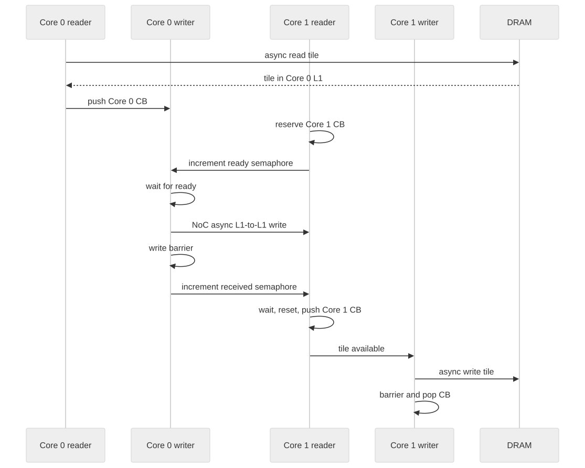

<!-- rewrite-status: improved-draft -->
# NoC tile transfer: ownership before movement

<p class="source-note">
<strong>Original source:</strong>
<a href="https://github.com/tenstorrent/tt-metal/blob/992f3ca634aac8733c70e48da395aab5361b4166/tech_reports/prog_examples/NoC_tile_transfer/NoC_tile_transfer.md"><code>tech_reports/prog_examples/NoC_tile_transfer/NoC_tile_transfer.md</code> at <code>992f3ca</code></a>
· <strong>Status:</strong> improved draft
</p>

The NoC write is only one step in this example. Correctness comes from proving
that the destination L1 region is reserved before the sender writes, the write
is complete before the receiver publishes its circular-buffer page, and the
page remains owned until the final writer consumes it.

{ .atlas-diagram }

<small>[Open full-size diagram](../../../assets/diagrams/noc-tile-handshake.svg) · [Diagram source](https://github.com/buicongnguyen/tenstorrent_work/blob/main/diagram_sources/noc-tile-handshake.mmd)</small>

## End-to-end path

```text
source DRAM
  → Core 0 reader
  → Core 0 circular buffer
  → Core 0 writer
  → NoC L1-to-L1 write
  → Core 1 circular buffer
  → Core 1 writer
  → destination DRAM
```

The host creates two logical cores, converts them to physical worker
coordinates for kernel synchronization, allocates one-tile DRAM input/output
buffers, creates semaphores and circular buffers, installs four kernels, and
passes addresses and coordinates through runtime arguments.

## Four kernels, four ownership roles

| Kernel | Waits for | Action | Publishes/releases |
|---|---|---|---|
| Core 0 reader | Back space in source CB | DRAM → local L1 async read, then read barrier | Pushes one source-CB page |
| Core 0 writer | Source page and receiver-ready semaphore | Core 0 L1 → Core 1 L1 async NoC write | Write barrier, then increments receiver semaphore |
| Core 1 reader | Back space, then transfer-complete semaphore | Reserves the exact destination CB page before remote write | Resets semaphore and pushes destination-CB page |
| Core 1 writer | Front page in destination CB | Local L1 → DRAM async write | Write barrier, then pops the page |

The circular-buffer calls and NoC barriers solve different problems:

- `cb_reserve_back` / `cb_push_back` and `cb_wait_front` / `cb_pop_front`
  transfer **software ownership** between local producers and consumers.
- `noc_async_read_barrier` and `noc_async_write_barrier` establish completion of
  outstanding **data movement** before the next ownership transition.
- the semaphore handshake coordinates two cores that do not share a local CB
  control structure.

## The handshake in detail

1. Core 1 reserves a destination page in its local circular buffer.
2. Core 1 remotely increments Core 0's semaphore: “the destination address is
   safe to write.”
3. Core 0 waits for that signal, issues `noc_async_write`, and then executes a
   write barrier.
4. Only after completion does Core 0 increment Core 1's semaphore: “the tile is
   present.”
5. Core 1 waits, resets its local semaphore, and pushes the reserved page.
6. Core 1's writer waits on the CB, writes the tile to DRAM, executes a barrier,
   and pops the page.

If step 2 is omitted, the sender can overwrite unreserved space. If the write
barrier in step 3 is omitted, the receiver can publish a page whose bytes are
still in flight.

## Address domains

The host chooses `CoreCoord{0,0}` and `CoreCoord{0,1}` as logical workers, but
the kernel handshake uses physical coordinates returned by
`worker_core_from_logical_core`. Keep these domains explicit: a logical grid is
a placement abstraction, while a NoC address must name the routed physical
endpoint expected by the device APIs.

## Code connection

- [Complete host example at `992f3ca`](https://github.com/tenstorrent/tt-metal/blob/992f3ca634aac8733c70e48da395aab5361b4166/tt_metal/programming_examples/NoC_tile_transfer/noc_tile_transfer.cpp)
- Original kernel roles and snippets remain in the
  [pinned report](https://github.com/tenstorrent/tt-metal/blob/992f3ca634aac8733c70e48da395aab5361b4166/tech_reports/prog_examples/NoC_tile_transfer/NoC_tile_transfer.md).
- Use `CreateSemaphore`, `CreateCircularBuffer`, `CreateKernel`, and
  `SetRuntimeArgs` on the host; use `noc_semaphore_*`, `noc_async_*`, barriers,
  and CB ownership APIs in the data-movement kernels.

The expected value is `14`: the example fills the input buffer with that value,
runs the workload, reads the destination buffer, and compares the first result.

## Verify your understanding

### 1. Which call proves that Core 1 has storage reserved before Core 0 writes?

???+ note "Expert answer — ownership reasoning"
    On Core 1, `cb_reserve_back` reserves the destination circular-buffer page.
    Core 1 then obtains that reserved page's write pointer and signals Core 0's
    readiness semaphore. Core 0 may issue its remote write only after observing
    that signal.

    The semaphore by itself is not the proof: its meaning comes from program
    order—**reserve first, then signal**—and from both kernels agreeing that the
    signal refers to the exact remote L1 address Core 0 will use.

### 2. Which event proves the bytes have arrived before Core 1 pushes its CB page?

???+ note "Expert answer — completion reasoning"
    Core 0 executes `noc_async_write_barrier()` after issuing the L1-to-L1 write,
    then increments Core 1's transfer-complete semaphore. Core 1 waits for that
    semaphore before calling `cb_push_back`.

    The causal chain is therefore `write → write barrier → remote signal → wait
    satisfied → push`. Signaling before the barrier would allow Core 1 to publish
    a page while some bytes were still in flight.

### 3. Why is a NoC barrier not a replacement for `cb_push_back`?

???+ note "Expert answer — protocol-layer reasoning"
    A NoC barrier proves completion of outstanding transport issued by that
    RISC. It does not update the local circular buffer's software indices or
    transfer a reserved back page from producer ownership to consumer-visible
    front ownership.

    `cb_push_back` performs that publication. Conversely, pushing without a
    barrier publishes too early. Correct code needs both boundaries in order:
    movement completion first, then local ownership transfer.

### 4. Add a second tile. List the semaphore state and CB ownership state for both tiles before changing code.

???+ note "Expert answer — protocol-design reasoning"
    Model each tile as a separate transaction before editing loops:

    | Tile state | Core 0 source CB | Core 1 destination CB | Ready signal | Arrival signal |
    |---|---|---|---|---|
    | tile 0 may be sent | front page owned by sender | back page 0 reserved by receiver | credit for tile 0 observed | not yet issued |
    | tile 0 may be consumed | source may pop after write completion | page 0 pushed to receiver writer | credit consumed | completion for tile 0 observed |
    | tile 1 may be sent | second front page owned by sender | a distinct back page 1 reserved | a second credit/sequence observed | not yet issued |
    | tile 1 may be consumed | second source may pop after completion | page 1 pushed in FIFO order | second credit consumed | completion for tile 1 observed |

    A one-bit semaphore that is repeatedly reset can lose the distinction between
    two in-flight tiles. Either serialize tile 1 until tile 0's handshake is
    reclaimed, or use monotonic/counting sequence values and sufficient CB depth
    so readiness and arrival for each tile cannot be conflated.

## Source and delta

- **Original:** [NoC Tile Transfer at `992f3ca`](https://github.com/tenstorrent/tt-metal/blob/992f3ca634aac8733c70e48da395aab5361b4166/tech_reports/prog_examples/NoC_tile_transfer/NoC_tile_transfer.md)
- **Added here:** an ownership table, explicit two-way semaphore protocol,
  logical-versus-physical address boundary, and failure analysis.
- **Review conclusion:** the one-tile ownership and semaphore chain is verified
  against the pinned example. The multi-tile answer is a protocol derivation,
  not a claim that the example implements pipelining. NoC processor/default
  selection is configuration- and architecture-specific and is intentionally
  not generalized here.
