<!-- rewrite-status: improved-draft -->
# TensorAccessor: logical pages to physical NoC addresses

<p class="source-note">
<strong>Original source:</strong>
<a href="https://github.com/tenstorrent/tt-metal/blob/992f3ca634aac8733c70e48da395aab5361b4166/tech_reports/tensor_accessor/tensor_accessor.md"><code>tech_reports/tensor_accessor/tensor_accessor.md</code> at <code>992f3ca</code></a>
· <strong>Status:</strong> improved draft
</p>

`TensorAccessor` separates a kernel's logical question—“where is page or shard
N?”—from the physical distribution across banks. Its output is an address that
NoC read/write APIs can consume.

{ .atlas-diagram }

<small>[Open full-size diagram](../../assets/diagrams/tensor-accessor-address.svg) · [Diagram source](https://github.com/buicongnguyen/tenstorrent_work/blob/main/diagram_sources/tensor-accessor-address.mmd)</small>

## Two phases, one argument layout

### Host: decide what is static

```cpp
const auto accessor_args = TensorAccessorArgs(
    buffer,
    tensor_accessor::ArgConfig::RuntimeNumBanks |
        tensor_accessor::ArgConfig::RuntimeBankCoords);

auto kernel = CreateKernel(
    program,
    "path/to/kernel.cpp",
    grid,
    DataMovementConfig{
        .processor = DataMovementProcessor::RISCV_0,
        .noc = NOC::RISCV_0_default,
        .compile_args = accessor_args.get_compile_time_args()});

SetCommonRuntimeArgs(program, kernel, accessor_args.get_common_runtime_args());
```

The host serializes one coherent accessor description into compile-time and
common-runtime portions. This is a performance/specialization choice, not two
independent configurations.

### Device: reconstruct and advance offsets

```cpp
constexpr uint32_t base_idx_cta = 0;
constexpr uint32_t base_idx_crta = 1;

auto args = TensorAccessorArgs<base_idx_cta, base_idx_crta>();
auto accessor = TensorAccessor(args, bank_base_address);
```

`next_compile_time_args_offset()` and `next_common_runtime_args_offset()` let a
kernel place further arguments after the accessor without manually duplicating
its encoded length.

## Compile time versus runtime

| Field family | Static benefit | Runtime benefit |
|---|---|---|
| Rank | Enables compile-time shape/stride structure | One kernel shape can handle different ranks |
| Number of banks | Enables fixed-size bank-coordinate storage | Adapts to a dynamic distribution |
| Tensor/shard shape | Enables precomputed strides and volumes | Reuses code across shapes |
| Bank coordinates | Enables a fixed routing table | Reuses code across placements |

The important dependency rule from the source is:

!!! danger "Container size controls where its values may live"
    If rank or number of banks is runtime, the corresponding tensor shape,
    shard shape, or bank-coordinate values must also be runtime. Compile-time
    indexing cannot calculate offsets into a container whose size is unknown at
    compile time.

Flags can be combined with bitwise OR. `ArgConfig::None` places everything at
compile time; `ArgConfig::Runtime` places all supported fields at runtime.

## Address calculation

The main forms are:

```cpp
uint64_t noc_addr = accessor.get_noc_addr(page_id);
auto [bank_id, bank_offset] = accessor.get_bank_and_offset(page_id);

std::array<uint32_t, 4> page_coord{0, 1, 2, 3};
uint64_t coord_addr = accessor.get_noc_addr(page_coord);
```

For sharded tensors, use `get_shard_noc_addr(shard_id)` or a shard coordinate.
The `DistributionSpec` holds the page-based tensor shape, shard shape, strides,
volumes, and packed bank coordinates used in this mapping.

!!! note "Units"
    Tensor and shard volumes, shapes, and strides exposed by the distribution
    spec are measured in **pages**, not elements or bytes. Byte addresses enter
    at the aligned page size and bank base-address boundary.

## Data movement pattern

```cpp
uint32_t l1_write_addr = get_write_ptr(cb_id);
noc_async_read_page(page_id, accessor, l1_write_addr);
noc_async_read_barrier();

uint32_t l1_read_addr = get_read_ptr(cb_id);
noc_async_write_page(page_id, accessor, l1_read_addr);
noc_async_write_barrier();
```

The accessor calculates *where*; the asynchronous NoC API moves bytes; the
barrier establishes completion; circular-buffer APIs establish local page
ownership. Keeping those roles separate prevents an address calculation from
being mistaken for a synchronization guarantee.

## Manual distribution specs

Manual `DistributionSpec` construction is useful when accessors share bank
coordinates or mix static and dynamic arrays. It also exposes more room for
configuration mismatch. Preserve these invariants:

- rank agrees with tensor and shard shape lengths;
- number of banks agrees with the packed-coordinate container;
- page size and bank base address match the buffer whose distribution is
  described;
- sharded-only APIs are guarded by `args::is_sharded`.

## Performance reasoning

The pinned report states:

- static rank allows zero-cost accessor construction because precomputation can
  happen at compile time;
- address calculation grows approximately linearly with rank;
- iterators can outperform repeated `get_noc_addr()` calls by caching traversal
  state, especially for shard pages.

Choose runtime flexibility only for dimensions that actually vary across cache
hits or program uses. The custom runtime page-size constructor exists for cases
where a cached program is reused with a different aligned page size.

## Code connection

- [`tensor_accessor.h` at the pinned TT-Metal commit](https://github.com/tenstorrent/tt-metal/blob/992f3ca634aac8733c70e48da395aab5361b4166/tt_metal/hw/inc/api/tensor/tensor_accessor.h)
- [TensorAccessor iterator learner page](tensor_accessor_iterator.md)
- Use `TensorAccessorArgs(buffer, flags)` on the host and
  `TensorAccessor(args, bank_base_address[, page_size])` in a data-movement
  kernel.

## Verify your understanding

1. If `RuntimeRank` is selected, why can tensor shape not remain a compile-time
   array indexed by that rank?
2. What units does `dspec.tensor_shape()` use?
3. Which component calculates the address, which moves the data, and which
   establishes ownership?
4. Compare a loop using repeated `get_noc_addr(page_id)` with an accessor
   iterator. Expected observation: the iterator can reuse state instead of
   reconstructing the full mapping for each page.

## Source and delta

- **Original:** [Tensor Accessor Guide at `992f3ca`](https://github.com/tenstorrent/tt-metal/blob/992f3ca634aac8733c70e48da395aab5361b4166/tech_reports/tensor_accessor/tensor_accessor.md)
- **Added here:** host/device phase separation, argument-dependency rule,
  address/movement/ownership boundaries, invariants, and performance choices.
- **Still to review:** cycle-level cost across ranks and architectures.
