<!-- rewrite-status: improved-draft -->
# Tensor and memory layouts

<p class="source-note">
<strong>Original source:</strong>
<a href="https://github.com/tenstorrent/tt-metal/blob/992f3ca634aac8733c70e48da395aab5361b4166/tech_reports/tensor_layouts/tensor_layouts.md"><code>tech_reports/tensor_layouts/tensor_layouts.md</code> at <code>992f3ca</code></a>
· <strong>Status:</strong> draft learner edition
</p>

The word *layout* is used for two different decisions in TT-NN. Keeping them
separate is the key to this chapter:

{ .atlas-diagram }

<small>[Open full-size diagram](../../assets/diagrams/tensor-layout-layers.svg) · [Diagram source](https://github.com/buicongnguyen/tenstorrent_work/blob/main/diagram_sources/tensor-layout-layers.mmd)</small>

- **Tensor layout** answers: how do elements become addressable pages?
- **Memory layout** answers: how are those pages distributed?
- **Storage** answers: in which physical memory class do they live?

Changing one decision does not automatically determine the others.

## Step 1 — flatten only the outer dimensions

TT-Metal buffers are described as 2D memory objects. For an N-dimensional
tensor, preserve the final dimension and combine everything before it.

```text
[1, 4, 6, 8]  →  [(1 × 4 × 6), 8]  →  [24, 8]
```

This is a representation step, not a transpose. Element order does not change.

!!! example "Checkpoint"
    A tensor with shape `[2, 3, 64, 96]` becomes `[384, 96]` because
    `2 × 3 × 64 = 384`.

## Step 2 — choose how elements form pages

=== "Row-major"

    A row is normally the page granularity. A `64 × 64` tensor therefore has
    64 row pages.

    { .atlas-diagram }

    <small>[Open full-size diagram](../../assets/diagrams/row-pages.svg) · [Diagram source](https://github.com/buicongnguyen/tenstorrent_work/blob/main/diagram_sources/row-pages.mmd)</small>

    This representation is intuitive for host-style indexing and operations
    that consume rows directly.

=== "Tiled"

    The common tile is `32 × 32`. A `64 × 64` tensor becomes a `2 × 2` grid
    of four tile pages.

    ```text
    ┌───────────────┬───────────────┐
    │ tile (0, 0)   │ tile (0, 1)   │
    │ 32 × 32       │ 32 × 32       │
    ├───────────────┼───────────────┤
    │ tile (1, 0)   │ tile (1, 1)   │
    │ 32 × 32       │ 32 × 32       │
    └───────────────┴───────────────┘
    ```

    Tiled data matches the natural unit consumed by many Tensix compute APIs.

### Tile count and payload

For height `H`, width `W`, and a common `32 × 32` tile:

```text
tile_rows = ceil(H / 32)
tile_cols = ceil(W / 32)
tile_count = tile_rows × tile_cols
payload_per_tile = 32 × 32 × bytes_per_element
```

For a `64 × 96` BF16 tensor:

```text
tile grid       = 2 × 3
tile count      = 6
payload / tile  = 32 × 32 × 2 B = 2 KiB
total payload   = 12 KiB
```

Padding may be required when the final two dimensions are not tile-aligned.
The padded representation consumes and moves real bytes even if the logical
model later ignores them.

## Step 3 — understand faces inside a tile

A common `32 × 32` tile is arranged as four `16 × 16` faces. Conceptually:

```text
┌───────────┬───────────┐
│ face 0    │ face 1    │
│ 16 × 16   │ 16 × 16   │
├───────────┼───────────┤
│ face 2    │ face 3    │
│ 16 × 16   │ 16 × 16   │
└───────────┴───────────┘
```

The faces are the bridge between the programmer-visible tile and the matrix
engine's smaller native work. Do not assume the bytes of a tile are identical
to a flat row-major `32 × 32` array.

## Step 4 — distribute pages across memory

Now choose a **memory layout**. The page definition from the previous step
stays intact.

=== "Interleaved"

    Pages are assigned round-robin across available banks.

    { .atlas-diagram }

    <small>[Open full-size diagram](../../assets/diagrams/interleaved-banks.svg) · [Diagram source](https://github.com/buicongnguyen/tenstorrent_work/blob/main/diagram_sources/interleaved-banks.mmd)</small>

    This is the simple general-purpose choice. It spreads sequential pages,
    but the consumer may need NoC traffic to gather them.

=== "Sharded"

    A shard groups a region of the tensor and assigns it to selected cores or
    banks.

    { .atlas-diagram }

    <small>[Open full-size diagram](../../assets/diagrams/sharded-cores.svg) · [Diagram source](https://github.com/buicongnguyen/tenstorrent_work/blob/main/diagram_sources/sharded-cores.mmd)</small>

    Sharding can improve locality and parallelism, but only when the shard
    geometry matches how the next kernels consume data.

## A decision table

| Question | Choice | Consequence to inspect |
|---|---|---|
| How do elements become pages? | Row-major / tiled | page size, padding, compute compatibility |
| How do pages reach banks/cores? | Interleaved / sharded | locality, NoC traffic, parallelism |
| Where are bytes stored? | DRAM / L1 | capacity, latency, lifetime |
| What encoding is used? | BF16, BFP, FP32, integer… | tile bytes, precision, engine support |

## A repeatable reasoning flow

{ .atlas-diagram }

<small>[Open full-size diagram](../../assets/diagrams/tensor-layout-decision.svg) · [Diagram source](https://github.com/buicongnguyen/tenstorrent_work/blob/main/diagram_sources/tensor-layout-decision.mmd)</small>

## Common mistakes

!!! failure "Treating tiled and sharded as opposites"
    Tiled is a tensor-layout choice. Sharded is a memory-layout choice. A
    tensor can be tiled and sharded at the same time.

!!! failure "Counting logical elements but not padded bytes"
    Transfers and capacity depend on the physical representation, including
    padding and alignment.

!!! failure "Choosing L1 without a lifetime plan"
    L1 is local and fast but limited. Buffers, circular buffers, binaries, and
    runtime-reserved regions share the space.

!!! failure "Sharding without following the consumer"
    Sharding is valuable when it makes later accesses local and balanced.
    Otherwise it can add resharding or communication.

## Code connection

Find these concepts in the current official repository:

- `ttnn.ROW_MAJOR_LAYOUT` and `ttnn.TILE_LAYOUT`
- `ttnn.DRAM_MEMORY_CONFIG` and `ttnn.L1_MEMORY_CONFIG`
- `ttnn.create_sharded_memory_config`
- `tt::tt_metal::InterleavedBufferConfig`
- `tt::tt_metal::ShardSpec`
- `tt::tt_metal::CircularBufferConfig`

APIs evolve, so search the exact upstream revision when a symbol differs from
the snapshot.

## Source and delta

- Official source:
  [`tensor_layouts.md`](https://github.com/tenstorrent/tt-metal/blob/992f3ca634aac8733c70e48da395aab5361b4166/tech_reports/tensor_layouts/tensor_layouts.md)
- Related source:
  [`allocator.md`](https://github.com/tenstorrent/tt-metal/blob/992f3ca634aac8733c70e48da395aab5361b4166/tech_reports/memory/allocator.md)
- Local unchanged copy:
  `upstream/tt-metal/tech_reports/tensor_layouts/tensor_layouts.md`

This edition adds a decision model, worked byte calculations, flow diagrams,
failure modes, checkpoints, and code-search targets. It does not replace
architecture-specific constraints in the current official documentation.
