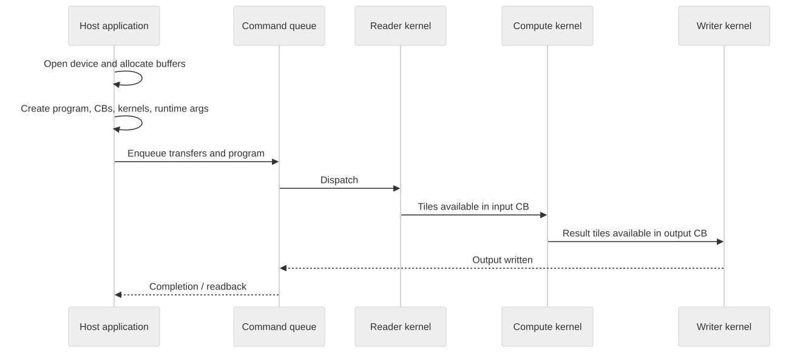

# Architecture mental model

The fastest route into TT-Metalium is to stop thinking first about APIs and
start thinking about **where data lives and who moves it**.

## A Tensix core is a coordinated node

{ .atlas-diagram }

<small>[Open full-size diagram](../assets/diagrams/tensix-tile.svg) · [Diagram source](https://github.com/buicongnguyen/tenstorrent_work/blob/main/diagram_sources/tensix-tile.mmd)</small>

Treat this as a coordination problem:

- data-movement kernels bring pages or tiles into local SRAM;
- circular buffers communicate availability and ownership;
- compute kernels unpack, transform, and pack data;
- data-movement kernels send results onward.

The exact processor assignment and capabilities vary by architecture and
kernel configuration. The durable idea is the split between moving data and
transforming data.

## Host code builds a program; kernels execute it

{ .atlas-diagram }

<small>[Open full-size diagram](../assets/diagrams/program-lifecycle.svg) · [Diagram source](https://github.com/buicongnguyen/tenstorrent_work/blob/main/diagram_sources/program-lifecycle.mmd)</small>

Host code describes resources and schedules work. Device kernels execute
concurrently and must coordinate through explicit mechanisms. This is why the
same operation has two views:

| Host view | Device view |
|---|---|
| Buffers, programs, core ranges, kernels | addresses, pages, tiles, semaphores |
| Compile-time and runtime arguments | constants and per-launch values |
| Enqueue and completion | reads, barriers, compute, writes |
| Tensor shape/layout metadata | concrete bytes in DRAM or L1 |

## The five coordinates of any tensor

Before asking whether an operation is fast, write down:

1. **Logical shape** — what the model sees.
2. **Tensor layout** — row-major or tiled representation.
3. **Data format** — element encoding and tile payload size.
4. **Memory layout** — interleaved or sharded distribution.
5. **Storage** — host memory, device DRAM, or device L1.

Mixing these axes is a common source of confusion. The
[layout rewrite](../rewrites/tensor_layouts/tensor_layouts.md) separates them
with concrete examples.

## The performance question

{ .atlas-diagram }

<small>[Open full-size diagram](../assets/diagrams/performance-triage.svg) · [Diagram source](https://github.com/buicongnguyen/tenstorrent_work/blob/main/diagram_sources/performance-triage.mmd)</small>

Do not optimize from the API surface alone. First locate the waiting:
host, command queue, memory path, synchronization, or compute engine.

## Sources for this model

This page synthesizes the upstream `METALIUM_GUIDE.md`,
`tensor_layouts/tensor_layouts.md`, `memory/allocator.md`, and the programming
examples. It is a learning aid, not a replacement for the official,
architecture-specific documentation.
