# Learning path: high level to low level

The reports are easiest to learn by abstraction and dependency, not by their
upstream folder names. The Atlas therefore uses the same eight levels in this
curriculum, the [57-report catalog](../reference/report-catalog.md), and the
left navigation.

{ .atlas-diagram }

<small>[Open full-size diagram](../assets/diagrams/learning-path.svg) · [Diagram source](https://github.com/buicongnguyen/tenstorrent_work/blob/main/diagram_sources/learning-path.mmd)</small>

## Understand the route before starting

| Level | Layer | What becomes visible |
|---:|---|---|
| 0 | Orientation and stack | TT-NN, TT-Metalium, kernels, TT-LLK, and hardware boundaries |
| 1 | Models and operators | Complete workloads and the operators they need |
| 2 | TT-NN runtime | Devices, tracing, comparison, and runtime behavior |
| 3 | Tensor and memory | Tiles, formats, layouts, sharding, allocation, and addressing |
| 4 | Kernels and dataflow | Host programs, device kernels, circular buffers, NoC, and multicore flows |
| 5 | Performance and debugging | Evidence for correctness and bottlenecks across layers |
| 6 | Multi-device systems | Meshes, Ethernet, collectives, fabric, and multi-host execution |
| 7 | Hardware, TT-LLK, and ISA | Tensix engines, registers, instructions, and architecture constraints |

Levels **0 → 4 → 7** are the main descent from high-level software to the
lowest layer. Levels **5** and **6** are advanced branches: they require the
lower concepts, but are not themselves always lower abstractions.

## Level 0 — orient yourself

**Goal:** distinguish TT-NN, TT-Metalium host code, device kernels, TT-LLK,
and hardware engines.

Read:

1. [Architecture mental model](architecture-mental-model.md)
2. [TT-NN stack overview](../rewrites/ttnn/ttnn.md)
3. Official [`METALIUM_GUIDE.md`](https://github.com/tenstorrent/tt-metal/blob/992f3ca634aac8733c70e48da395aab5361b4166/METALIUM_GUIDE.md)

**Checkpoint:** draw the host-to-device call path for one tensor operation
without looking at the diagram.

[Open every Level 0 report →](../reference/report-catalog.md#level-0-orientation)

## Level 1 — start with a workload

**Goal:** see why the lower layers exist by following a complete model or
operator first.

Choose one route:

1. [New model bring-up](../rewrites/ttnn/TTNN-model-bringup.md)
2. [LLMs in TT-NN](../rewrites/LLMs/llms.md)
3. [Convolution networks](../rewrites/CNNs/ttcnn.md)
4. [FlashAttention](../rewrites/FlashAttention/FlashAttention.md)

**Checkpoint:** identify the TT-NN operations, tensor shapes, and performance
goal of your chosen workload before opening a kernel.

[Open every Level 1 report →](../reference/report-catalog.md#level-1-models-operators)

## Level 2 — understand the TT-NN runtime

**Goal:** connect an operator call to device ownership, graph capture,
operation tracing, checking, and serialization.

Read:

1. [Sub-devices](../rewrites/SubDevices/SubDevices.md)
2. [Graph tracing](../rewrites/ttnn/graph-tracing.md)
3. [Operation tracing](../rewrites/ttnn/operation-tracing.md)
4. [Comparison mode](../rewrites/ttnn/comparison-mode.md)

**Checkpoint:** explain what the runtime knows before execution, what a trace
records, and where comparison can detect a wrong result.

[Open every Level 2 report →](../reference/report-catalog.md#level-2-ttnn-runtime)

## Level 3 — representation before execution

**Goal:** understand why shape, tile layout, data format, memory layout,
sharding, and storage location are separate decisions.

Read:

1. [Tensor and memory layouts](../rewrites/tensor_layouts/tensor_layouts.md)
2. [Data formats](../rewrites/data_formats/data_formats.md)
3. [Tensor sharding](../rewrites/tensor_sharding/tensor_sharding.md)
4. [Device allocator](../rewrites/memory/allocator.md)
5. [TensorAccessor](../rewrites/tensor_accessor/tensor_accessor.md)

**Checkpoint:** given a `[1, 4, 64, 96]` BF16 tensor, state its flattened 2D
shape, tile grid, tile count, tile payload size, placement, and address rule.

[Open every Level 3 report →](../reference/report-catalog.md#level-3-tensor-memory)

## Level 4 — follow tiles through kernels

**Goal:** separate data movement from compute, and distinguish compile-time
configuration, runtime arguments, and synchronization.

Read:

1. [NoC tile transfer](../rewrites/prog_examples/NoC_tile_transfer/NoC_tile_transfer.md)
2. [Data multicasting](../rewrites/prog_examples/multicast/multicast.md)
3. [SFPU eltwise chain](../rewrites/prog_examples/sfpu_eltwise_chain/sfpu_eltwise_chain.md)
4. [Named kernel arguments](../rewrites/NamedKernelArgs/kernel_args_as_parameters.md)
5. [Kernel code indexing](../rewrites/code-indexing/kernel-code-indexing.md)

**Checkpoint:** trace one tile from DRAM or L1 through reader, compute, and
writer kernels, including circular-buffer ownership and NoC barriers.

[Open every Level 4 report →](../reference/report-catalog.md#level-4-kernels-dataflow)

## Level 5 — measure and debug

**Goal:** decide whether a problem is correctness, host dispatch, PCIe, DRAM,
NoC, local memory, synchronization, or compute.

For a cross-layer route organized by measured symptoms, start with the
[performance optimization learning track](optimization-path.md). It links back
to the canonical report at each level and explains how to use DeepWiki for code
discovery without treating it as the source of truth.

Read:

1. [Kernel debugging tips](../rewrites/Debugging/Kernel_Debugging_Tips.md)
2. [Metal profiler](../rewrites/MetalProfiler/metal-profiler.md)
3. [Hardware performance counters](../rewrites/PerfCounters/perf-counters.md)
4. [Runtime and model optimizations](../rewrites/AdvancedPerformanceOptimizationsForModels/AdvancedPerformanceOptimizationsForModels.md)
5. [Saturating DRAM bandwidth](../rewrites/Saturating_DRAM_bandwidth/Saturating_DRAM_bandwidth.md)
6. [Matrix multiply FLOPS](../rewrites/GEMM_FLOPS/GEMM_FLOPS.md)

**Checkpoint:** name the measurement that would confirm or reject each
candidate bottleneck before changing code.

[Open every Level 5 report →](../reference/report-catalog.md#level-5-performance-debugging)

## Level 6 — scale beyond one device

**Goal:** extend ownership, addressing, routing, and synchronization across
cores, chips, meshes, and hosts.

Read:

1. [Programming a mesh with TT-NN](../rewrites/Programming_Mesh_of_Devices/Programming_Mesh_of_Devices_with_TT-NN.md)
2. [Basic Ethernet multichip](../rewrites/EthernetMultichip/BasicEthernetGuide.md)
3. [TT-Fabric architecture](../rewrites/TT-Fabric/TT-Fabric-Architecture.md)
4. [TT-Metalium Distributed](../rewrites/TT-Distributed/TT-Distributed-Architecture-1219.md)

**Checkpoint:** distinguish scale-up from scale-out and explain which layer
owns routing, transport, and session state in one example.

[Open every Level 6 report →](../reference/report-catalog.md#level-6-distributed-systems)

## Level 7 — descend to TT-LLK and the ISA

**Goal:** connect kernel behavior to low-level APIs, Tensix engines, registers,
and instructions without mixing Wormhole and Blackhole details.

Use:

1. [Matrix engine](../rewrites/matrix_engine/matrix_engine.md)
2. [Corsix Parts 1–7 reading workbook](../resources/corsix-reading-workbook.md)
3. [Official ISA deep dive](../resources/isa-reference.md)
4. [Resource guide and trust labels](../resources/index.md)

Parts 1–4 of the Corsix route establish board, PCIe, NoC, and Ethernet context;
Parts 5–7 descend through the T tile, SFPU/vector ISA, and matrix pipeline. Use
the official ISA links after each part to verify, qualify, or reject claims.

**Checkpoint:** trace one tile from L1 through Unpack → `SrcA`/`SrcB` → Matrix
or SFPU → `Dst` → Pack → L1, and label every architecture-specific claim.

[Open every Level 7 report →](../reference/report-catalog.md#level-7-hardware-isa)

!!! warning "Do not mix abstraction levels accidentally"
    TT-Metalium deliberately hides many ISA details. Descend when explaining
    behavior, debugging a low-level kernel, validating a performance
    assumption, or studying the hardware—not merely to make an explanation
    sound more detailed.

## Use the same three passes at every level

1. **Map:** identify actors, memory locations, and abstraction boundaries.
2. **Trace:** follow one tensor, tile, page, message, or instruction through the flow.
3. **Test:** find the matching code and predict one observable result before running it.
