# Performance optimization learning track

Performance work is easiest to learn as a sequence of questions:

> **Measure → classify → change one mechanism → verify the same metric.**

This track crosses Levels 2–7 of the Atlas. It does not create a second copy of
every report; it links the canonical page for each layer and uses DeepWiki as a
code-discovery index through the
[DeepWiki research guide](../resources/deepwiki-research-guide.md).

{ .atlas-diagram }

<small>[Open full-size diagram](../assets/diagrams/optimization-track.svg) · [Diagram source](https://github.com/buicongnguyen/tenstorrent_work/blob/main/diagram_sources/optimization-track.mmd)</small>

## Begin with a measurement contract

Before changing code, record:

- hardware architecture and device topology;
- `tt-metal` commit or release, firmware, and driver versions;
- model or operation, shape, batch/sequence dimensions, and iteration count;
- dtype, math fidelity, tensor layout, sharding, and DRAM/L1 placement;
- cold-run time separately from warm steady-state time;
- synchronization and host readback included in the measured boundary;
- profiler configuration and its possible overhead;
- correctness check and acceptable numerical tolerance.

Change **one independent variable** at a time. Otherwise a program-cache hit,
layout conversion, and different kernel can be accidentally credited to the
same optimization.

## Choose the route from the symptom

| Observation | Likely layer | First mechanism to investigate | Evidence that can confirm it |
|---|---|---|---|
| First iteration is much slower | Level 2 runtime | JIT compilation, program cache, warm-up | cold vs warm timings and cache-entry/log evidence |
| Large gaps between device operations | Levels 2/5 | host submission, Fast Dispatch, Metal Trace | host/device timeline and dispatch-core state |
| Gap between model iterations | Level 5 | multiple command queues and I/O overlap | compute and transfer overlap in the timeline |
| Host frequently waits | Levels 2/5 | blocking calls, unnecessary synchronization, async execution | host wait zones and queue depth |
| High DRAM or NoC traffic | Levels 3/4 | layout, sharding, L1 placement, reuse, multicast | DRAM/NoC utilization and bytes moved |
| Some cores finish much earlier | Level 4 | work split and core-grid balance | per-core kernel durations |
| Compute waits for input or output space | Level 4 | reader/writer pipeline, circular-buffer sizing, double buffering | CB wait/stall markers and RISC timelines |
| Multi-device communication creates bubbles | Level 6 | mesh events, collectives, fabric overlap | per-device timeline and link utilization |
| Compute engine is already saturated | Level 7 | data format, fidelity, specialized LLK/ISA path | FPU/SFPU/Pack/Unpack counters plus accuracy |

## Stage 1 — separate cold start from steady state

**Question:** Is the slow time compilation and program construction, or device
execution?

Read:

1. Official [TT-NN program-cache example](https://docs.tenstorrent.com/tt-metal/latest/ttnn/ttnn/usage.html#enabling-program-cache)
2. DeepWiki [program configuration and optimization](https://deepwiki.com/tenstorrent/tt-metal/4.10-program-configuration-and-optimization)
3. [Advanced model optimizations](../rewrites/AdvancedPerformanceOptimizationsForModels/AdvancedPerformanceOptimizationsForModels.md)

Keep three phases distinct:

| Phase | Reused work | Question to test |
|---|---|---|
| **Cold run** | none | Which programs compile or are constructed? |
| **Warm cached run** | compiled/program structure | Does the same operation configuration hit the program cache? |
| **Trace replay** | captured dispatch-command sequence | Are tensor addresses and captured parameters stable? |

Program cache is not a tensor-data cache, model-weight cache, or transparent
hardware cache. For an interview, explain the cache key, what remains dynamic,
and why the first run must not be mixed with steady-state latency.

**Lab:** run one fixed operation configuration repeatedly, record the first and
later iterations separately, then change one attribute that is expected to
select a different program. Predict whether the cache-entry count changes.

## Stage 2 — understand how work reaches workers

**Question:** Can the device consume commands without the host synchronously
launching every step?

Use the [Fast Dispatch DeepWiki page](https://deepwiki.com/tenstorrent/tt-metal/2.5-fast-dispatch-and-command-queue-system)
to find the issue queue, command prefetcher, dispatcher, worker launch, and
completion path. Verify the explanation against the official
[`METALIUM_GUIDE.md`](https://github.com/tenstorrent/tt-metal/blob/main/METALIUM_GUIDE.md#fast-dispatch)
and current firmware/source links.

Fast Dispatch is the normal performance path. Slow dispatch is primarily a
debugging path and can require different host APIs; do not present the two as a
single environment-variable-only benchmark.

!!! important "Two kinds of prefetch"
    **Dispatch prefetch** pulls command pages toward the dispatcher. **Data
    prefetch/pipelining** moves future tensor pages or tiles toward a kernel's
    circular buffers. They hide different latency at different layers.

**Lab:** profile the default Fast Dispatch path and identify command issue,
prefetch, dispatch, worker execution, and completion. Use slow dispatch only in
an isolated compatible example when debugging or studying the contrast.

## Stage 3 — remove host gaps with Metal Trace

**Question:** Does the device wait between operations because the host is still
constructing or dispatching them?

Read the [pinned official optimization report](https://github.com/tenstorrent/tt-metal/blob/992f3ca634aac8733c70e48da395aab5361b4166/tech_reports/AdvancedPerformanceOptimizationsForModels/AdvancedPerformanceOptimizationsForModels.md)
alongside its
[learner edition](../rewrites/AdvancedPerformanceOptimizationsForModels/AdvancedPerformanceOptimizationsForModels.md).

Metal Trace captures dispatch commands in device memory and replays them. The
important invariant is not merely “same model”: captured tensor addresses,
shapes, operation parameters, and other encoded state must remain compatible.
Compile and warm the program cache before capture.

**Lab:** choose a static-shape, repeatable workload. Compare a warm cached run
against trace replay. Expect smaller host/inter-op gaps only when host dispatch
was a meaningful part of the baseline.

## Stage 4 — overlap iterations with command queues and events

**Question:** Can transfer for iteration `n+1` overlap compute for iteration
`n`?

Multiple hardware command queues are independent. Events establish the
required happens-before edges:

- compute must not consume an input before its write completes;
- a producer must not overwrite a persistent input while compute still reads it;
- readback must not consume an output before compute finishes;
- compute must not reuse output storage before readback finishes.

Non-blocking APIs and async execution make overlap possible; they do not make
ordering correct automatically.

**Lab:** compare one queue against a two-queue pipeline with the same input,
output, and correctness check. Draw the producer/consumer event graph first.
Then confirm transfer/compute overlap and a reduced iteration gap.

## Stage 5 — shorten the memory path

**Question:** Are extra movement, conversion, or remote accesses limiting the
operation?

Read:

1. [Tensor and memory layouts](../rewrites/tensor_layouts/tensor_layouts.md)
2. [Tensor sharding](../rewrites/tensor_sharding/tensor_sharding.md)
3. [Device allocator](../rewrites/memory/allocator.md)
4. [TensorAccessor](../rewrites/tensor_accessor/tensor_accessor.md)
5. DeepWiki [memory management](https://deepwiki.com/tenstorrent/tt-metal/2.7-memory-management-and-allocators)

Study persistent DRAM inputs, DRAM-sharded to L1-sharded movement, preserving
intermediates in L1, and avoiding unnecessary layout/reshard conversions. Do
not optimize for L1 residency without including its capacity and lifetime
constraints.

**Lab:** count or profile conversions and bytes moved before changing
placement. Compare the same operation with one memory decision changed and
verify both traffic and latency.

## Stage 6 — pipeline tiles and reuse data

**Question:** Are Data Movement RISCs, circular buffers, compute engines, and
the writer overlapped effectively?

Read:

1. [NoC tile transfer](../rewrites/prog_examples/NoC_tile_transfer/NoC_tile_transfer.md)
2. [Matmul data reuse](../rewrites/prog_examples/matmul_multi_core_optimized/data_reuse.md)
3. [Matmul data multicast](../rewrites/prog_examples/matmul_multi_core_optimized/data_mcast.md)
4. [SFPU elementwise chain](../rewrites/prog_examples/sfpu_eltwise_chain/sfpu_eltwise_chain.md)
5. DeepWiki [data movement and buffers](https://deepwiki.com/tenstorrent/tt-metal/2.12-data-movement-and-buffer-operations)

At this layer, “prefetch” normally means a reader prepares future pages or
tiles while compute consumes current tiles. Circular-buffer depth, barriers,
multicast, and work distribution decide whether this becomes real overlap.

**Lab:** trace one tile through reader → input CB → compute → output CB →
writer. Identify the first stage that waits and change only the matching buffer,
transfer grouping, reuse, or work split.

## Stage 7 — scale communication deliberately

**Question:** Is a collective, Ethernet/fabric route, or cross-device event
creating the critical path?

Read:

1. [CCL performance practices](../rewrites/Programming_Mesh_of_Devices/CCL_Performance_Best_Practices.md)
2. [TT-Fabric architecture](../rewrites/TT-Fabric/TT-Fabric-Architecture.md)
3. [TT-Metalium Distributed](../rewrites/TT-Distributed/TT-Distributed-Architecture-1219.md)

Reuse the same producer/consumer reasoning from multiple command queues, but
add device ownership, routing, link bandwidth, and collective topology.

## Stage 8 — descend to TT-LLK and ISA last

**Question:** Has measurement shown that a compute engine, instruction path,
format conversion, or low-level synchronization is the remaining limit?

Use:

1. [Matrix engine](../rewrites/matrix_engine/matrix_engine.md)
2. [Corsix Parts 1–7 workbook](../resources/corsix-reading-workbook.md)
3. [Official ISA route](../resources/isa-reference.md)
4. DeepWiki [LLK map](https://deepwiki.com/tenstorrent/tt-metal/3-low-level-kernel-apis-%28llk%29)

Carry the architecture name on every conclusion. Wormhole, Blackhole, and
future processors can share a principle without sharing registers,
instructions, vector widths, or pipeline restrictions.

## Transfer the lessons to another NPU

| Tenstorrent mechanism | Transferable NPU principle |
|---|---|
| Program cache | Separate compilation/specialization from steady-state execution |
| Fast Dispatch | Move command scheduling close to the accelerator and amortize host submission |
| Command prefetcher | Keep the command consumer supplied ahead of demand |
| Metal Trace | Capture and replay a static command graph |
| Multiple CQs + events | Overlap independent engines with explicit dependencies |
| L1 sharding and persistent tensors | Control placement, lifetime, and locality explicitly |
| Circular-buffer pipeline | Decouple producer, compute, and consumer with bounded buffers |
| Multicast and data reuse | Reduce repeated movement of shared operands |
| Mesh/fabric overlap | Hide communication behind useful work where dependencies permit |
| TT-LLK/ISA specialization | Descend below portable APIs only after evidence justifies it |

## Interview drill

For each technique, answer four questions without using the feature name first:

1. What measured bottleneck does it remove?
2. What work or data is reused, moved earlier, or overlapped?
3. What correctness invariant does the optimization introduce?
4. What observation would prove that it helped?

A strong answer explains, for example, “record and replay a stable command
sequence to remove host inter-operation gaps,” then names Metal Trace. This
shows a reusable performance model rather than memorization of one API.

## Finish line for an optimization claim

Do not mark an optimization lesson complete until it includes:

- a source ledger with original DeepWiki and official links;
- an architecture and software-version boundary;
- a before/after flow or timeline;
- a correctness invariant;
- a controlled baseline and one-variable experiment;
- the profiler metric that confirms or rejects the hypothesis;
- a transferable-NPU explanation and interview questions.
